# UniHub Workshop — Tài liệu Thiết kế Tổng hợp

# UniHub Workshop — Project Proposal

## Vấn đề

Trường Đại học A tổ chức **"Tuần lễ kỹ năng và nghề nghiệp"** hàng năm — sự kiện kéo dài 5 ngày, mỗi ngày có 8–12 workshop diễn ra song song tại nhiều phòng khác nhau. Hiện tại, ban tổ chức quản lý toàn bộ quy trình bằng **Google Form** kết hợp với **email thủ công**.

Phương thức này bộc lộ những hạn chế nghiêm trọng khi quy mô ngày càng lớn:

- **Không kiểm soát được số lượng đăng ký theo thời gian thực**: Google Form không có cơ chế giới hạn chỗ ngồi (capacity cap). Sinh viên vẫn gửi form dù workshop đã kín chỗ, buộc ban tổ chức phải lọc thủ công và gửi email từ chối — gây chậm trễ và bức xúc cho sinh viên.
- **Tranh chấp chỗ ngồi (Race Condition)**: Khi hàng trăm sinh viên cùng bấm đăng ký một workshop 60 chỗ, không có cơ chế nào đảm bảo hai sinh viên không cùng nhận chiếc vé cuối cùng.
- **Không có check-in điện tử**: Việc điểm danh tại cửa phòng hoàn toàn thủ công bằng giấy, dễ nhầm lẫn, chậm và không thể tổng hợp dữ liệu tức thời.
- **Tải trọng đột biến**: Dự kiến 12.000 sinh viên truy cập trong 10 phút đầu mở đăng ký, 60% dồn vào 3 phút đầu tiên. Google Form không được thiết kế để chịu tải ở mức này, dẫn đến nguy cơ sập form, mất dữ liệu.
- **Không tích hợp được với hệ thống quản lý sinh viên cũ**: Hệ thống hiện hữu chỉ xuất file CSV hàng đêm, không có API. Việc đối chiếu danh sách sinh viên hợp lệ hoàn toàn thủ công.
- **Không hỗ trợ thanh toán**: Các workshop có thu phí không có cơ chế thanh toán trực tuyến, buộc sinh viên phải đóng tiền mặt.

## Mục tiêu

Xây dựng hệ thống **UniHub Workshop** nhằm số hóa toàn bộ quy trình từ đăng ký đến check-in tại sự kiện, với các mục tiêu định lượng:

- Hỗ trợ **12.000 sinh viên** truy cập đồng thời trong **10 phút** đầu mở đăng ký, với 60% lưu lượng dồn vào 3 phút đầu tiên mà không sập hệ thống.
- **Không có tình trạng bán lố vé** (overselling): mỗi workshop chỉ có đúng `capacity` sinh viên đăng ký thành công, không âm ghế.
- **Giảm thời gian chờ phản hồi** xuống dưới 2 giây cho các thao tác đọc (xem danh sách workshop) và dưới 5 giây cho thao tác ghi (đăng ký), ngay cả trong điều kiện tải cao.
- **Check-in offline**: Nhân sự có thể quét mã QR check-in ngay cả khi mất mạng Wi-Fi / 4G, dữ liệu tự đồng bộ khi có kết nối trở lại.
- **Tích hợp thanh toán trực tuyến** qua PayOS cho các workshop có thu phí, với cơ chế chống trừ tiền hai lần (Idempotency).
- **Đồng bộ dữ liệu sinh viên từ CSV** của hệ thống cũ mà không gây gián đoạn (zero-downtime), không giới hạn bởi kích thước file (xử lý streaming).
- **AI tóm tắt tài liệu workshop**: Admin upload PDF, hệ thống tự động sinh bản tóm tắt hiển thị trên trang workshop.

## Người dùng và nhu cầu

| Nhóm | Mô tả | Nhu cầu cốt lõi |
|---|---|---|
| **Sinh viên** | Người tham dự workshop, khoảng 12.000 người | Xem lịch workshop kèm số chỗ còn lại theo thời gian thực; đăng ký nhanh, công bằng; nhận mã QR để check-in; nhận email/app thông báo xác nhận; thanh toán online nếu workshop có phí. Điều quan trọng nhất: **tốc độ và tính công bằng khi giành chỗ**. |
| **Ban tổ chức (Admin)** | Người quản lý sự kiện, khoảng 5–10 người | Tạo và quản lý workshop (thêm/sửa/xóa/hủy); phân công nhân sự check-in cho từng phòng; xem thống kê đăng ký theo thời gian thực; upload PDF tài liệu workshop; đồng bộ danh sách sinh viên từ CSV. Điều quan trọng nhất: **kiểm soát toàn bộ sự kiện từ một dashboard duy nhất**. |
| **Nhân sự check-in (Staff)** | Người quét QR tại cửa phòng sự kiện, khoảng 20–30 người | Quét mã QR sinh viên bằng mobile app; hoạt động ổn định ngay cả khi mất mạng; chặn quét nhầm QR của workshop khác; dữ liệu tự đồng bộ khi có mạng. Điều quan trọng nhất: **quét nhanh, chính xác, không phụ thuộc Internet**. |

## Phạm vi

### Thuộc phạm vi đồ án

- **Web App (React + Vite)**: Giao diện cho Sinh viên (xem lịch, đăng ký, thanh toán, xem QR) và Admin (CRUD workshop, thống kê, quản lý đồng bộ CSV, xem danh sách đăng ký).
- **Mobile App (React Native + Expo)**: Giao diện cho Staff quét QR check-in, hỗ trợ offline-first với AsyncStorage.
- **Backend API (Node.js + Express)**: Xác thực JWT + RBAC; xử lý đăng ký workshop với transaction và row-level locking; tích hợp thanh toán PayOS với Circuit Breaker; Rate Limiting (Global + User-level Sliding Window) qua Redis.
- **Background Workers (Node.js)**: Xử lý hàng đợi RabbitMQ cho các tác vụ bất đồng bộ (gửi email/app notification, sinh AI summary, đồng bộ CSV).
- **PostgreSQL**: Lưu trữ toàn bộ dữ liệu nghiệp vụ (users, workshops, registrations, payments, checkins, notifications, AI summaries, sync jobs).
- **Redis**: Cache danh sách workshop và lưu trạng thái cho Rate Limiter phân tán.
- **RabbitMQ**: Message broker điều phối các tác vụ nền.
- **Nginx**: Load balancer phân phối tải cho nhiều instance API.
- **Cloudflare Worker**: Xử lý webhook callback từ PayOS.
- **AWS S3**: Lưu trữ file CSV, ảnh workshop, tài liệu PDF (có cấu hình Presigned URL).
- **Tích hợp PayOS**: Cổng thanh toán (môi trường test/sandbox).
- **AI Model**: Tích hợp sinh tóm tắt từ PDF.
- **Docker + Docker Compose**: Container hóa toàn bộ hệ thống, hỗ trợ scale-out.

### Không thuộc phạm vi đồ án

- **Cổng thanh toán thật (production)**: Chỉ tích hợp với môi trường sandbox/test của PayOS.
- **Hạ tầng production**: Không triển khai lên AWS/GCP production, không cấu hình CI/CD pipeline đầy đủ, không có monitoring (Prometheus/Grafana), không có auto-scaling thực tế.
- **Gửi SMS / Telegram notification**: Hệ thống được thiết kế để dễ mở rộng thêm kênh (strategy pattern) nhưng hiện tại chỉ triển khai email và in-app notification.
- **Hệ thống quản lý sinh viên hai chiều**: Chỉ import dữ liệu từ CSV, không ghi ngược dữ liệu về hệ thống cũ.
- **Ứng dụng iOS/Android native**: Chỉ triển khai qua Expo (React Native).
- **Xác thực SSO / OAuth của trường**: Chỉ dùng email + password.
- **Quản lý tài chính đầy đủ**: Không có báo cáo tài chính, đối soát giao dịch, xuất hóa đơn.

## Rủi ro và ràng buộc

### 1. Tranh chấp chỗ ngồi (Race Condition)
Hai sinh viên cùng bấm nút đăng ký workshop còn đúng 1 chỗ. Nếu xử lý không đúng, cả hai đều nhận vé hoặc hệ thống ghi nhận số ghế âm.

**Biện pháp**: Sử dụng database transaction (`BEGIN...COMMIT`) kết hợp `SELECT ... FOR UPDATE` để khóa dòng workshop tại PostgreSQL, đảm bảo tuần tự hóa (serialization) các request giành chỗ cuối cùng. Kết hợp với database trigger `sync_workshop_available_seats()` và constraint `CHECK (available_seats >= 0)` để bảo vệ ở tầng cơ sở dữ liệu.

### 2. Tải trọng đột biến (Spike Traffic)
12.000 sinh viên dồn vào hệ thống trong 10 phút, 60% (7.200 người) trong 3 phút đầu — tương đương ~40 request/giây chỉ riêng cho API đăng ký, chưa kể các request xem danh sách workshop.

**Biện pháp**: 
- **Rate Limiting 2 tầng**: Global limit (toàn hệ thống tối đa N req/s cho API đăng ký) + User-level Sliding Window (mỗi user tối đa 1 req/5s) — đều triển khai trên Redis.
- **Nginx Load Balancer** phân tải cho 3 instance API (`api1`, `api2`, `api3`) trong docker-compose.
- **Redis Cache** danh sách workshop (TTL động theo thời gian sự kiện) để giảm tải database.
- Các tác vụ nặng (gửi email, xử lý AI) được đẩy qua **RabbitMQ** để API phản hồi ngay.

### 3. Cổng thanh toán không ổn định (Payment Gateway Instability)
PayOS có thể gặp sự cố (timeout, lỗi 5xx) vào đúng thời điểm cao điểm đăng ký. Nếu API chờ đợi PayOS quá lâu, toàn bộ thread Node.js bị kẹt, kéo theo các request khác cũng thất bại (cascading failure).

**Biện pháp**: 
- **Circuit Breaker** (thư viện `opossum`): Khi tỷ lệ lỗi > 50%, circuit mở — các request gọi PayOS thất bại ngay lập tức (fail-fast).
- **Graceful Degradation**: Khi circuit mở, hệ thống vẫn tạo `Registration` và giữ chỗ cho sinh viên, trả về `checkoutUrl = null` kèm thông báo thanh toán sau. Sinh viên không bị mất chỗ.
- **Idempotency Key**: Mỗi payment có `idempotency_key` UNIQUE, kết hợp `UNIQUE INDEX` trên `payments(registration_id) WHERE status = 'success'` để chống trừ tiền hai lần ngay ở tầng database.

### 4. Check-in offline (Offline-first)
Môi trường trường đại học có nhiều điểm mù Wi-Fi và sóng 4G chập chờn. Staff phải quét QR được ngay cả khi hoàn toàn mất mạng.

**Biện pháp**: 
- Mobile app lưu dữ liệu check-in vào **AsyncStorage** (bộ nhớ cục bộ của điện thoại).
- QR code chứa `workshop_id|registration_id` để app có thể validate workshop offline (chặn quét nhầm phòng).
- Cơ chế **lock state** (useRef) ngăn camera bắn nhiều request/giây cho cùng một khung hình QR.
- Background hook `useAutoSync` phát hiện có mạng (qua `expo-network`) và tự động đồng bộ hàng loạt lên server.
- **Tuyệt đối không xóa dữ liệu offline** cho đến khi nhận HTTP 201 từ server.

### 5. Tích hợp một chiều qua CSV (One-way CSV Integration)
Hệ thống quản lý sinh viên cũ **không có API**, chỉ xuất file CSV hàng đêm. File có thể lên tới hàng trăm MB, chứa dữ liệu lỗi, trùng lặp.

**Biện pháp**: 
- **Presigned URL upload**: Frontend upload trực tiếp lên AWS S3, không qua API server — tránh chiếm băng thông và thread của backend.
- **Streaming pipeline**: Worker dùng `S3 ReadStream → Node.js Stream → PostgreSQL COPY (pg-copy-streams)` để import dữ liệu vào bảng `staging_users` mà **không cần nạp vào RAM** (O(1) memory). Hỗ trợ file CSV hàng GB.
- **Staging + UPSERT**: Dữ liệu đổ vào bảng staging (không constraint), sau đó merge vào bảng `users` chính bằng `INSERT ... ON CONFLICT DO UPDATE`.
- **Cron Job ban đêm**: Cho phép lên lịch đồng bộ vào 2h sáng (`SYNC_CRON_SCHEDULE`) để tránh ảnh hưởng đến giờ cao điểm.
- **RabbitMQ với prefetch(1)**: Mỗi worker chỉ xử lý 1 file CSV tại một thời điểm, tránh OOM.

### 6. Độ phức tạp kiến trúc (Architecture Complexity)
Hệ thống bao gồm 7+ dịch vụ (Nginx, API × 3, Worker, PostgreSQL, Redis, RabbitMQ, Cloudflare Worker) đòi hỏi khả năng vận hành và debug cross-container.

**Biện pháp**: Docker Compose đóng gói toàn bộ hạ tầng, khởi chạy bằng một lệnh duy nhất. Seed data có sẵn để kiểm thử nhanh. README hướng dẫn chi tiết từng bước.


---


# UniHub Workshop — Technical Design

## Kiến trúc tổng thể

### Phong cách kiến trúc

UniHub Workshop được thiết kế theo mô hình **Service-Oriented Architecture (SOA)** kết hợp với **Event-Driven Architecture** cho các tác vụ bất đồng bộ, đóng gói toàn bộ trong **Docker Containers**.

**Lý do lựa chọn:**

| Yếu tố | Lựa chọn | Lý do |
|---|---|---|
| **Phong cách tổng thể** | SOA + Event-Driven | Hệ thống có các tác vụ với đặc tính khác biệt rõ rệt: đồng bộ (đăng ký, thanh toán — cần phản hồi ngay) và bất đồng bộ (gửi email, import CSV, AI tóm tắt — mất nhiều thời gian). Event-Driven qua RabbitMQ giúp tách biệt hai luồng này, API phản hồi nhanh còn worker xử lý ngầm. |
| **Giao tiếp** | REST (HTTPS) + AMQP (RabbitMQ) | REST cho các request đồng bộ từ client; AMQP cho các tác vụ nền giữa API và Worker. |
| **Xác thực** | JWT (Stateless) | Kiến trúc phân tán với 3 instance API sau Nginx. JWT không cần lưu session server-side, mọi instance đều có thể xác thực độc lập. |
| **Cơ sở dữ liệu** | PostgreSQL (chính) + Redis (cache/Rate Limit) | Nghiệp vụ giữ chỗ và thanh toán đòi hỏi ACID Transactions với Row-Level Locking. Redis bổ trợ cache giảm tải DB và lưu trạng thái Rate Limiter phân tán. |
| **Containerization** | Docker + Docker Compose | Đóng gói toàn bộ hạ tầng (Nginx, API×3, Web, Redis, RabbitMQ) vào một file duy nhất. Khởi chạy bằng một lệnh `docker-compose up`. Hỗ trợ scale-out bằng `--scale`. |

---

### Thành phần hệ thống và cách giao tiếp

Hệ thống gồm **10 thành phần** trải trên 4 tầng:

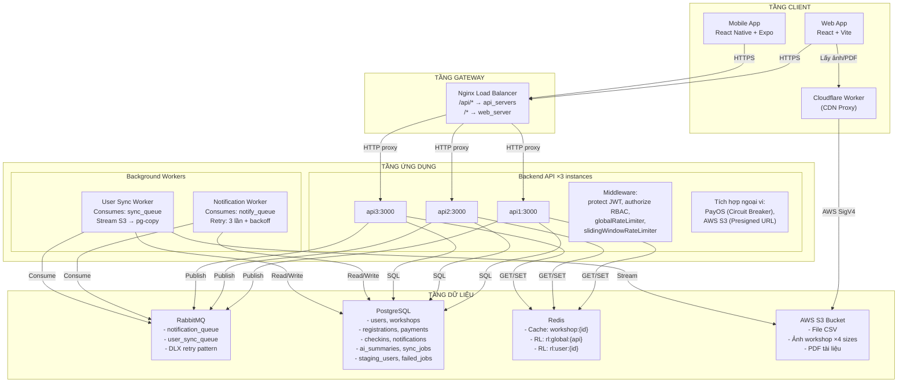
```mermaid
graph TB
    subgraph CLIENT["TẦNG CLIENT"]
        WebApp["Web App<br/>React + Vite"]
        MobileApp["Mobile App<br/>React Native + Expo"]
        CFWorker["Cloudflare Worker<br/>(CDN Proxy)"]
    end

    subgraph GATEWAY["TẦNG GATEWAY"]
        Nginx["Nginx Load Balancer<br/>/api/* → api_servers<br/>/* → web_server"]
    end

    subgraph APP["TẦNG ỨNG DỤNG"]
        subgraph API["Backend API ×3 instances"]
            API1["api1:3000"]
            API2["api2:3000"]
            API3["api3:3000"]
            MWS["Middleware:<br/>protect JWT, authorize RBAC,<br/>globalRateLimiter,<br/>slidingWindowRateLimiter"]
            INT["Tích hợp ngoại vi:<br/>PayOS (Circuit Breaker),<br/>AWS S3 (Presigned URL)"]
        end
        
        subgraph Workers["Background Workers"]
            NotifW["Notification Worker<br/>Consumes: notify_queue<br/>Retry: 3 lần + backoff"]
            SyncW["User Sync Worker<br/>Consumes: sync_queue<br/>Stream S3 → pg-copy"]
        end
    end

    subgraph DATA["TẦNG DỮ LIỆU"]
        RMQ["RabbitMQ<br/>- notification_queue<br/>- user_sync_queue<br/>- DLX retry pattern"]
        PG["PostgreSQL<br/>- users, workshops<br/>- registrations, payments<br/>- checkins, notifications<br/>- ai_summaries, sync_jobs<br/>- staging_users, failed_jobs"]
        Redis["Redis<br/>- Cache: workshop:{id}<br/>- RL: rl:global:{api}<br/>- RL: rl:user:{id}"]
        S3["AWS S3 Bucket<br/>- File CSV<br/>- Ảnh workshop ×4 sizes<br/>- PDF tài liệu"]
    end

    WebApp -->|HTTPS| Nginx
    MobileApp -->|HTTPS| Nginx
    CFWorker -->|AWS SigV4| S3

    Nginx -->|HTTP proxy| API1
    Nginx -->|HTTP proxy| API2
    Nginx -->|HTTP proxy| API3

    API1 -->|SQL| PG
    API2 -->|SQL| PG
    API3 -->|SQL| PG
    API1 -->|GET/SET| Redis
    API2 -->|GET/SET| Redis
    API3 -->|GET/SET| Redis
    API1 -->|Publish| RMQ
    API2 -->|Publish| RMQ
    API3 -->|Publish| RMQ

    NotifW -->|Consume| RMQ
    SyncW -->|Consume| RMQ
    NotifW -->|Read/Write| PG
    SyncW -->|Read/Write| PG
    SyncW -->|Stream| S3

    WebApp -->|Lấy ảnh/PDF| CFWorker
```

#### Mô tả chi tiết từng thành phần

##### 1. Nginx Load Balancer
- **Vai trò:** Reverse proxy duy nhất tiếp nhận mọi request từ bên ngoài.
- **Cấu hình:** 
  - `upstream api_servers` gồm 3 backend: `api1:3000`, `api2:3000`, `api3:3000`.
  - `upstream web_server` trỏ đến `web:80`.
  - Request `/api/*` → proxy pass đến cụm API.
  - Request `/*` → proxy pass đến Web App (React).
  - Thuật toán mặc định: **Round Robin**.
- **Giao tiếp:** HTTP/1.1, truyền header `X-Real-IP`, `X-Forwarded-For`.
- **Khi sập:** Nếu Nginx chết, **toàn bộ hệ thống không thể truy cập từ bên ngoài**. Đây là single point of failure trong cấu hình development. Ở production, có thể thêm keepalived hoặc cloud load balancer.

##### 2. Backend API (× 3 instances)
- **Vai trò:** Xử lý toàn bộ logic nghiệp vụ cốt lõi.
- **Công nghệ:** Node.js 20+ với Express, kiến trúc phân lớp:
  - `routes/` — Định nghĩa endpoint, gắn middleware.
  - `controllers/` — Parse request, gọi service, trả response.
  - `services/` — Logic nghiệp vụ thuần (không biết về HTTP).
  - `repositories/` — Truy vấn SQL qua `pg.Pool`.
- **Stateless:** Không lưu session, mỗi instance xác thực độc lập qua JWT. Nhờ đó Nginx có thể phân tải tự do.
- **Giao tiếp:**
  - **Với PostgreSQL:** Qua `pg` connection pool (tối đa 20 connections/pool). Sử dụng transaction (`BEGIN/COMMIT`) và `SELECT ... FOR UPDATE` cho nghiệp vụ đăng ký.
  - **Với Redis:** Qua thư viện `redis`. Gửi lệnh `GET/SET/DEL` cho cache, `INCR/EXPIRE` và Lua scripts cho Rate Limiter.
  - **Với RabbitMQ:** Qua `amqplib`. Publish message vào `notification_queue` và `user_sync_queue`.
  - **Với PayOS:** Qua HTTPS REST, được bọc trong Circuit Breaker (`opossum`).
  - **Với AWS S3:** Qua AWS SDK. Tạo Presigned URL cho upload, không trực tiếp nhận file.
- **Khi sập 1 instance:** Nginx tự động chuyển request sang 2 instance còn lại (health check ngầm của Nginx). User không bị ảnh hưởng.
- **Khi sập cả 3 instance:** Toàn bộ API ngừng hoạt động. Web App vẫn hiển thị giao diện (SPA) nhưng không thể fetch dữ liệu mới. Mobile App không thể đồng bộ check-in. RabbitMQ, Redis, PostgreSQL vẫn chạy — dữ liệu không mất.

##### 3. Web App (React + Vite)
- **Vai trò:** Giao diện Sinh viên và Admin.
- **Công nghệ:** React 18, Vite, React Router.
- **Trang chính:**
  - `StudentDashboard` — Danh sách workshop, đăng ký, xem QR.
  - `StudentPayments` — Quản lý thanh toán.
  - `AdminWorkshops` — CRUD workshop.
  - `AdminStats` — Thống kê đăng ký.
  - `AdminPayments` — Quản lý thanh toán toàn hệ thống.
  - `AdminSyncUsers` — Đồng bộ CSV.
  - `AdminFailedJobs` — Xem job thất bại.
  - `Login`, `Profile`, `QrGenerator`.
- **Giao tiếp:** Gọi API qua `/api/*` (Nginx proxy). Client dùng JWT lưu trong localStorage.
- **Khi sập:** Nếu Web container chết, Nginx trả về 502 Bad Gateway. Không ảnh hưởng đến Mobile App và API. Sinh viên không xem được giao diện web nhưng dữ liệu trong DB vẫn nguyên vẹn.

##### 4. Mobile App (React Native + Expo)
- **Vai trò:** Ứng dụng quét QR check-in cho Staff.
- **Công nghệ:** React Native, Expo, AsyncStorage (lưu offline), expo-camera (quét QR), expo-network (phát hiện mạng).
- **Offline-first:** 
  - QR code chứa `workshop_id|registration_id` để app validate workshop ngay cả khi offline.
  - Dữ liệu check-in lưu vào AsyncStorage cục bộ.
  - Background hook `useAutoSync` phát hiện mạng và đồng bộ hàng loạt.
  - Cơ chế lock state (useRef) ngăn camera spam request.
- **Giao tiếp:** HTTPS REST đến Nginx → API. Khi mất mạng, lưu cục bộ và chờ đồng bộ.
- **Khi sập:** App vẫn quét QR và lưu offline bình thường. Không ảnh hưởng gì đến các thành phần khác.

##### 5. Background Workers (Node.js)
- **Vai trò:** Xử lý các tác vụ nền không cần phản hồi tức thời.
- **Hai worker riêng biệt** (cùng Docker image, khởi động trong `index.js`):
  
  **Notification Worker** (`notification.worker.js`):
  - Consume từ `notification_queue`.
  - Gửi email qua EmailStrategy (Strategy Pattern).
  - Retry tối đa 3 lần với exponential backoff (5s → 15s → 30s).
  - Sử dụng RabbitMQ DLX (Dead Letter Exchange) để tự động requeue sau TTL.
  - Khi thất bại hoàn toàn: lưu vào bảng `failed_jobs` để admin xem lại.
  
  **User Sync Worker** (`userSync.worker.js`):
  - Consume từ `user_sync_queue`.
  - Download CSV stream từ S3, pipe thẳng vào PostgreSQL qua `pg-copy-streams`.
  - Merge dữ liệu từ `staging_users` sang `users` bằng SQL `UPSERT`.
  - Tích hợp `node-cron` để quét `sync_jobs` pending theo lịch (`SYNC_CRON_SCHEDULE`).
  - `prefetch(1)` — chỉ xử lý 1 file/lần, tránh OOM.

- **Giao tiếp:** Nhận message từ RabbitMQ, đọc/ghi PostgreSQL, gọi API ngoài (email SMTP, AI model), stream từ S3.
- **Khi sập:** RabbitMQ không nhận ACK → message được requeue tự động. Khi worker khởi động lại, tiếp tục xử lý từ đầu. Không mất dữ liệu. API vẫn hoạt động bình thường (chỉ các tác vụ nền bị trì hoãn).

##### 6. PostgreSQL
- **Vai trò:** Cơ sở dữ liệu quan hệ chính, lưu toàn bộ dữ liệu nghiệp vụ.
- **Đặc điểm:**
  - OLTP workload: đọc/ghi nhỏ, tần suất cao, yêu cầu latency thấp.
  - 9 bảng chính + 2 bảng staging/sync.
  - Row-Level Locking (`SELECT ... FOR UPDATE`) cho nghiệp vụ đăng ký.
  - Trigger `sync_workshop_available_seats()` tự động cập nhật `available_seats`.
  - Constraint `CHECK (available_seats >= 0)` bảo vệ ở tầng DB.
  - Unique constraints chống trùng lặp (registration, payment, checkin).
  - UUID làm khóa chính (bảo mật, tránh lộ số lượng).
- **Giao tiếp:** Qua TCP/IP. API và Worker kết nối qua connection pool.
- **Khi sập:** **Toàn bộ hệ thống ngừng hoạt động** — API không thể đọc/ghi dữ liệu, Worker không thể xử lý job. Đây là single point of failure. Trong môi trường development, sử dụng Supabase (managed PostgreSQL) để giảm rủi ro.

##### 7. Redis
- **Vai trò:** Cache và Rate Limiter phân tán.
- **Hai chức năng chính:**
  - **Cache Workshop:** Lưu thông tin workshop với TTL động (`calculateCacheTTL`): 1 giờ cho workshop mới tạo, 30 phút quanh thời gian diễn ra sự kiện.
  - **Rate Limiter:** Lưu trạng thái cho 2 tầng rate limit:
    - Global: giới hạn tổng request vào API đăng ký.
    - User-level (Sliding Window): mỗi user tối đa 1 req/5s, dùng ZSET (Sorted Set).
- **Giao tiếp:** TCP, thư viện `redis` npm. API kết nối khi khởi động.
- **Khi sập:** 
  - Cache miss: API fallback về đọc trực tiếp từ PostgreSQL → chậm hơn nhưng **không mất chức năng**.
  - Rate Limiter mất: Mọi request vượt qua rate limit → tăng áp lực lên DB. Hệ thống vẫn chạy nhưng dễ bị quá tải.
  - Worker vẫn hoạt động bình thường (không phụ thuộc Redis).

##### 8. RabbitMQ
- **Vai trò:** Message broker điều phối tác vụ bất đồng bộ.
- **Hai queue chính:**
  - `notification_queue` (durable, persistent) — gửi email xác nhận.
  - `user_sync_queue` (durable, persistent) — đồng bộ CSV.
- **Cơ chế:**
  - Manual ACK (không auto-ack) để đảm bảo không mất message.
  - DLX pattern cho retry với delay.
  - `prefetch(1)` giới hạn mỗi worker xử lý 1 message/lần.
- **Giao tiếp:** AMQP (port 5672). Management UI tại port 15672.
- **Khi sập:** 
  - API vẫn publish message (sẽ fail nhưng không crash nhờ error handling).
  - Worker không consume được → email không gửi, CSV không đồng bộ.
  - **Dữ liệu nghiệp vụ chính (đăng ký, thanh toán) không bị ảnh hưởng.**
  - Khi RabbitMQ khởi động lại, message trong durable queue vẫn tồn tại.

##### 9. Cloudflare Worker (CDN Proxy)
- **Vai trò:** Proxy CDN cho AWS S3, ký AWS Signature V4.
- **Hoạt động:** Nhận request HTTP, ký chữ ký AWS, forward sang S3, trả về response với Cache-Control header.
- **Cache policy:** Ảnh đã xử lý (`/processed/`) cache 30 ngày; file khác cache 1 giờ.
- **Giao tiếp:** HTTPS (từ client) → S3 API (từ worker).
- **Khi sập:** Ảnh workshop và PDF không hiển thị được. Các chức năng khác không bị ảnh hưởng.

##### 10. AWS S3
- **Vai trò:** Lưu trữ file tĩnh.
- **Dữ liệu lưu trữ:**
  - File CSV đồng bộ sinh viên.
  - Ảnh workshop (gốc + 3 kích thước: thumb, medium, large).
  - PDF tài liệu workshop.
- **Giao tiếp:** 
  - Presigned URL cho upload (client upload trực tiếp, không qua API).
  - GetObject qua Cloudflare Worker (CDN) hoặc trực tiếp từ Worker (stream pipe).
- **Khi sập:** Upload và download file không hoạt động. Chức năng đăng ký, thanh toán, check-in không bị ảnh hưởng.

---

### Ma trận ảnh hưởng khi sự cố (Failure Impact Matrix)

| Thành phần sập ↓ | API | Web App | Mobile App | Worker | DB | Cache | Queue | Ảnh hưởng người dùng |
|---|---|---|---|---|---|---|---|---|
| **Nginx** | 🔴 Mất kết nối | 🔴 502 | 🔴 502 | 🟢 | 🟢 | 🟢 | 🟢 | **Toàn bộ hệ thống không truy cập được** |
| **API (1 instance)** | 🟡 Nginx chuyển | 🟢 | 🟢 | 🟢 | 🟢 | 🟢 | 🟢 | Không ảnh hưởng |
| **API (cả 3)** | 🔴 Ngừng | 🔴 Không fetch | 🔴 Không sync | 🟢 | 🟢 | 🟢 | 🟢 | **Không đăng ký/thanh toán được** |
| **Web App** | 🟢 | 🔴 502 | 🟢 | 🟢 | 🟢 | 🟢 | 🟢 | Sinh viên không xem được web |
| **Mobile App** | 🟢 | 🟢 | 🔴 | 🟢 | 🟢 | 🟢 | 🟢 | Staff không quét QR được |
| **Worker** | 🟢 | 🟢 | 🟢 | 🔴 | 🟢 | 🟢 | 🟡 Pending | Email chậm, CSV chưa sync |
| **PostgreSQL** | 🔴 Lỗi DB | 🔴 Lỗi fetch | 🔴 Lỗi sync | 🔴 Lỗi DB | 🔴 | 🟢 | 🟢 | **Toàn bộ hệ thống ngừng** |
| **Redis** | 🟡 Chậm hơn | 🟡 Chậm hơn | 🟡 Chậm hơn | 🟢 | 🟢 | 🔴 | 🟢 | Chậm, mất rate limit |
| **RabbitMQ** | 🟡 Fail publish | 🟢 | 🟢 | 🔴 Không consume | 🟢 | 🟢 | 🔴 | Email không gửi, CSV không sync |
| **Cloudflare Worker** | 🟢 | 🔴 Thiếu ảnh | 🔴 Thiếu ảnh | 🟢 | 🟢 | 🟢 | 🟢 | Ảnh/PDF không hiển thị |
| **AWS S3** | 🟡 Upload lỗi | 🔴 Thiếu ảnh | 🟢 | 🔴 Sync lỗi | 🟢 | 🟢 | 🟢 | Upload/sync file không hoạt động |

> 🔴 = Ngừng hoạt động hoàn toàn  
> 🟡 = Suy giảm chức năng  
> 🟢 = Không ảnh hưởng

### Single Points of Failure & Biện pháp giảm thiểu

| Điểm yếu | Mức độ nghiêm trọng | Biện pháp trong hiện tại | Hướng cải thiện cho production |
|---|---|---|---|
| **Nginx** | Rất cao — mất toàn bộ kết nối | Restart policy: `unless-stopped` | Thêm cloud load balancer (AWS ALB), multi-AZ |
| **PostgreSQL** | Rất cao — mất toàn bộ dữ liệu | Supabase managed (có backup, replication) | Multi-region replication, read replicas |
| **RabbitMQ** | Trung bình — chỉ ảnh hưởng tác vụ nền | Durable queues, persistent messages | RabbitMQ cluster với mirrored queues |
| **Redis** | Thấp — hệ thống chạy chậm nhưng không sập | Fallback về DB khi cache miss | Redis Sentinel / Cluster |

---

## C4 Diagram

### Level 1 — System Context
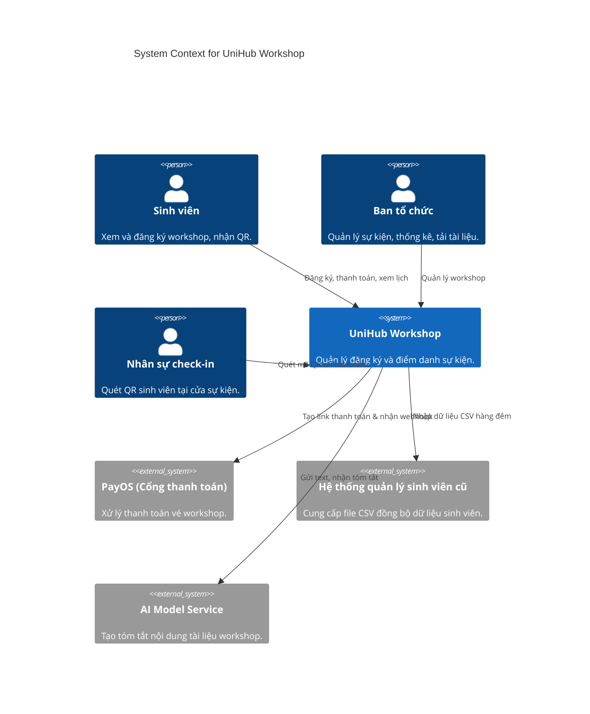
```mermaid
C4Context
  title System Context for UniHub Workshop
  Person(student, "Sinh viên", "Xem và đăng ký workshop, nhận QR.")
  Person(admin, "Ban tổ chức", "Quản lý sự kiện, thống kê, tải tài liệu.")
  Person(staff, "Nhân sự check-in", "Quét QR sinh viên tại cửa sự kiện.")
  
  System(unihub, "UniHub Workshop", "Quản lý đăng ký và điểm danh sự kiện.")
  
  System_Ext(payos, "PayOS (Cổng thanh toán)", "Xử lý thanh toán vé workshop.")
  System_Ext(legacy_sys, "Hệ thống quản lý sinh viên cũ", "Cung cấp file CSV đồng bộ dữ liệu sinh viên.")
  System_Ext(ai_service, "AI Model Service", "Tạo tóm tắt nội dung tài liệu workshop.")

  Rel(student, unihub, "Đăng ký, thanh toán, xem lịch")
  Rel(admin, unihub, "Quản lý workshop")
  Rel(staff, unihub, "Quét mã QR offline/online")
  
  Rel(unihub, payos, "Tạo link thanh toán & nhận webhook")
  Rel(unihub, legacy_sys, "Nhập dữ liệu CSV hàng đêm")
  Rel(unihub, ai_service, "Gửi text, nhận tóm tắt")
```

### Level 2 — Container
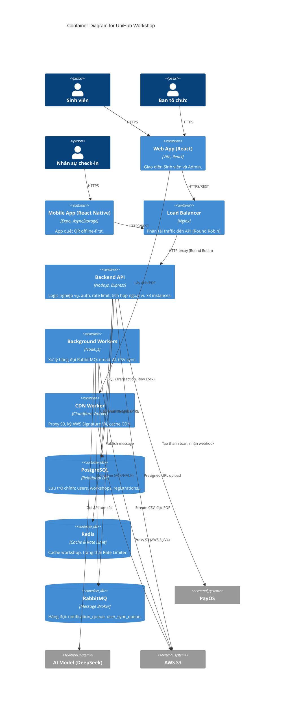
```mermaid
C4Container
  title Container Diagram for UniHub Workshop
  
  Person(student, "Sinh viên")
  Person(admin, "Ban tổ chức")
  Person(staff, "Nhân sự check-in")

  Container(web_app, "Web App (React)", "Vite, React", "Giao diện Sinh viên và Admin.")
  Container(mobile_app, "Mobile App (React Native)", "Expo, AsyncStorage", "App quét QR offline-first.")
  
  Container(load_balancer, "Load Balancer", "Nginx", "Phân tải traffic đến API (Round Robin).")
  Container(api_service, "Backend API", "Node.js, Express", "Logic nghiệp vụ, auth, rate limit, tích hợp ngoại vi. ×3 instances.")
  Container(worker, "Background Workers", "Node.js", "Xử lý hàng đợi RabbitMQ: email, AI, CSV sync.")
  Container(cdn_worker, "CDN Worker", "Cloudflare Worker", "Proxy S3, ký AWS Signature V4, cache CDN.")
  
  ContainerDb(db, "PostgreSQL", "Relational DB", "Lưu trữ chính: users, workshops, registrations...")
  ContainerDb(cache, "Redis", "Cache & Rate Limit", "Cache workshop, trạng thái Rate Limiter.")
  ContainerDb(mq, "RabbitMQ", "Message Broker", "Hàng đợi: notification_queue, user_sync_queue.")

  System_Ext(payos, "PayOS")
  System_Ext(ai_service, "AI Model (DeepSeek)")
  System_Ext(s3, "AWS S3")

  Rel(student, web_app, "HTTPS")
  Rel(admin, web_app, "HTTPS")
  Rel(staff, mobile_app, "HTTPS")
  
  Rel(web_app, load_balancer, "HTTPS/REST")
  Rel(mobile_app, load_balancer, "HTTPS/REST")
  Rel(web_app, cdn_worker, "Lấy ảnh/PDF")
  
  Rel(load_balancer, api_service, "HTTP proxy (Round Robin)")
  
  Rel(api_service, db, "SQL (Transaction, Row Lock)")
  Rel(api_service, cache, "GET/SET/INCR/EXPIRE")
  Rel(api_service, mq, "Publish message")
  Rel(api_service, payos, "Tạo thanh toán, nhận webhook")
  Rel(api_service, s3, "Presigned URL upload")
  
  Rel(worker, mq, "Consume (ACK/NACK)")
  Rel(worker, db, "Cập nhật trạng thái")
  Rel(worker, ai_service, "Gọi API tóm tắt")
  Rel(worker, s3, "Stream CSV, đọc PDF")
  
  Rel(cdn_worker, s3, "Proxy S3 (AWS SigV4)")
```

---

## High-Level Architecture Diagram

Sơ đồ dưới đây thể hiện luồng dữ liệu và sự phụ thuộc giữa các thành phần tại các điểm tích hợp chính của hệ thống.

### 1. Tích hợp cổng thanh toán (PayOS)

Đây là luồng dữ liệu giữa UniHub Workshop và cổng thanh toán PayOS, bao gồm cả nhánh xử lý khi PayOS gặp sự cố (Circuit Breaker Open):

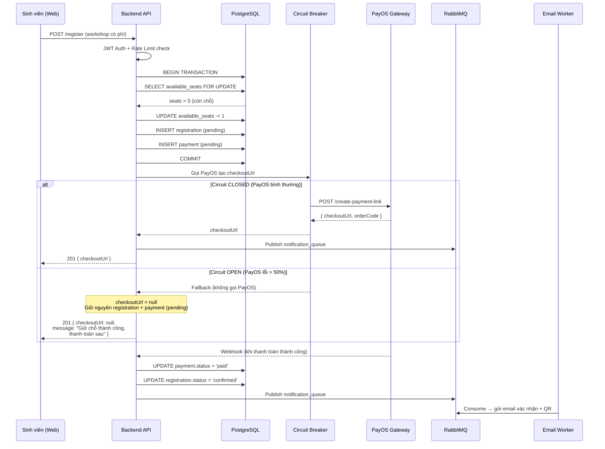
```mermaid
sequenceDiagram
    participant S as Sinh viên (Web)
    participant API as Backend API
    participant DB as PostgreSQL
    participant CB as Circuit Breaker
    participant PayOS as PayOS Gateway
    participant MQ as RabbitMQ
    participant W as Email Worker

    S->>API: POST /register (workshop có phí)
    API->>API: JWT Auth + Rate Limit check
    
    API->>DB: BEGIN TRANSACTION
    API->>DB: SELECT available_seats FOR UPDATE
    DB-->>API: seats = 5 (còn chỗ)
    API->>DB: UPDATE available_seats -= 1
    API->>DB: INSERT registration (pending)
    API->>DB: INSERT payment (pending)
    API->>DB: COMMIT
    
    API->>CB: Gọi PayOS tạo checkoutUrl
    
    alt Circuit CLOSED (PayOS bình thường)
        CB->>PayOS: POST /create-payment-link
        PayOS-->>CB: { checkoutUrl, orderCode }
        CB-->>API: checkoutUrl
        API->>MQ: Publish notification_queue
        API-->>S: 201 { checkoutUrl }
    else Circuit OPEN (PayOS lỗi > 50%)
        CB-->>API: Fallback (không gọi PayOS)
        Note over API: checkoutUrl = null<br/>Giữ nguyên registration + payment (pending)
        API-->>S: 201 { checkoutUrl: null,<br/>message: "Giữ chỗ thành công,<br/>thanh toán sau" }
    end

    PayOS-->>API: Webhook (khi thanh toán thành công)
    API->>DB: UPDATE payment.status = 'paid'
    API->>DB: UPDATE registration.status = 'confirmed'
    API->>MQ: Publish notification_queue
    W->>MQ: Consume → gửi email xác nhận + QR
```

**Điểm mấu chốt**: Khi Circuit Breaker OPEN, hệ thống **không trả về lỗi** mà chuyển sang chế độ Graceful Degradation — sinh viên vẫn được giữ chỗ, frontend hiển thị nút "Thanh toán lại" để sinh viên chủ động gọi khi PayOS hồi phục.

### 2. Tích hợp hệ thống cũ (CSV Sync)

Luồng dữ liệu từ hệ thống quản lý sinh viên cũ (chỉ xuất CSV, không có API) vào UniHub Workshop:

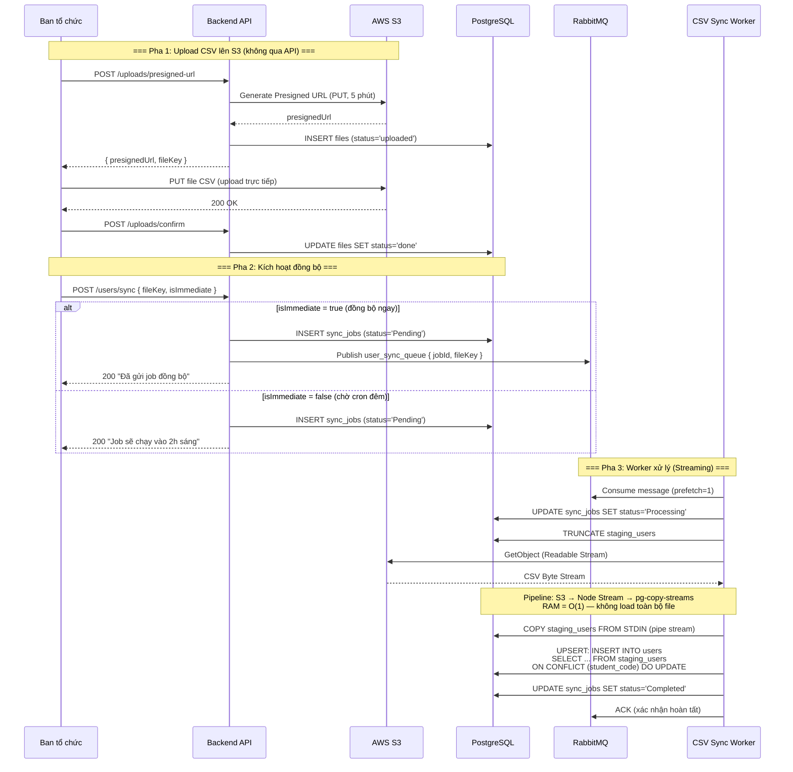
```mermaid
sequenceDiagram
    participant Admin as Ban tổ chức
    participant API as Backend API
    participant S3 as AWS S3
    participant DB as PostgreSQL
    participant MQ as RabbitMQ
    participant W as CSV Sync Worker

    Note over Admin,S3: === Pha 1: Upload CSV lên S3 (không qua API) ===
    Admin->>API: POST /uploads/presigned-url
    API->>S3: Generate Presigned URL (PUT, 5 phút)
    S3-->>API: presignedUrl
    API->>DB: INSERT files (status='uploaded')
    API-->>Admin: { presignedUrl, fileKey }

    Admin->>S3: PUT file CSV (upload trực tiếp)
    S3-->>Admin: 200 OK
    
    Admin->>API: POST /uploads/confirm
    API->>DB: UPDATE files SET status='done'

    Note over Admin,DB: === Pha 2: Kích hoạt đồng bộ ===
    Admin->>API: POST /users/sync { fileKey, isImmediate }
    
    alt isImmediate = true (đồng bộ ngay)
        API->>DB: INSERT sync_jobs (status='Pending')
        API->>MQ: Publish user_sync_queue { jobId, fileKey }
        API-->>Admin: 200 "Đã gửi job đồng bộ"
    else isImmediate = false (chờ cron đêm)
        API->>DB: INSERT sync_jobs (status='Pending')
        API-->>Admin: 200 "Job sẽ chạy vào 2h sáng"
    end

    Note over MQ,W: === Pha 3: Worker xử lý (Streaming) ===
    W->>MQ: Consume message (prefetch=1)
    W->>DB: UPDATE sync_jobs SET status='Processing'
    
    W->>DB: TRUNCATE staging_users
    W->>S3: GetObject (Readable Stream)
    S3-->>W: CSV Byte Stream
    
    Note over W,DB: Pipeline: S3 → Node Stream → pg-copy-streams<br/>RAM = O(1) — không load toàn bộ file
    
    W->>DB: COPY staging_users FROM STDIN (pipe stream)
    W->>DB: UPSERT: INSERT INTO users<br/>SELECT ... FROM staging_users<br/>ON CONFLICT (student_code) DO UPDATE
    
    W->>DB: UPDATE sync_jobs SET status='Completed'
    W->>MQ: ACK (xác nhận hoàn tất)
```

**Điểm mấu chốt**: Dữ liệu CSV **chưa từng được nạp toàn bộ vào RAM** — pipeline stream trực tiếp từ S3 qua Node.js (chỉ giữ buffer nhỏ) vào PostgreSQL, cho phép xử lý file hàng GB trên server 512MB RAM.

### 3. Tích hợp AI Model (DeepSeek)

Luồng dữ liệu khi Admin upload PDF giới thiệu workshop và hệ thống sinh tóm tắt bằng AI:

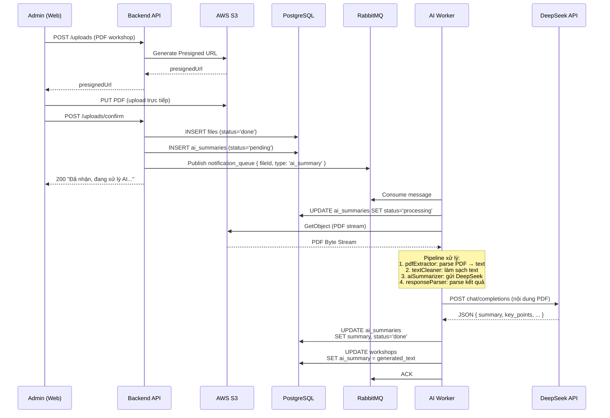
```mermaid
sequenceDiagram
    participant A as Admin (Web)
    participant API as Backend API
    participant S3 as AWS S3
    participant DB as PostgreSQL
    participant MQ as RabbitMQ
    participant W as AI Worker
    participant AI as DeepSeek API

    A->>API: POST /uploads (PDF workshop)
    API->>S3: Generate Presigned URL
    S3-->>API: presignedUrl
    API-->>A: presignedUrl

    A->>S3: PUT PDF (upload trực tiếp)
    A->>API: POST /uploads/confirm
    API->>DB: INSERT files (status='done')
    API->>DB: INSERT ai_summaries (status='pending')
    API->>MQ: Publish notification_queue { fileId, type: 'ai_summary' }
    API-->>A: 200 "Đã nhận, đang xử lý AI..."

    W->>MQ: Consume message
    W->>DB: UPDATE ai_summaries SET status='processing'
    
    W->>S3: GetObject (PDF stream)
    S3-->>W: PDF Byte Stream
    
    Note over W: Pipeline xử lý:<br/>1. pdfExtractor: parse PDF → text<br/>2. textCleaner: làm sạch text<br/>3. aiSummarizer: gửi DeepSeek<br/>4. responseParser: parse kết quả

    W->>AI: POST chat/completions (nội dung PDF)
    AI-->>W: JSON { summary, key_points, ... }
    
    W->>DB: UPDATE ai_summaries<br/>SET summary, status='done'
    W->>DB: UPDATE workshops<br/>SET ai_summary = generated_text
    W->>MQ: ACK
```

**Điểm mấu chốt**: Pipeline pattern (`pdfExtractor → textCleaner → aiSummarizer → responseParser`) cho phép thêm/bớt/sắp xếp các bước xử lý mà không thay đổi code lõi. Mỗi filter là một class độc lập implement cùng interface.

### 4. Check-in Offline (Luồng dữ liệu khi mất mạng)

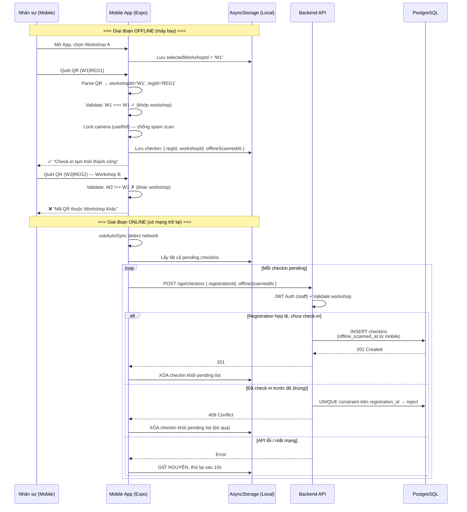
```mermaid
sequenceDiagram
    participant Staff as Nhân sự (Mobile)
    participant App as Mobile App (Expo)
    participant AS as AsyncStorage (Local)
    participant API as Backend API
    participant DB as PostgreSQL

    Note over Staff,AS: === Giai đoạn OFFLINE (máy bay) ===
    Staff->>App: Mở App, chọn Workshop A
    App->>AS: Lưu selectedWorkshopId = 'W1'
    
    Staff->>App: Quét QR (W1|REG1)
    App->>App: Parse QR → workshopId='W1', regId='REG1'
    App->>App: Validate: W1 === W1 ✓ (khớp workshop)
    App->>App: Lock camera (useRef) — chống spam scan
    
    App->>AS: Lưu checkin: { regId, workshopId, offlineScannedAt }
    App-->>Staff: ✅ "Check-in tạm thời thành công"
    
    Staff->>App: Quét QR (W2|REG2) — Workshop B
    App->>App: Validate: W2 !== W1 ✗ (khác workshop)
    App-->>Staff: ❌ "Mã QR thuộc Workshop khác"

    Note over Staff,AS: === Giai đoạn ONLINE (có mạng trở lại) ===
    App->>App: useAutoSync detect network
    App->>AS: Lấy tất cả pending checkins
    
    loop Mỗi checkin pending
        App->>API: POST /api/checkins { registrationId, offlineScannedAt }
        API->>API: JWT Auth (staff) + Validate workshop
        
        alt Registration hợp lệ, chưa check-in
            API->>DB: INSERT checkins<br/>(offline_scanned_at từ mobile)
            DB-->>API: 201 Created
            API-->>App: 201
            App->>AS: XÓA checkin khỏi pending list
        else Đã check-in trước đó (trùng)
            API->>DB: UNIQUE constraint trên registration_id → reject
            API-->>App: 409 Conflict
            App->>AS: XÓA checkin khỏi pending list (bỏ qua)
        else API lỗi / mất mạng
            API-->>App: Error
            App->>AS: GIỮ NGUYÊN, thử lại sau 10s
        end
    end
```

**Nguyên tắc cốt lõi**: **Không bao giờ xóa dữ liệu offline** cho đến khi nhận HTTP 201 từ server. Nếu API lỗi hoặc mạng lại mất giữa chừng, dữ liệu vẫn an toàn trong AsyncStorage.

### 5. Sơ đồ phụ thuộc tổng thể (Dependency Map)

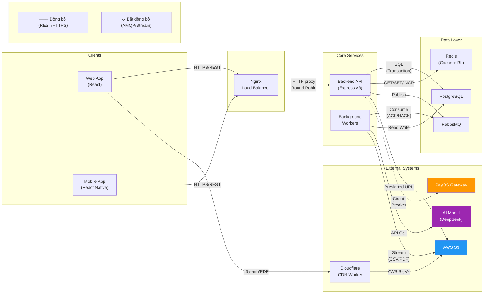
```mermaid
graph LR
    subgraph Clients["Clients"]
        WA["Web App<br/>(React)"]
        MA["Mobile App<br/>(React Native)"]
    end

    subgraph Gateway[" "]
        Nginx["Nginx<br/>Load Balancer"]
    end

    subgraph Core["Core Services"]
        API["Backend API<br/>(Express ×3)"]
        Worker["Background<br/>Workers"]
    end

    subgraph Data["Data Layer"]
        PG["PostgreSQL"]
        Redis["Redis<br/>(Cache + RL)"]
        RMQ["RabbitMQ"]
    end

    subgraph External["External Systems"]
        S3["AWS S3"]
        PayOS["PayOS Gateway"]
        AI["AI Model<br/>(DeepSeek)"]
        CDN["Cloudflare<br/>CDN Worker"]
    end

    WA -->|"HTTPS/REST"| Nginx
    MA -->|"HTTPS/REST"| Nginx
    WA -->|"Lấy ảnh/PDF"| CDN

    Nginx -->|"HTTP proxy<br/>Round Robin"| API

    API -->|"SQL<br/>(Transaction)"| PG
    API -->|"GET/SET/INCR"| Redis
    API -->|"Publish"| RMQ
    API -->|"Presigned URL"| S3
    API -.->|"Circuit<br/>Breaker"| PayOS

    Worker -->|"Consume<br/>(ACK/NACK)"| RMQ
    Worker -->|"Read/Write"| PG
    Worker -->|"API Call"| AI
    Worker -->|"Stream<br/>(CSV/PDF)"| S3

    CDN -->|"AWS SigV4"| S3

    %% Legend
    subgraph Legend[" "]
        L1["─── Đồng bộ (REST/HTTPS)"]
        L2["-.- Bất đồng bộ (AMQP/Stream)"]
    end

    style PayOS fill:#ff9800,color:#fff
    style AI fill:#9c27b0,color:#fff
    style S3 fill:#2196f3,color:#fff
```

---

## Thiết kế cơ sở dữ liệu

Hệ thống sử dụng **PostgreSQL** làm cơ sở dữ liệu chính, kết hợp với **Redis** cho cache và rate limiting.

### Lựa chọn công nghệ

| Tiêu chí | PostgreSQL | Redis |
|---|---|---|
| **Vai trò** | Source of truth — toàn bộ dữ liệu nghiệp vụ | Cache & Rate Limiter state |
| **Tính nhất quán** | Strong Consistency (ACID) | Best-effort (cache TTL) |
| **Mô hình dữ liệu** | Relational (bảng, khóa ngoại, constraint) | Key-Value + Sorted Sets |
| **Khả năng mở rộng** | Vertical (scale-up) + Read Replica | Horizontal (cluster/sentinel) |
| **Lý do chọn** | Row-level locking cho chống overselling; ACID cho thanh toán; Schema cố định phù hợp nghiệp vụ | In-memory tốc độ cao cho rate limit; TTL tự động hết hạn cache; ZSET cho sliding window |

### Vì sao PostgreSQL mà không phải MongoDB?

Nghiệp vụ cốt lõi của hệ thống là **giữ chỗ** và **thanh toán** — cả hai đều yêu cầu:
- **Tính toàn vẹn giao dịch (ACID)**: Một đăng ký phải đồng thời tạo `registration` + giảm `available_seats`. Nếu một bước thất bại, toàn bộ phải rollback.
- **Row-Level Locking**: Khi 2 sinh viên cùng giành chỗ cuối, database phải xếp hàng tuần tự — PostgreSQL làm được điều này với `SELECT ... FOR UPDATE`.
- **Ràng buộc phức tạp**: `CHECK (available_seats >= 0)`, `UNIQUE (student_id, workshop_id)`, `UNIQUE INDEX ... WHERE status = 'success'`.

MongoDB không đảm bảo được multi-document ACID transaction với hiệu suất cao như PostgreSQL trong kịch bản này.

### Lược đồ (Schema) chính

Chi tiết đầy đủ tại `blueprint/database/script_schema.sql`. Dưới đây là các bảng cốt lõi:

#### `users` — Quản lý định danh & phân quyền
| Cột | Kiểu | Ràng buộc | Mô tả |
|---|---|---|---|
| `id` | UUID | PK, DEFAULT gen_random_uuid() | Khóa chính |
| `student_code` | TEXT | UNIQUE | Mã số sinh viên (đối chiếu CSV) |
| `name` | TEXT | NOT NULL | Họ tên |
| `email` | TEXT | NOT NULL UNIQUE | Email đăng nhập |
| `password_hash` | TEXT | NOT NULL | Mật khẩu đã băm (bcrypt + salt) |
| `role` | TEXT | NOT NULL, CHECK (IN 'student','admin','staff') | Phân quyền |
| `created_at` | TIMESTAMP | DEFAULT NOW() | Thời gian tạo |

#### `workshops` — Thông tin sự kiện
| Cột | Kiểu | Ràng buộc | Mô tả |
|---|---|---|---|
| `id` | UUID | PK | Khóa chính |
| `title` | TEXT | NOT NULL | Tên workshop |
| `description` | TEXT | | Mô tả chi tiết |
| `capacity` | INT | NOT NULL, CHECK (> 0) | Tổng số chỗ |
| `available_seats` | INT | NOT NULL, CHECK (>= 0), CHECK (<= capacity) | Chỗ còn trống (tự động cập nhật bởi trigger) |
| `price` | DECIMAL | DEFAULT 0, CHECK (>= 0) | Phí tham dự (0 = miễn phí) |
| `start_time` | TIMESTAMP | NOT NULL | Thời gian bắt đầu |
| `end_time` | TIMESTAMP | NOT NULL, CHECK (> start_time) | Thời gian kết thúc |
| `location` | TEXT | | Phòng tổ chức |
| `speaker` | TEXT | | Diễn giả |
| `room_map_url` | TEXT | | Sơ đồ phòng |
| `created_by` | UUID | FK → users(id), ON DELETE SET NULL | Admin tạo workshop |

#### `registrations` — Liên kết Sinh viên ↔ Workshop
| Cột | Kiểu | Ràng buộc | Mô tả |
|---|---|---|---|
| `id` | UUID | PK | Khóa chính |
| `student_id` | UUID | NOT NULL, FK → users(id) CASCADE | Sinh viên đăng ký |
| `workshop_id` | UUID | NOT NULL, FK → workshops(id) CASCADE | Workshop được đăng ký |
| `status` | TEXT | NOT NULL, CHECK (IN 'pending','confirmed','cancelled') | Trạng thái |
| `created_at` | TIMESTAMP | DEFAULT NOW() | Thời gian đăng ký |

Ràng buộc đặc biệt: `UNIQUE (student_id, workshop_id)` — mỗi sinh viên chỉ đăng ký 1 workshop 1 lần.

**Trigger `sync_workshop_available_seats()`**: Tự động cập nhật `workshops.available_seats` khi INSERT/UPDATE/DELETE trên `registrations`, đảm bảo số ghế luôn nhất quán.

#### `payments` — Quản lý thanh toán
| Cột | Kiểu | Ràng buộc | Mô tả |
|---|---|---|---|
| `id` | UUID | PK | Khóa chính |
| `registration_id` | UUID | NOT NULL, FK → registrations(id) CASCADE | Đăng ký liên quan |
| `amount` | DECIMAL | NOT NULL, CHECK (>= 0) | Số tiền |
| `status` | TEXT | NOT NULL, CHECK (IN 'pending','paid','failed','expired') | Trạng thái |
| `idempotency_key` | TEXT | UNIQUE | Khóa chống trừ 2 lần |
| `order_code` | SERIAL | UNIQUE | Mã đơn hàng PayOS |
| `checkout_url` | TEXT | | Link thanh toán |
| `external_id` | TEXT | | paymentLinkId từ PayOS |
| `created_at` | TIMESTAMP | DEFAULT NOW() | Thời gian tạo |

Ràng buộc đặc biệt: `UNIQUE INDEX unique_success_payment ON payments(registration_id) WHERE status = 'success'` — mỗi đăng ký chỉ có 1 thanh toán thành công.

#### `checkins` — Lịch sử quét QR
| Cột | Kiểu | Ràng buộc | Mô tả |
|---|---|---|---|
| `id` | UUID | PK | Khóa chính |
| `registration_id` | UUID | NOT NULL UNIQUE, FK → registrations(id) CASCADE | Đăng ký được check-in |
| `checkin_time` | TIMESTAMP | | Thời điểm đồng bộ lên server |
| `offline_scanned_at` | TIMESTAMP | | Thời điểm quét QR thực tế (offline) |
| `status` | TEXT | NOT NULL, CHECK (IN 'pending','synced') | Trạng thái đồng bộ |
| `staff_id` | UUID | FK → users(id), ON DELETE SET NULL | Nhân sự quét QR |

#### Bảng phụ trợ
- **`workshop_staffs`**: Phân công staff cho từng workshop. `UNIQUE (workshop_id, staff_id)`.
- **`notifications`**: Lịch sử gửi thông báo (`type`: email/sms/push, `status`: pending/sent/failed).
- **`ai_summaries`**: Kết quả tóm tắt AI từ PDF. `UNIQUE (file_id)`.
- **`files`**: Metadata file upload lên S3 (`status`: uploaded/processing/done).
- **`workshop_images`**: Ảnh workshop với 3 kích thước (thumb, medium, large) + CDN URL.
- **`sync_jobs`**: Tracking tiến độ đồng bộ CSV (`status`: Pending/Processing/Completed/Failed).
- **`staging_users`**: Bảng tạm không constraint để đổ CSV siêu tốc qua `COPY`.
- **`failed_jobs`**: Lưu payload của job thất bại để admin xem lại.

### Chiến lược Indexing

Chỉ tạo index tối thiểu trên khóa chính và khóa ngoại bắt buộc trong giai đoạn đầu. Lý do: 12.000 sinh viên tạo ra lượng `INSERT` khổng lồ vào `registrations` trong 10 phút đầu — index làm chậm quá trình ghi. Chiến lược dài hạn: monitor slow query log để thêm composite index chính xác theo pattern truy xuất thực tế.

### Trade-off: Strong vs Eventual Consistency

| Luồng nghiệp vụ | Mức nhất quán | Lý do |
|---|---|---|
| **Đăng ký + Thanh toán** | **Strong Consistency** | Số chỗ trống và trạng thái thanh toán phải chính xác tuyệt đối, chấp nhận latency cao hơn do transaction. |
| **Cache Workshop (Redis)** | **Eventual Consistency** | Chấp nhận dữ liệu cache lệch vài giây so với DB. Khi cache TTL hết hạn, đọc lại từ DB. |
| **Email Notification** | **Eventual Consistency** | Gửi email có thể trễ vài giây, không ảnh hưởng đến nghiệp vụ chính. |
| **AI Summary** | **Eventual Consistency** | Sinh tóm tắt mất vài chục giây, không cần đồng bộ tức thời. |
| **CSV Sync** | **Eventual Consistency** | Dữ liệu sinh viên mới có độ trễ vài phút, chấp nhận được với lịch sync đêm. |

---

## Thiết kế kiểm soát truy cập

Hệ thống sử dụng mô hình **RBAC (Role-Based Access Control)** với **JWT (JSON Web Tokens)**.

### Ba nhóm người dùng

| Role | Quyền hạn | API được phép |
|---|---|---|
| **`student`** | Xem danh sách workshop, đăng ký, thanh toán, xem QR của bản thân | `GET /api/workshops`, `POST /api/workshops/:id/register`, `GET/POST /api/payments/*`, `GET /api/registrations/my` |
| **`admin`** | Toàn quyền CRUD workshop, xem thống kê, quản lý đồng bộ CSV, upload PDF, phân công staff | `POST/PUT/DELETE /api/workshops`, `GET /api/admin/stats`, `POST /api/users/sync`, `POST /api/uploads/*` |
| **`staff`** | Chỉ quét QR check-in tại workshop được phân công | `POST /api/checkins`, `GET /api/workshops/:id/checkins` |

### Luồng xác thực

1. **Login**: Client gửi `POST /api/auth/login` với `{ email, password }`.
2. **Xác thực**: Backend tìm user trong DB, so sánh password_hash với bcrypt.
3. **Cấp JWT**: Backend sinh token chứa payload `{ id, role }`, ký bằng `JWT_SECRET`, trả về client.
4. **Gửi request**: Client gắn `Authorization: Bearer <token>` vào mọi request.
5. **Middleware `protect`**: Decode JWT, trích xuất `userId` và `role`, kiểm tra user tồn tại trong DB.
6. **Middleware `authorize(...roles)`**: Kiểm tra role của user có nằm trong danh sách cho phép không. Nếu không → 403 Forbidden.

### Các kịch bản lỗi xác thực

| Tình huống | HTTP Status | Hành vi |
|---|---|---|
| Token hết hạn/sai chữ ký | 401 Unauthorized | Client logout, chuyển về trang login |
| User bị xóa nhưng token còn hạn | 401 Unauthorized | `protect` kiểm tra DB, không tìm thấy user |
| Role không đủ quyền | 403 Forbidden | Student gọi API Admin, Staff gọi API đăng ký |
| Thiếu token | 401 Unauthorized | Request không có header Authorization |

### Ràng buộc bảo mật

- **Mật khẩu**: Băm bằng `bcrypt` với salt ngẫu nhiên trước khi lưu vào DB.
- **JWT TTL**: 7 ngày cho mobile app (offline check-in), 24 giờ cho Web App.
- **JWT_SECRET**: Lưu trong biến môi trường, không hardcode.
- **UUID làm khóa chính**: Tránh lộ số lượng người dùng (so với auto-increment integer).

---

## Thiết kế các cơ chế bảo vệ hệ thống

### 1. Kiểm soát tải đột biến (Rate Limiting)

**Bài toán**: 12.000 sinh viên truy cập đồng loạt, 60% (7.200 người) dồn vào 3 phút đầu → ~40 req/s chỉ riêng API đăng ký. Nếu không kiểm soát, PostgreSQL cạn kiệt connection pool (tối đa 20 connections/pool × 3 instances = 60 connections), gây timeout hàng loạt.

**Thiết kế 2 tầng Rate Limiter trên Redis**:

#### Tầng 1: Global Rate Limiter (Fixed Window)
- **Mục tiêu**: Bảo vệ PostgreSQL connection pool.
- **Thuật toán**: Fixed Window Counter trên Redis.
- **Giới hạn**: Toàn bộ hệ thống tối đa N request/giây cho endpoint đăng ký.
- **Key pattern**: `rl:global:{api_endpoint}:{window_timestamp}`
- **Redis command**: `INCR` + `EXPIRE`.
- **Middleware**: `globalRateLimiter` — áp dụng cho `POST /api/workshops/:id/register`.

#### Tầng 2: User-level Sliding Window Rate Limiter
- **Mục tiêu**: Ngăn một user spam đăng ký liên tục.
- **Thuật toán**: Sliding Window Log trên Redis Sorted Set (ZSET).
- **Giới hạn**: Mỗi user tối đa 1 request/5 giây cho endpoint đăng ký.
- **Key pattern**: `rl:user:{user_id}:{api_endpoint}`
- **Redis command**: 
  1. `ZREMRANGEBYSCORE` xóa entries cũ ngoài window.
  2. `ZCARD` đếm số request trong window.
  3. Nếu < limit: `ZADD` thêm timestamp mới.
- **Middleware**: `slidingWindowRateLimiter(1, 5000)` — 1 request mỗi 5000ms.

#### Hành vi khi vượt ngưỡng
- HTTP 429 Too Many Requests.
- Response body: `{ message: "Hệ thống đang quá tải, vui lòng thử lại sau vài giây" }`.
- Frontend hiển thị thông báo thân thiện, không crash.

### 2. Xử lý cổng thanh toán không ổn định (Circuit Breaker)

**Bài toán**: PayOS có thể timeout hoặc trả về 5xx. Nếu API Node.js chờ đợi đồng bộ, thread bị kẹt → kéo theo request xem danh sách workshop của sinh viên khác cũng thất bại (cascading failure).

**Giải pháp: Circuit Breaker Pattern với thư viện `opossum`**:

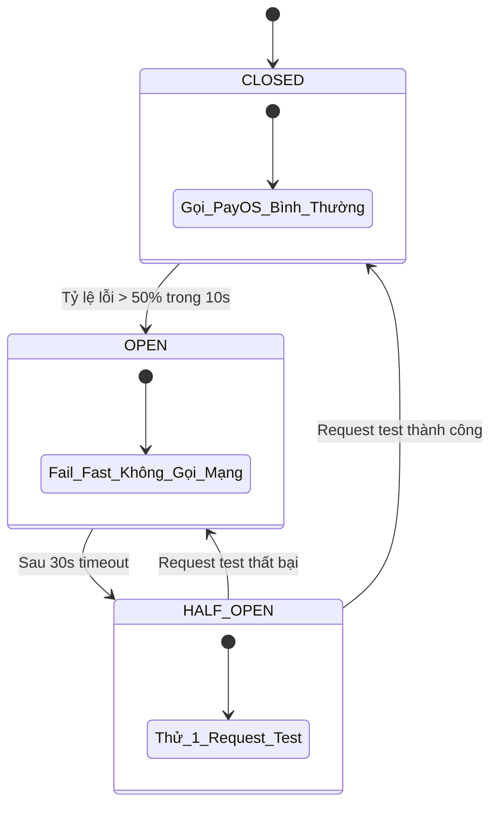
```mermaid
stateDiagram-v2
    [*] --> CLOSED
    CLOSED --> OPEN : Tỷ lệ lỗi > 50% trong 10s
    OPEN --> HALF_OPEN : Sau 30s timeout
    HALF_OPEN --> CLOSED : Request test thành công
    HALF_OPEN --> OPEN : Request test thất bại

    state CLOSED {
        [*] --> Gọi_PayOS_Bình_Thường
    }
    state OPEN {
        [*] --> Fail_Fast_Không_Gọi_Mạng
    }
    state HALF_OPEN {
        [*] --> Thử_1_Request_Test
    }
```

#### Graceful Degradation (Fallback)
Khi Circuit Breaker ở trạng thái **OPEN**, thay vì ném lỗi 500 cho sinh viên, hệ thống thực thi hàm Fallback:

1. Vẫn tạo `Registration` với `status = 'pending'`.
2. Vẫn tạo `Payment` với `status = 'pending'`, `checkout_url = null`.
3. Vẫn giảm `available_seats` của workshop.
4. Trả về response: `{ checkoutUrl: null, message: "Cổng thanh toán đang bảo trì. Bạn đã được giữ chỗ và có thể thanh toán sau." }`.
5. Frontend hiển thị nút "Thanh toán lại" để sinh viên chủ động gọi lại.

→ **Sinh viên không bị mất chỗ dù cổng thanh toán sập.**

### 3. Chống trừ tiền hai lần & Tranh chấp chỗ ngồi (Idempotency)

**Bài toán A — Tranh chấp chỗ ngồi (Race Condition)**:
Workshop 60 chỗ, 100 sinh viên cùng bấm đăng ký. Nếu dùng code JavaScript kiểm tra ghế trống rồi trừ (check-then-act), hai request có thể cùng thấy `available_seats = 1` và cùng đăng ký thành công → 61 người / 60 chỗ.

**Giải pháp**: Database Transaction + Row-Level Locking
```sql
BEGIN;
  -- Khóa dòng workshop này, các request khác phải xếp hàng
  SELECT available_seats FROM workshops WHERE id = $1 FOR UPDATE;
  -- Kiểm tra còn chỗ không
  IF available_seats <= 0 THEN ROLLBACK; -- Hết chỗ
  -- Giảm ghế
  UPDATE workshops SET available_seats = available_seats - 1;
  -- Tạo registration
  INSERT INTO registrations ...;
COMMIT;
```
Request thứ hai sẽ bị block ở `SELECT ... FOR UPDATE` cho đến khi request đầu COMMIT. Lúc đó `available_seats = 0` → bị từ chối.

**Bảo vệ tầng DB**: Constraint `CHECK (available_seats >= 0)` và trigger `sync_workshop_available_seats()` đảm bảo ngay cả khi code có bug, DB vẫn từ chối overselling.

**Bài toán B — Trùng lặp thanh toán (Double Charge)**:
Sinh viên bấm đăng ký liên tục, sinh ra nhiều payment.

**Giải pháp**: Idempotency Key + Unique Constraint
1. Khi sinh viên gửi request thanh toán, API kiểm tra: đã có `Registration` với `status = 'pending'` của workshop này chưa?
2. Nếu **đã có**: Không tạo mới, lấy `order_code` của Payment cũ, gọi lại PayOS lấy link (hoặc trả link cũ nếu còn hạn).
3. Nếu **chưa có**: Tạo mới với `idempotency_key` UNIQUE.
4. Tầng DB: `UNIQUE INDEX unique_success_payment ON payments(registration_id) WHERE status = 'success'` — không thể có 2 payment thành công cho cùng 1 registration.

### 4. Dead Letter Queue & Message Retry (DLQ Pattern)

**Bài toán**: Khi Worker xử lý tác vụ nền (gửi email, AI summary, CSV sync) gặp lỗi, nếu message bị hủy ngay thì:
- Email xác nhận không bao giờ được gửi → sinh viên không nhận QR.
- AI summary thất bại âm thầm → admin không biết để xử lý lại.
- CSV sync lỗi → dữ liệu sinh viên lỗi thời.

**Giải pháp**: Hệ thống triển khai **Dead Letter Exchange (DLX) Pattern** trên RabbitMQ kết hợp với bảng `failed_jobs` trong PostgreSQL:

#### Cơ chế Retry với Exponential Backoff (Notification Worker)

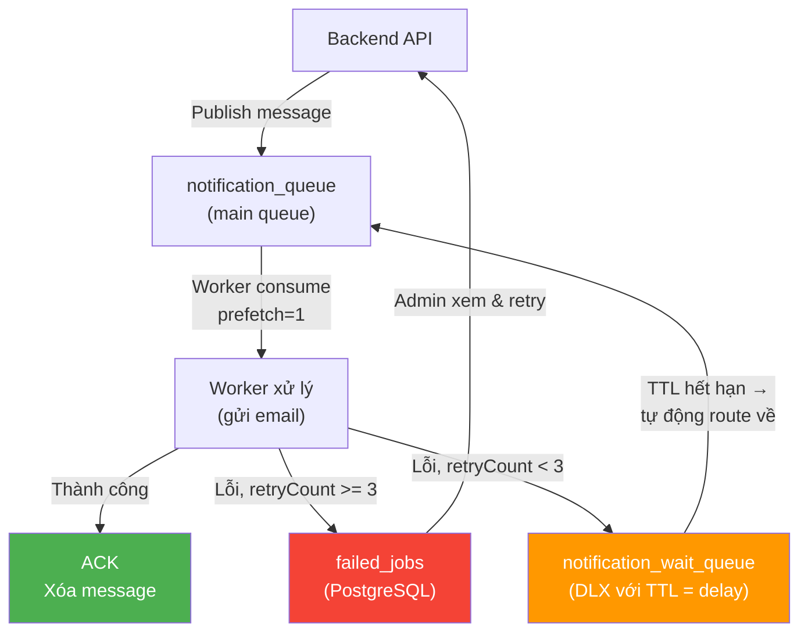
```mermaid
flowchart TD
    API["Backend API"] -->|Publish message| NQ["notification_queue<br/>(main queue)"]
    NQ -->|Worker consume<br/>prefetch=1| W["Worker xử lý<br/>(gửi email)"]
    
    W -->|Thành công| ACK["ACK<br/>Xóa message"]
    W -->|Lỗi, retryCount >= 3| FJ["failed_jobs<br/>(PostgreSQL)"]
    W -->|Lỗi, retryCount < 3| WAIT["notification_wait_queue<br/>(DLX với TTL = delay)"]
    
    FJ -->|Admin xem & retry| API
    WAIT -->|"TTL hết hạn →<br/>tự động route về"| NQ

    style ACK fill:#4caf50,color:#fff
    style FJ fill:#f44336,color:#fff
    style WAIT fill:#ff9800,color:#fff
```

#### Cấu hình RabbitMQ DLX cho Retry

```javascript
// Tạo các Wait Queue với TTL và DLX
const delays = [5000, 15000, 30000]; // 5s, 15s, 30s (exponential backoff)

for (const delay of delays) {
  await channel.assertQueue(`notification_wait_queue_${delay}`, {
    durable: true,
    arguments: {
      'x-dead-letter-exchange': '',           // Default exchange
      'x-dead-letter-routing-key': 'notification_queue', // Route về main queue
      'x-message-ttl': delay,                 // Tự động expire sau delay
    },
  });
}
```

#### Luồng xử lý

1. Worker nhận message từ `notification_queue`.
2. Gửi email. Nếu **thành công**: `channel.ack(msg)` — message bị xóa khỏi queue.
3. Nếu **thất bại**:
   - Tăng `retryCount` trong message payload.
   - Nếu `retryCount < 3`: publish vào `notification_wait_queue_{delay}` tương ứng. Message sẽ tự động quay lại `notification_queue` sau TTL. **Không cần code timer.**
   - Nếu `retryCount >= 3`: lưu payload vào bảng `failed_jobs` của PostgreSQL, gửi `channel.ack(msg)` để xóa khỏi RabbitMQ (tránh infinite loop).
4. Admin có thể xem danh sách job thất bại tại `AdminFailedJobs.jsx` và quyết định retry thủ công hoặc bỏ qua.

```
Retry attempt 1: delay 5s  → Wait Queue (TTL 5s)  → notification_queue → Worker
Retry attempt 2: delay 15s → Wait Queue (TTL 15s) → notification_queue → Worker
Retry attempt 3: delay 30s → Wait Queue (TTL 30s) → notification_queue → Worker
Retry attempt 4: ❌ → failed_jobs (PostgreSQL)
```

### 5. Bảng Failed Jobs & Admin Dashboard

**Bài toán**: Khi tác vụ nền thất bại hoàn toàn (sau 3 lần retry), admin cần biết để xử lý. Không thể để email thất bại âm thầm.

**Giải pháp**: Bảng `failed_jobs` lưu mọi job thất bại để admin xem và retry:

| Cột | Kiểu | Mô tả |
|---|---|---|
| `id` | SERIAL PK | ID tự động tăng |
| `payload` | JSONB NOT NULL | Toàn bộ payload của message gốc |
| `error_message` | TEXT | Thông báo lỗi (vd: "SMTP connection timeout") |
| `failed_at` | TIMESTAMP DEFAULT NOW() | Thời điểm thất bại |
| `status` | TEXT DEFAULT 'failed' | Trạng thái: `failed`, `retried` |

**Admin Dashboard** (`AdminFailedJobs.jsx`):
- Hiển thị danh sách job thất bại theo thời gian gần nhất.
- Mỗi job hiển thị: loại (email/ai/csv), payload (tóm tắt), lỗi, thời gian.
- Nút **Retry**: Admin bấm → job được publish lại vào queue tương ứng → status chuyển thành `retried`.
- Nút **Dismiss**: Đánh dấu đã xem, không retry.

Việc có dashboard này đảm bảo **không có lỗi nào bị bỏ sót** — admin luôn biết chính xác email nào chưa gửi được, AI summary nào thất bại, CSV sync nào lỗi.

### 6. Bảo vệ Database Connection Pool

**Bài toán**: 12.000 sinh viên tạo ra lượng request khổng lồ. Mỗi API instance có connection pool tối đa 20 connections. Nếu tất cả request cùng cố gắng lấy connection từ pool, pool cạn kiệt → các request khác phải chờ → timeout hàng loạt.

**Giải pháp**:

| Cơ chế | Mô tả |
|---|---|
| **Connection Pool Limit** | `pg.Pool({ max: 20 })` — mỗi API instance tối đa 20 connections. Tổng 60 connections cho 3 instances. |
| **Connection Timeout** | `connectionTimeoutMillis: 2000` — nếu không lấy được connection trong 2s, báo lỗi ngay thay vì chờ vô hạn. |
| **Idle Timeout** | `idleTimeoutMillis: 30000` — connection idle 30s sẽ bị đóng, giải phóng tài nguyên. |
| **Rate Limiter bảo vệ pool** | Global Rate Limiter giới hạn tổng request/giây vào DB < connection pool capacity. |
| **Cache giảm DB hit** | Redis cache danh sách workshop → phần lớn request đọc không cần query DB. |
| **Bất đồng bộ hóa tác vụ nặng** | CSV sync, AI summary được đẩy vào RabbitMQ → Worker có connection pool riêng, không cạnh tranh với API. |

### 7. Input Validation & Sanitization

**Bài toán**: Dữ liệu đầu vào từ client có thể chứa SQL injection, XSS, hoặc payload quá lớn gây crash server.

**Giải pháp**:

| Lớp bảo vệ | Công cụ / Kỹ thuật | Mô tả |
|---|---|---|
| **Body size limit** | `express.json({ limit: '1mb' })` | Từ chối request có body > 1MB — chống DoS qua payload lớn. |
| **SQL Injection** | Parameterized queries (`$1`, `$2`) trong repository | Mọi query đều dùng prepared statements, không nối chuỗi SQL. |
| **XSS** | Helmet middleware | Set security headers: CSP, X-Frame-Options, X-Content-Type-Options. |
| **Input sanitization** | Validation trong controller | Kiểm tra kiểu dữ liệu, format (email regex, UUID format), required fields. |
| **CORS** | `cors({ origin: ... })` | Chỉ cho phép origin của Web App và Mobile App. |
| **File upload** | Presigned URL (không qua API) | File không đi qua server Node.js — tránh upload bomb. File size limit được cấu hình ở S3. |

### 8. Graceful Shutdown (Tắt hệ thống an toàn)

**Bài toán**: Khi `docker-compose down`, nếu các request đang xử lý dở dang bị ngắt đột ngột, transaction có thể bị treo, message bị mất.

**Giải pháp**: Express server lắng nghe tín hiệu `SIGTERM` / `SIGINT`:

```
Docker stop → SIGTERM → Server:
  1. Ngừng nhận request mới (health check báo unhealthy)
  2. Đợi các request đang xử lý hoàn tất (grace period 30s)
  3. Đóng connection pool PostgreSQL (pg.Pool.end())
  4. Đóng kết nối Redis (redis.quit())
  5. Đóng kết nối RabbitMQ (connection.close())
  6. Process exit (0)
```

Docker Compose có thể cấu hình `stop_grace_period: 30s` để đảm bảo container không bị kill cứng.

## Các quyết định kỹ thuật quan trọng (ADR)

### ADR 1: PostgreSQL (SQL) vs MongoDB (NoSQL)
- **Lựa chọn**: PostgreSQL.
- **Lý do**: Nghiệp vụ cốt lõi (giữ chỗ, thanh toán) đòi hỏi ACID Transactions với Row-Level Locking. PostgreSQL là chuẩn vàng cho OLTP với dữ liệu có quan hệ chặt chẽ. MongoDB không đảm bảo multi-document ACID transaction hiệu suất cao trong kịch bản race condition.
- **Đánh đổi**: Khó scale-out ngang. Giải quyết bằng cách thêm Redis cache và RabbitMQ để giãn tải đọc/ghi.

### ADR 2: JWT (Stateless) vs Session (Stateful)
- **Lựa chọn**: JWT.
- **Lý do**: 3 instance API sau Nginx Load Balancer. JWT stateless — mọi instance đều có thể xác thực độc lập mà không cần Redis Session Store. Token chứa `{ id, role }` giúp middleware `protect` và `authorize` không cần query DB mỗi request (chỉ query khi cần kiểm tra user còn tồn tại).
- **Đánh đổi**: Không thể revoke token ngay lập tức. Giải quyết bằng TTL ngắn (24h cho web, 7 ngày cho mobile) và kiểm tra DB trong middleware `protect`.

### ADR 3: RabbitMQ cho Background Jobs
- **Lựa chọn**: RabbitMQ thay vì xử lý trực tiếp trên Express thread hoặc dùng Redis Pub/Sub.
- **Lý do**: 
  - Các tác vụ (gửi email, import CSV, AI summary) tốn thời gian. Đẩy vào queue → API response ngay.
  - Durable queues + persistent messages → không mất dữ liệu khi worker crash.
  - ACK/NACK mechanism → tự động requeue.
  - DLX pattern → retry với delay thông minh.
  - `prefetch(1)` → mỗi worker chỉ xử lý 1 message, tránh OOM với CSV lớn.
- **Đánh đổi**: Tăng độ phức tạp hạ tầng (thêm 1 service, cần monitor queue).

### ADR 4: Presigned URL Upload (S3) vs Upload qua API
- **Lựa chọn**: Presigned URL — client upload trực tiếp lên S3.
- **Lý do**: File CSV có thể lên tới hàng trăm MB. Nếu upload qua API, Node.js phải buffer toàn bộ file → OOM, chiếm băng thông server, block thread. Presigned URL giúp API chỉ xử lý metadata (vài ms), còn việc upload do AWS chịu.
- **Đánh đổi**: Cần cấu hình CORS trên S3 bucket, quản lý lifecycle policy để xóa file cũ.

### ADR 5: Streaming Pipeline (S3 → pg-copy-streams) vs Load File vào RAM
- **Lựa chọn**: Streaming pipeline — S3 ReadStream → Node.js PassThrough → PostgreSQL COPY FROM STDIN.
- **Lý do**: Hỗ trợ file CSV kích thước bất kỳ (MB đến GB) với RAM O(1). Nếu load vào RAM rồi parse CSV, Node.js sẽ OOM với file lớn. `pg-copy-streams` là cách nhanh nhất để nạp dữ liệu vào PostgreSQL (nhanh hơn INSERT row-by-row hàng trăm lần).
- **Đánh đổi**: Không thể validate từng dòng trước khi import (không báo lỗi dòng nào thất bại). Staging table giúp cách ly dữ liệu bẩn trước khi merge.

### ADR 6: Database Trigger vs Application-Level Logic cho Seat Management
- **Lựa chọn**: Database Trigger `sync_workshop_available_seats()` + Application Transaction.
- **Lý do**: Trigger ở tầng DB là lớp bảo vệ cuối cùng — ngay cả khi application code có bug, DB vẫn đảm bảo `available_seats` nhất quán với `registrations`. Kết hợp với `CHECK (available_seats >= 0)`, không cách nào overselling xảy ra.
- **Đánh đổi**: Trigger ẩn logic, khó debug. Được cân bằng bởi application-level transaction vẫn là lớp chính, trigger chỉ là safety net.

### ADR 7: Retry với DLX (RabbitMQ) vs Manual Retry trong Code
- **Lựa chọn**: RabbitMQ Dead Letter Exchange (DLX) cho retry tự động, bảng `failed_jobs` cho retry thủ công.
- **Lý do**:
  - DLX + TTL tự động delay và requeue message **mà không cần code timer** trong JavaScript — tránh giữ message trong RAM của worker, tránh mất message khi worker crash giữa chừng.
  - Exponential backoff (5s → 15s → 30s) giúp xử lý lỗi tạm thời (SMTP timeout, API rate limit) mà không spam.
  - Sau 3 lần thất bại: lưu vào `failed_jobs` (PostgreSQL) thay vì dead-letter queue vô hạn — tránh infinite loop, cho phép admin kiểm tra và retry thủ công.
  - `prefetch(1)` đảm bảo mỗi worker chỉ xử lý 1 message/lần, tránh OOM với CSV lớn.
- **Đánh đổi**: Cấu hình DLX phức tạp hơn so với `setTimeout` + `channel.nack()`. Bù lại, độ tin cậy cao hơn nhiều — message tồn tại trên disk của RabbitMQ, không trong RAM của worker.

### ADR 8: Failed Jobs Table (PostgreSQL) vs RabbitMQ Dead Letter Queue cho Final Failure
- **Lựa chọn**: Bảng `failed_jobs` trong PostgreSQL cho các job thất bại hoàn toàn.
- **Lý do**:
  - RabbitMQ DLQ thuần túy không cung cấp giao diện quản lý thân thiện. Bảng `failed_jobs` cho phép admin xem, lọc, retry từng job từ Web Admin Dashboard.
  - Lưu trong PostgreSQL giúp dễ dàng query, phân tích lỗi theo thời gian, loại job.
  - Payload JSONB lưu toàn bộ message gốc — admin có thể xem chi tiết để debug.
  - Tích hợp trực tiếp vào Admin Web App (`AdminFailedJobs.jsx`) — không cần truy cập RabbitMQ Management UI.
- **Đánh đổi**: Tăng dung lượng DB theo thời gian. Giải quyết bằng cách thêm job định kỳ xóa `failed_jobs` cũ hơn 30 ngày, hoặc admin chủ động dismiss.

### ADR 9: 2-Tầng Rate Limiting (Global + User) vs Chỉ 1 Tầng
- **Lựa chọn**: 2 tầng — Global Rate Limiter (Fixed Window) + User-level Rate Limiter (Sliding Window).
- **Lý do**:
  - Chỉ dùng 1 tầng không đủ: nếu chỉ có Global Limit 100 req/s, một user có thể spam chiếm hết quota. Nếu chỉ có User Limit 1 req/5s, 1000 user khác nhau vẫn có thể đồng loạt gửi request và làm cạn connection pool.
  - Fixed Window cho Global vì đơn giản, hiệu quả — chỉ cần `INCR` + `EXPIRE`.
  - Sliding Window cho User vì công bằng hơn — ngăn user gửi 2 request ở cuối window cũ và đầu window mới (burst tại boundary).
- **Đánh đổi**: Tốn nhiều Redis memory hơn (ZSET cho sliding window). Cấu hình 2 middleware riêng biệt. Bù lại, bảo vệ toàn diện hơn.

### ADR 10: Strategy Pattern cho Notification vs Hardcode Email
- **Lựa chọn**: Strategy Pattern (`BaseStrategy` → `EmailStrategy`, có thể mở rộng `SmsStrategy`, `TelegramStrategy`).
- **Lý do**:
  - Requirements yêu cầu "dễ mở rộng thêm kênh thông báo mới". Strategy Pattern cho phép thêm kênh mới chỉ bằng cách tạo class mới implement `send()` — không sửa code hiện có (Open/Closed Principle).
  - `NotificationContext` chọn strategy dựa trên `type` trong message — dễ dàng thêm logic routing (vd: gửi Email + SMS cùng lúc).
- **Đánh đổi**: Tăng số lượng file/class. Với quy mô hiện tại (chỉ Email), có thể coi là over-engineering. Nhưng đây là yêu cầu tường minh từ đề bài, và chi phí triển khai thấp.

### ADR 11: Pipeline Pattern cho AI Summary vs Monolithic Function
- **Lựa chọn**: Pipeline Pattern (`pdfExtractor → textCleaner → aiSummarizer → responseParser`).
- **Lý do**:
  - Mỗi filter là một class độc lập implement cùng interface `Filter.process(input) → output`. Có thể thêm, bớt, sắp xếp lại thứ tự mà không ảnh hưởng filter khác.
  - Dễ test từng filter riêng lẻ.
  - Nếu sau này đổi AI model (từ DeepSeek sang GPT), chỉ cần thay `aiSummarizer`.
  - Nếu thêm bước dịch (translate) hoặc lọc ngôn ngữ nhạy cảm, chỉ cần chèn filter mới vào pipeline.
- **Đánh đổi**: Tăng số lượng file. Overhead nhỏ do chuyển dữ liệu qua lại giữa các filter. Với file PDF vài MB, overhead này không đáng kể.


---


# Đặc tả: Kiểm soát truy cập và Phân quyền (Auth)

## Mô tả
Hệ thống sử dụng cơ chế xác thực không trạng thái (Stateless Authentication) dựa trên JSON Web Tokens (JWT). Việc phân quyền (Authorization) được thực thi ở mức Middleware của Backend API để đảm bảo chỉ những người dùng hợp lệ mới được truy cập vào các tài nguyên tương ứng.

## Luồng chính
1. Người dùng gửi thông tin đăng nhập (email, password) tới endpoint `/api/auth/login`.
2. Backend kiểm tra thông tin trong bảng `users`. Nếu hợp lệ, hệ thống sẽ mã hóa một chuỗi JWT bao gồm payload: `{ id, role }` kèm theo chữ ký bí mật.
3. Backend trả về JWT cho Client.
4. Client lưu trữ token ở Local Storage hoặc Async Storage.
5. Khi người dùng thực hiện các thao tác (vd: đăng ký workshop, thêm staff), Client gắn token vào Header: `Authorization: Bearer <token>`.
6. Hệ thống đi qua middleware `protect`:
   - Xác thực chữ ký token.
   - Giải mã lấy `id` và `role`.
   - Tìm user trong cơ sở dữ liệu để đảm bảo user vẫn còn tồn tại.
7. Hệ thống đi qua middleware `authorize('admin', 'student', ...)`:
   - Kiểm tra `role` của user có nằm trong danh sách được phép không.
   - Nếu có, cho qua (gọi controller tiếp theo).
   - Nếu không, chặn lại với lỗi 403 Forbidden.

## Kịch bản lỗi
- **Token hết hạn hoặc sai chữ ký:** Middleware `protect` trả về 401 Unauthorized. Client sẽ tự động logout người dùng.
- **Role không phù hợp:** Một sinh viên cố gắng truy cập endpoint của Admin (ví dụ `POST /api/workshops`). Middleware `authorize` trả về 403 Forbidden.
- **User bị xóa nhưng token còn hạn:** Middleware `protect` sẽ kiểm tra lại DB và không tìm thấy user, trả về 401 Unauthorized.

## Ràng buộc
- Token cần có thời gian hết hạn (Expiration Time - TTL) hợp lý (ví dụ: 7 ngày cho app check-in offline, 24 giờ cho Admin web).
- Mật khẩu lưu trong DB bắt buộc phải được băm (hashing) sử dụng `bcrypt` (kèm theo salt ngẫu nhiên) để đảm bảo tính an toàn nếu lộ lọt dữ liệu.

## Tiêu chí chấp nhận
- Người dùng `student` chỉ có thể gọi API xem và đăng ký, gọi API Admin sẽ bị lỗi 403.
- Người dùng `staff` chỉ có thể gọi API check-in.
- Admin không thể tự đăng ký Workshop dưới tư cách sinh viên (trừ phi dùng tài khoản sinh viên).
- Các API trả về đúng mã HTTP Status chuẩn: 401 khi chưa login, 403 khi thiếu quyền.

---

## Sơ đồ luồng (Sequence Diagram)

### Luồng đăng nhập và xác thực request

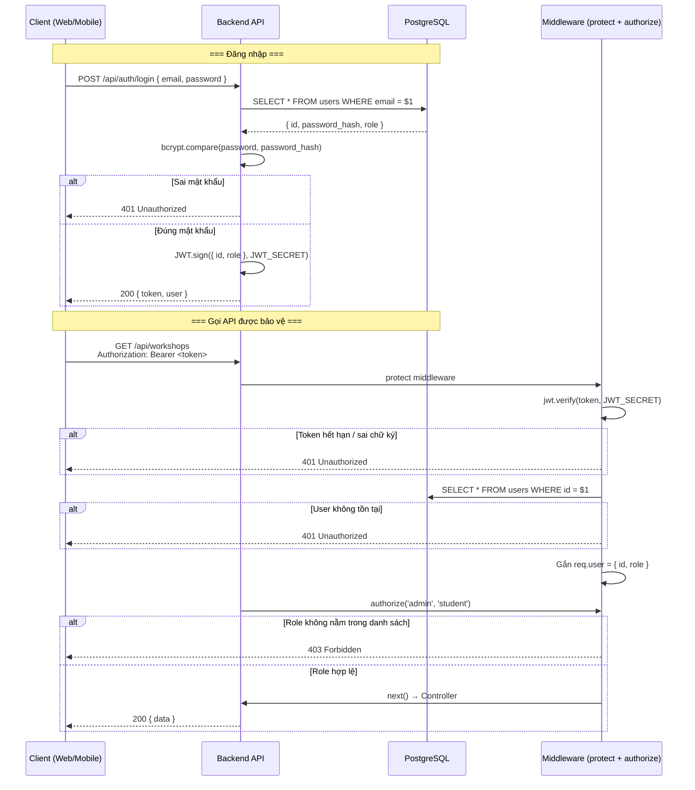
```mermaid
sequenceDiagram
    participant C as Client (Web/Mobile)
    participant API as Backend API
    participant DB as PostgreSQL
    participant MW as Middleware (protect + authorize)

    Note over C,DB: === Đăng nhập ===
    C->>API: POST /api/auth/login { email, password }
    API->>DB: SELECT * FROM users WHERE email = $1
    DB-->>API: { id, password_hash, role }
    API->>API: bcrypt.compare(password, password_hash)
    
    alt Sai mật khẩu
        API-->>C: 401 Unauthorized
    else Đúng mật khẩu
        API->>API: JWT.sign({ id, role }, JWT_SECRET)
        API-->>C: 200 { token, user }
    end

    Note over C,DB: === Gọi API được bảo vệ ===
    C->>API: GET /api/workshops<br/>Authorization: Bearer <token>
    
    API->>MW: protect middleware
    MW->>MW: jwt.verify(token, JWT_SECRET)
    alt Token hết hạn / sai chữ ký
        MW-->>C: 401 Unauthorized
    end
    MW->>DB: SELECT * FROM users WHERE id = $1
    alt User không tồn tại
        MW-->>C: 401 Unauthorized
    end
    MW->>MW: Gắn req.user = { id, role }
    
    API->>MW: authorize('admin', 'student')
    alt Role không nằm trong danh sách
        MW-->>C: 403 Forbidden
    else Role hợp lệ
        MW->>API: next() → Controller
        API-->>C: 200 { data }
    end
```

### Sơ đồ phân quyền (RBAC Matrix)

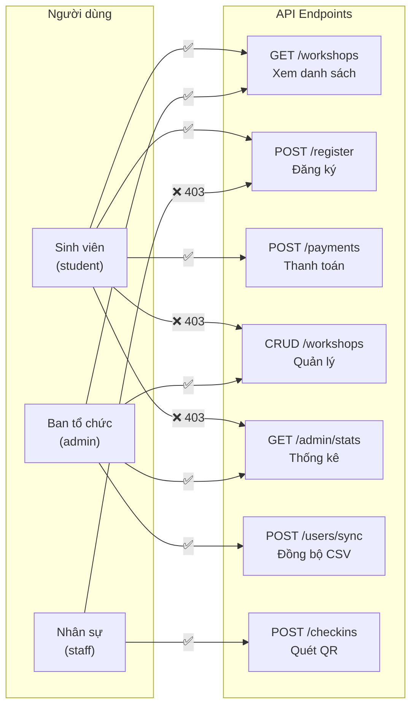
```mermaid
graph LR
    subgraph Users["Người dùng"]
        Student["Sinh viên<br/>(student)"]
        Admin["Ban tổ chức<br/>(admin)"]
        Staff["Nhân sự<br/>(staff)"]
    end

    subgraph APIs["API Endpoints"]
        A1["GET /workshops<br/>Xem danh sách"]
        A2["POST /register<br/>Đăng ký"]
        A3["POST /payments<br/>Thanh toán"]
        A4["CRUD /workshops<br/>Quản lý"]
        A5["GET /admin/stats<br/>Thống kê"]
        A6["POST /users/sync<br/>Đồng bộ CSV"]
        A7["POST /checkins<br/>Quét QR"]
    end

    Student -->|✅| A1
    Student -->|✅| A2
    Student -->|✅| A3
    Student -->|❌ 403| A4
    Student -->|❌ 403| A5
    
    Admin -->|✅| A1
    Admin -->|✅| A4
    Admin -->|✅| A5
    Admin -->|✅| A6
    
    Staff -->|✅| A7
    Staff -->|❌ 403| A2
```


---


# Đặc tả: Đăng ký tài khoản (Sign Up)

## Mô tả
Chức năng cho phép sinh viên mới tự tạo tài khoản trên hệ thống UniHub Workshop. Đối với sinh viên đã có trong hệ thống (qua đồng bộ CSV), tài khoản được tạo sẵn với mật khẩu mặc định và có thể đổi mật khẩu qua lần đăng nhập đầu tiên. Chức năng này cũng hỗ trợ Admin tạo tài khoản staff mới.

## Người dùng liên quan
- **Sinh viên mới**: Tự đăng ký tài khoản để tham gia workshop.
- **Admin**: Tạo tài khoản cho nhân sự check-in (staff).

## Luồng chính

### Sinh viên tự đăng ký
1. Sinh viên truy cập trang đăng ký, điền form: `name`, `email`, `student_code`, `password`.
2. Client gửi `POST /api/auth/signup` với payload form.
3. Backend kiểm tra:
   - `email` chưa tồn tại trong hệ thống.
   - `student_code` chưa tồn tại (nếu có).
   - `password` đủ mạnh (tối thiểu 6 ký tự).
4. Backend băm mật khẩu bằng `bcrypt` với salt ngẫu nhiên.
5. Lưu user mới vào bảng `users` với `role = 'student'`.
6. Trả về JWT token để tự động đăng nhập.

### Admin tạo tài khoản staff
1. Admin truy cập trang quản trị, điền form: `name`, `email`, chọn `role = 'staff'`.
2. Client gửi `POST /api/users` với payload và JWT admin.
3. Backend kiểm tra quyền admin qua middleware `authorize('admin')`.
4. Mật khẩu mặc định được sinh tự động (VD: `staff@123`).
5. Lưu user mới vào bảng `users`.
6. Gửi email thông báo cho staff mới (qua notification worker).

## Sơ đồ luồng (Sequence Diagram)

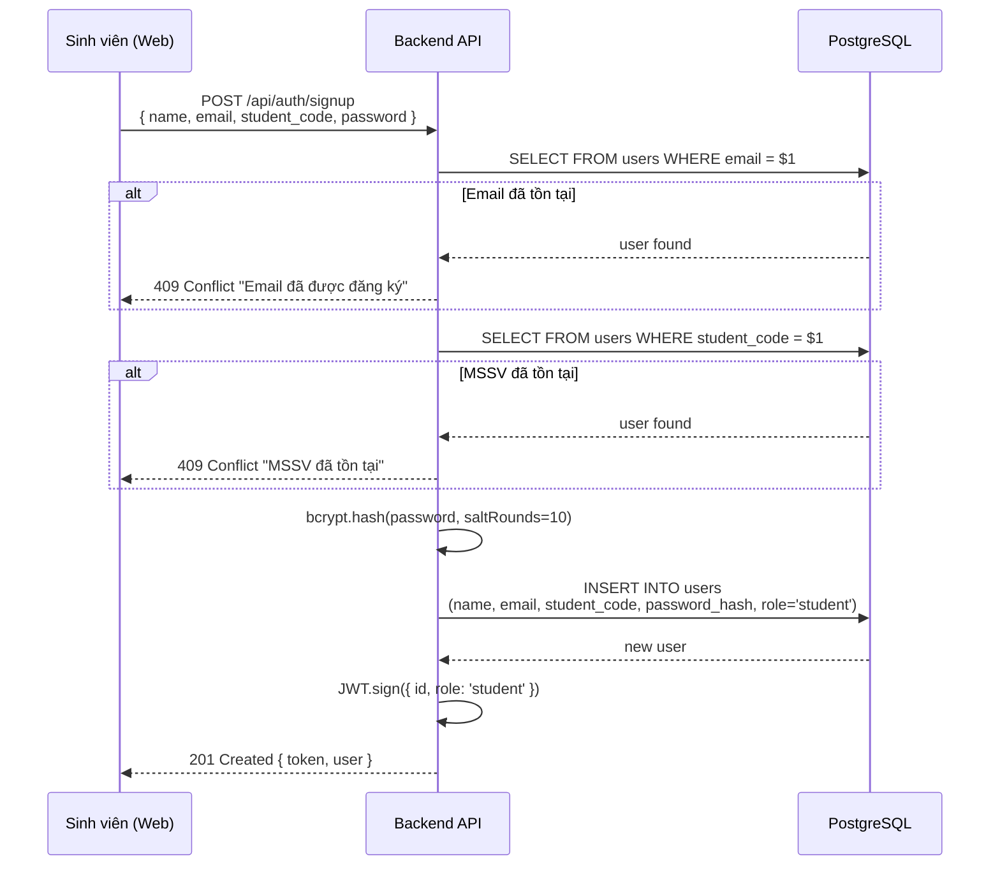
```mermaid
sequenceDiagram
    participant S as Sinh viên (Web)
    participant API as Backend API
    participant DB as PostgreSQL

    S->>API: POST /api/auth/signup<br/>{ name, email, student_code, password }
    
    API->>DB: SELECT FROM users WHERE email = $1
    alt Email đã tồn tại
        DB-->>API: user found
        API-->>S: 409 Conflict "Email đã được đăng ký"
    end
    
    API->>DB: SELECT FROM users WHERE student_code = $1
    alt MSSV đã tồn tại
        DB-->>API: user found
        API-->>S: 409 Conflict "MSSV đã tồn tại"
    end
    
    API->>API: bcrypt.hash(password, saltRounds=10)
    API->>DB: INSERT INTO users<br/>(name, email, student_code, password_hash, role='student')
    DB-->>API: new user
    
    API->>API: JWT.sign({ id, role: 'student' })
    API-->>S: 201 Created { token, user }
```

## Kịch bản lỗi
- **Email đã tồn tại**: HTTP 409 Conflict. Thông báo: "Email này đã được đăng ký. Vui lòng đăng nhập hoặc sử dụng email khác."
- **MSSV đã tồn tại**: HTTP 409 Conflict. Thông báo: "Mã số sinh viên này đã tồn tại trong hệ thống."
- **Password yếu**: HTTP 400 Bad Request. Thông báo: "Mật khẩu phải có ít nhất 6 ký tự."
- **Thiếu trường bắt buộc**: HTTP 400 Bad Request. Thông báo: "Vui lòng điền đầy đủ thông tin."

## Ràng buộc
- Mật khẩu phải được băm bằng `bcrypt` với salt ngẫu nhiên trước khi lưu.
- `email` là UNIQUE trong bảng `users`.
- `student_code` là UNIQUE (nếu được cung cấp).
- Không yêu cầu xác thực email trong lần đăng ký đầu (có thể thêm sau).

## Tiêu chí chấp nhận
- Sinh viên mới có thể đăng ký và nhận JWT token ngay sau khi đăng ký.
- Không thể đăng ký 2 tài khoản với cùng một email.
- Admin có thể tạo tài khoản staff mới.
- Staff mới nhận được email thông báo tài khoản (nếu notification worker hoạt động).


---


# Đặc tả: Luồng Đăng ký Workshop (Registration)

## Mô tả
Tính năng Đăng ký cho phép Sinh viên giành chỗ tham dự tại các Workshop của "Tuần lễ kỹ năng và nghề nghiệp". Điểm mấu chốt là giải quyết hiện tượng Tải đột biến (12.000 sinh viên truy cập cùng lúc) và Tranh chấp chỗ ngồi (Race Condition khi 2 người cùng bấm nút lấy cái vé cuối cùng).

## Luồng chính
1. Sinh viên mở Web Dashboard, API trả về danh sách Workshop kèm số ghế còn trống (`available_seats`).
2. Sinh viên nhấn nút "Đăng ký" tại một Workshop. Request POST gửi lên `/api/workshops/:id/register`.
3. Hệ thống vượt qua các hàng rào bảo vệ sau:
   - **JWT Auth Check:** Đảm bảo chỉ User sinh viên mới gọi được.
   - **Global Rate Limiter (Redis):** Đảm bảo cả hệ thống không xử lý quá 100 req/s.
   - **Sliding Window Rate Limiter (Redis):** Đảm bảo sinh viên này không gửi 2 request trong vòng 5 giây.
4. Database bắt đầu một Transaction (`BEGIN`).
5. Truy vấn `SELECT available_seats FROM workshops WHERE id = :id FOR UPDATE`. Dòng dữ liệu của Workshop này sẽ bị Lock tạm thời.
6. Hệ thống kiểm tra: Nếu `available_seats <= 0` => Báo lỗi Hết chỗ, `ROLLBACK`.
7. Trừ ghế: `UPDATE workshops SET available_seats = available_seats - 1`.
8. Sinh ra record vào bảng `registrations` với `status = pending` hoặc `confirmed`.
9. `COMMIT` Transaction, giải phóng Lock cho Request của sinh viên kế tiếp chạy.
10. Gửi Message (Event) tới RabbitMQ Queue (chạy ngầm).
11. Worker bắt được Message sẽ gửi Email / App Notification xác nhận cho Sinh viên.

## Kịch bản lỗi
- **Bị Rate Limit chặn:** HTTP 429 Too Many Requests. Sinh viên thấy thông báo: "Hệ thống đang quá tải, vui lòng thử lại sau vài giây".
- **Gửi Email thất bại:** Worker nhận Event gửi email bị crash. RabbitMQ sẽ NACK (Negative Acknowledgement) và giữ lại Message trong Queue. Khi Worker sống lại, Email sẽ được gửi lại mà không bị mất. Sinh viên vẫn đăng ký thành công.
- **Hết chỗ do Race Condition:** Dù màn hình FE hiển thị còn 1 chỗ, nhưng khi request tới DB thì Request của sinh viên khác đã Lock và mua mất vé đó. Lệnh `SELECT FOR UPDATE` của bạn này sẽ thấy 0 chỗ và trả về thông báo lỗi lịch sự cho sinh viên "Rất tiếc, vé cuối cùng vừa có người đăng ký".

## Ràng buộc
- Tuyệt đối không dùng Code JS (vd: lấy biến về rồi tính trừ đi 1) để kiểm tra ghế trống, bắt buộc phải ép Database gánh phần Logic giảm ghế bằng phép trừ trực tiếp trên câu lệnh SQL kết hợp Row Lock.
- RabbitMQ không được cấu hình `auto-ack = true` trong tác vụ Gửi Email để tránh mất mát thư.

## Tiêu chí chấp nhận
- Chạy giả lập 1.000 user cùng chọc vào API mua vé Workshop chỉ có 50 ghế trống. Kết thúc bài test, Database phải hiển thị chính xác 50 vé được mua và `available_seats = 0`, không bao giờ được phép có số ghế bị âm hoặc có 51 người mua thành công.

---

## Sơ đồ luồng (Sequence Diagram)

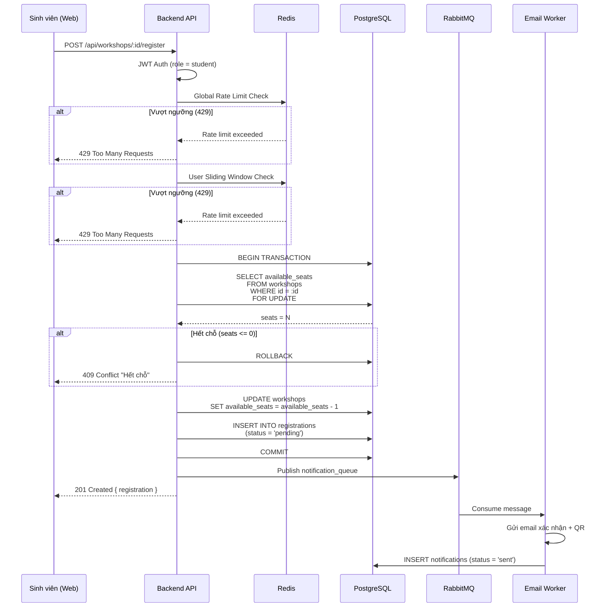
```mermaid
sequenceDiagram
    participant S as Sinh viên (Web)
    participant API as Backend API
    participant Redis as Redis
    participant DB as PostgreSQL
    participant MQ as RabbitMQ
    participant W as Email Worker

    S->>API: POST /api/workshops/:id/register
    API->>API: JWT Auth (role = student)
    
    API->>Redis: Global Rate Limit Check
    alt Vượt ngưỡng (429)
        Redis-->>API: Rate limit exceeded
        API-->>S: 429 Too Many Requests
    end
    
    API->>Redis: User Sliding Window Check
    alt Vượt ngưỡng (429)
        Redis-->>API: Rate limit exceeded
        API-->>S: 429 Too Many Requests
    end
    
    API->>DB: BEGIN TRANSACTION
    API->>DB: SELECT available_seats<br/>FROM workshops<br/>WHERE id = :id<br/>FOR UPDATE
    DB-->>API: seats = N
    
    alt Hết chỗ (seats <= 0)
        API->>DB: ROLLBACK
        API-->>S: 409 Conflict "Hết chỗ"
    end
    
    API->>DB: UPDATE workshops<br/>SET available_seats = available_seats - 1
    API->>DB: INSERT INTO registrations<br/>(status = 'pending')
    API->>DB: COMMIT
    
    API->>MQ: Publish notification_queue
    API-->>S: 201 Created { registration }
    
    MQ->>W: Consume message
    W->>W: Gửi email xác nhận + QR
    W->>DB: INSERT notifications (status = 'sent')
```

**Xử lý lỗi trong luồng**:
- **Rate Limit → 429**: "Hệ thống đang quá tải, vui lòng thử lại sau vài giây".
- **Hết chỗ → 409**: "Rất tiếc, vé cuối cùng vừa có người đăng ký".
- **DB lỗi → 500**: Rollback transaction, không mất dữ liệu.
- **Email thất bại**: Worker retry qua DLX (max 3 lần), message không mất.


---


# Đặc tả: Luồng thanh toán Workshop và Chống lỗi (Payment & Circuit Breaker)

## Mô tả
Chức năng này quản lý quá trình thanh toán của sinh viên đối với các Workshop có thu phí. Điểm nhấn của chức năng là sự tích hợp với cổng thanh toán PayOS và áp dụng mẫu thiết kế (pattern) Circuit Breaker để bảo vệ hệ thống khỏi các đợt sập mạng, sập dịch vụ bên thứ 3.

## Luồng chính
1. Sinh viên bấm "Đăng ký" một Workshop có phí.
2. Hệ thống kiểm tra Rate Limit và sức chứa của Workshop (Transaction + Row lock).
3. Hệ thống lưu một bản ghi `Registration` ở trạng thái `pending` và một bản ghi `Payment` ở trạng thái `pending`.
4. Gọi qua API của cổng thanh toán PayOS (thông qua thư viện `opossum` Circuit Breaker) để tạo `checkoutUrl`.
5. Trả URL về cho sinh viên để chuyển hướng sang giao diện thanh toán.
6. Cổng thanh toán gửi Webhook báo thành công: Hệ thống cập nhật trạng thái `Payment` thành `paid` và `Registration` thành `confirmed`.

## Kịch bản lỗi

### 1. Cổng thanh toán chập chờn / Timeout
- Lỗi kết nối (timeout, 5xx) xảy ra.
- Nếu số lần lỗi vượt mức 50% trong thời gian ngắn, Circuit Breaker chuyển sang trạng thái **Open**.
- **Fallback:** Các request tiếp theo thay vì gọi PayOS sẽ bị chặn lại ngay lập tức (Fail Fast). Hệ thống rẽ nhánh sang logic Fallback: 
  - Không ném ra lỗi (Throw Error).
  - Vẫn cho phép tạo `Registration` và giữ chỗ.
  - Trả về `checkoutUrl = null` và thông báo nhắc nhở sinh viên: *"Cổng thanh toán đang bảo trì, bạn đã được giữ chỗ, vui lòng quay lại thanh toán sau."*

### 2. Sinh viên cố bấm đăng ký nhiều lần liên tiếp (Trừ tiền 2 lần)
- Khi sinh viên gửi request lại, hệ thống kiểm tra thấy đã tồn tại một `Registration` và `Payment` `pending` cho Workshop này.
- Hệ thống từ chối tạo mới, mà lấy `order_code` (Idempotency Key) của Payment cũ để gọi lại PayOS tạo lại link hoặc trả thẳng link cũ. Ngăn chặn việc sinh ra 2 mã đơn hàng gây trừ tiền 2 lần.

## Ràng buộc
- Phải dùng Database Transaction kết hợp cơ chế Row Locking (`SELECT FOR UPDATE`) lúc kiểm tra ghế trống để tránh Overbooking.
- Idempotency Key (ở đây là `order_code`) phải là Unique trên toàn bộ hệ thống Payment.

## Tiêu chí chấp nhận
- Đăng ký miễn phí trả thẳng trạng thái `confirmed`.
- Đăng ký có phí trả về link PayOS.
- Giả lập tắt mạng PayOS: Sinh viên vẫn giữ được ghế trống và hệ thống hiển thị nút "Thanh toán lại" ở ngoài Dashboard để sinh viên có thể tự bấm lại khi cổng thanh toán sống lại.

---

## Sơ đồ luồng (Sequence Diagram)

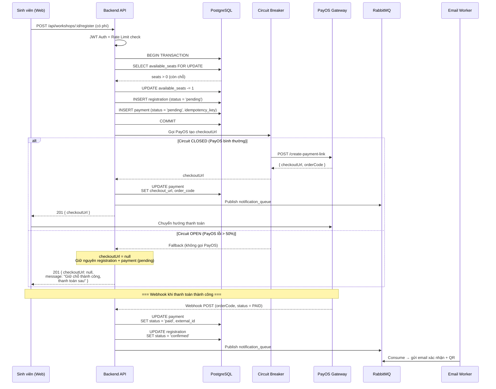
```mermaid
sequenceDiagram
    participant S as Sinh viên (Web)
    participant API as Backend API
    participant DB as PostgreSQL
    participant CB as Circuit Breaker
    participant PayOS as PayOS Gateway
    participant MQ as RabbitMQ
    participant W as Email Worker

    S->>API: POST /api/workshops/:id/register (có phí)
    API->>API: JWT Auth + Rate Limit check
    
    API->>DB: BEGIN TRANSACTION
    API->>DB: SELECT available_seats FOR UPDATE
    DB-->>API: seats > 0 (còn chỗ)
    API->>DB: UPDATE available_seats -= 1
    API->>DB: INSERT registration (status = 'pending')
    API->>DB: INSERT payment (status = 'pending', idempotency_key)
    API->>DB: COMMIT
    
    API->>CB: Gọi PayOS tạo checkoutUrl
    
    alt Circuit CLOSED (PayOS bình thường)
        CB->>PayOS: POST /create-payment-link
        PayOS-->>CB: { checkoutUrl, orderCode }
        CB-->>API: checkoutUrl
        API->>DB: UPDATE payment<br/>SET checkout_url, order_code
        API->>MQ: Publish notification_queue
        API-->>S: 201 { checkoutUrl }
        S->>PayOS: Chuyển hướng thanh toán
    else Circuit OPEN (PayOS lỗi > 50%)
        CB-->>API: Fallback (không gọi PayOS)
        Note over API: checkoutUrl = null<br/>Giữ nguyên registration + payment (pending)
        API-->>S: 201 { checkoutUrl: null,<br/>message: "Giữ chỗ thành công,<br/>thanh toán sau" }
    end
    
    Note over S,PayOS: === Webhook khi thanh toán thành công ===
    PayOS-->>API: Webhook POST (orderCode, status = PAID)
    API->>DB: UPDATE payment<br/>SET status = 'paid', external_id
    API->>DB: UPDATE registration<br/>SET status = 'confirmed'
    API->>MQ: Publish notification_queue
    W->>MQ: Consume → gửi email xác nhận + QR
```

### Sơ đồ trạng thái Circuit Breaker

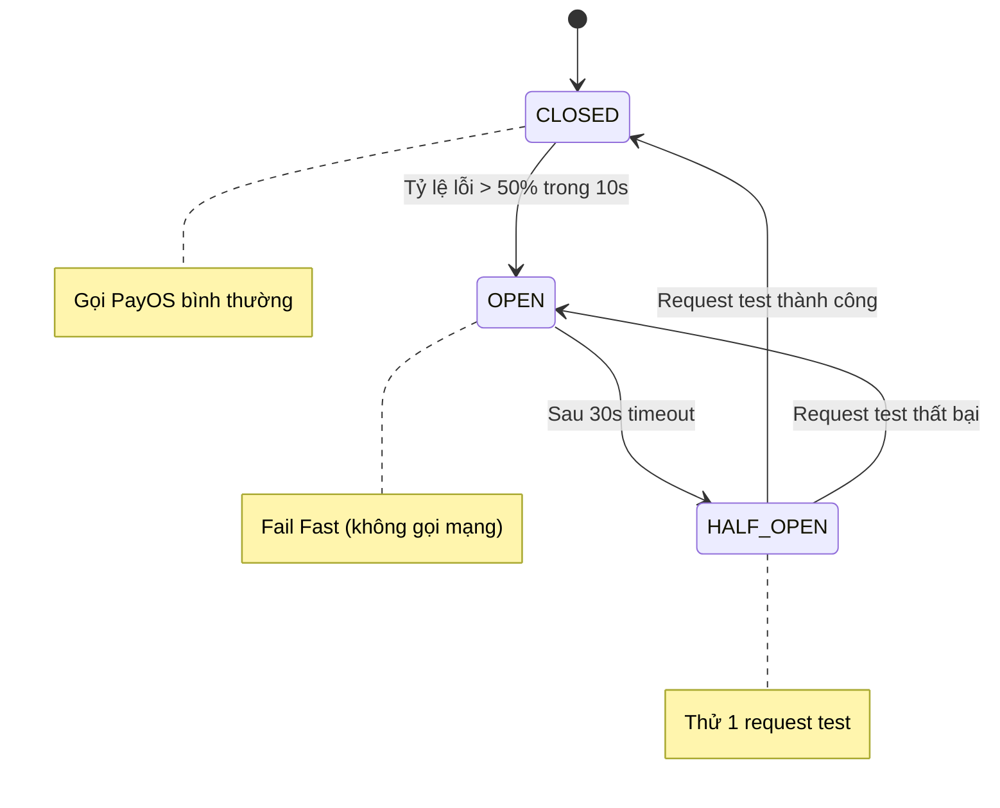
```mermaid
stateDiagram-v2
    [*] --> CLOSED
    CLOSED --> OPEN : Tỷ lệ lỗi > 50% trong 10s
    OPEN --> HALF_OPEN : Sau 30s timeout
    HALF_OPEN --> CLOSED : Request test thành công
    HALF_OPEN --> OPEN : Request test thất bại

    note right of CLOSED : Gọi PayOS bình thường
    note right of OPEN : Fail Fast (không gọi mạng)
    note right of HALF_OPEN : Thử 1 request test
```


---


# Đặc tả: Luồng Check-in Offline

## Mô tả
Chức năng cho phép nhân sự (staff) dùng Mobile App (React Native) quét mã QR của sinh viên tại cửa phòng sự kiện. Do môi trường trường đại học có thể có điểm mù Wifi hoặc sóng 4G chập chờn, tính năng quét QR bắt buộc phải hoạt động mượt mà ngay cả khi không có kết nối Internet (Offline-first).

## Luồng chính

### Giai đoạn 1: Chuẩn bị mã QR
1. Web App phía Sinh viên tạo mã QR theo định dạng: `workshop_id|registration_id` để nhúng sẵn ID của phòng thi/sự kiện vào bên trong mã QR. Chống việc quét nhầm giữa các phòng khi điện thoại offline.

### Giai đoạn 2: Quét mã tại sự kiện
1. Staff mở App, chọn Workshop đang phụ trách (App lưu ID này lại).
2. Khi mất mạng, Staff bật màn hình Camera quét QR.
3. App quét được chuỗi: `workshop_id|registration_id`.
4. App lập tức kiểm tra xem `workshop_id` trong mã QR có trùng với Workshop đang chọn hay không.
   - Nếu **không trùng**: Chặn ngay lập tức, báo lỗi "Mã QR thuộc về Workshop khác" (Offline validation).
   - Nếu **trùng**: App ghi nhận bản ghi check-in kèm Timestamp hiện tại và lưu vào bộ nhớ cục bộ (AsyncStorage của điện thoại).
5. App hiện màn hình xanh "Check-in tạm thời thành công".

### Giai đoạn 3: Tự động đồng bộ
1. Khi có mạng trở lại, một Background Hook (`useAutoSync`) phát hiện tín hiệu kết nối thông qua `expo-network` và App State.
2. Hook này âm thầm lấy toàn bộ mảng dữ liệu đang kẹt trong bộ nhớ cục bộ, gửi hàng loạt lên API Backend `/api/workshops/:id/checkins`.
3. Backend nhận Timestamp mà Staff đã quét lúc offline để ghi đè vào cột `offline_scanned_at` trên DB, đảm bảo tính chính xác của thời điểm sinh viên có mặt.
4. Xóa hàng đợi lưu tạm.

## Kịch bản lỗi
- **Staff quét nhầm QR cũ (không có dấu `|`):** App từ chối và báo lỗi ngay "Mã QR cũ hoặc không hợp lệ. Yêu cầu tải lại trang Web".
- **Staff quét cùng một mã nhiều lần:** App lưu Log quét trùng vào bộ nhớ, khi gọi lên Backend, Backend sử dụng Unique Index `registration_id` trên bảng `checkins` để từ chối các bản ghi thừa và chỉ tính 1 lần hợp lệ.
- **Có mạng nhưng API chết:** Hook đồng bộ sẽ đánh dấu thất bại và không xóa bộ nhớ cục bộ, chờ 10 giây sau thử lại.

## Ràng buộc
- Tuyệt đối không xóa dữ liệu offline khi chưa nhận được HTTP status 201 từ Backend.
- Camera phải có cơ chế **Lock state** (sử dụng useRef) để tránh Camera bắn ra 10 requests / giây cho cùng 1 khung hình QR, gây tràn bộ nhớ offline.

## Tiêu chí chấp nhận
- Chuyển điện thoại về chế độ Máy bay (Airplane mode), Staff quét QR hợp lệ và nhận thông báo xanh lá.
- Quét QR của Workshop B khi đang đứng ở màn hình Workshop A, App báo đỏ.
- Bật lại Wifi, đợi 5-10 giây, danh sách Check-in lưu tạm trên App biến mất và dữ liệu đổ thẳng lên Database Postgres trên Server.

---

## Sơ đồ luồng (Sequence Diagram)

### Giai đoạn Offline — Quét QR khi mất mạng

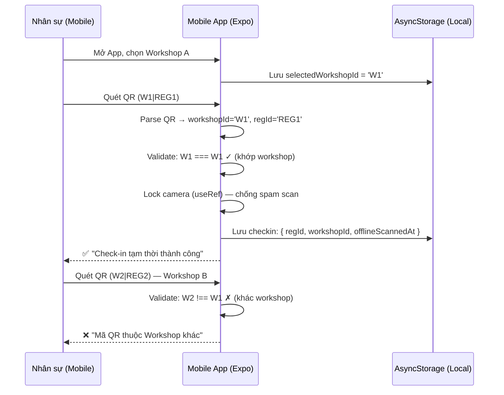
```mermaid
sequenceDiagram
    participant Staff as Nhân sự (Mobile)
    participant App as Mobile App (Expo)
    participant AS as AsyncStorage (Local)

    Staff->>App: Mở App, chọn Workshop A
    App->>AS: Lưu selectedWorkshopId = 'W1'
    
    Staff->>App: Quét QR (W1|REG1)
    App->>App: Parse QR → workshopId='W1', regId='REG1'
    App->>App: Validate: W1 === W1 ✓ (khớp workshop)
    App->>App: Lock camera (useRef) — chống spam scan
    
    App->>AS: Lưu checkin: { regId, workshopId, offlineScannedAt }
    App-->>Staff: ✅ "Check-in tạm thời thành công"
    
    Staff->>App: Quét QR (W2|REG2) — Workshop B
    App->>App: Validate: W2 !== W1 ✗ (khác workshop)
    App-->>Staff: ❌ "Mã QR thuộc Workshop khác"
```

### Giai đoạn Online — Đồng bộ khi có mạng trở lại

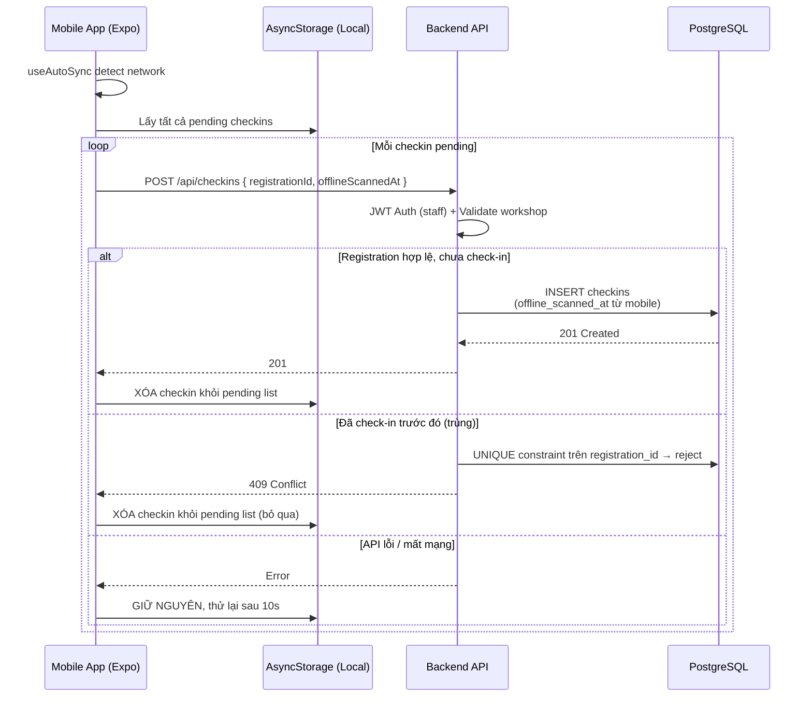
```mermaid
sequenceDiagram
    participant App as Mobile App (Expo)
    participant AS as AsyncStorage (Local)
    participant API as Backend API
    participant DB as PostgreSQL

    App->>App: useAutoSync detect network
    App->>AS: Lấy tất cả pending checkins
    
    loop Mỗi checkin pending
        App->>API: POST /api/checkins { registrationId, offlineScannedAt }
        API->>API: JWT Auth (staff) + Validate workshop
        
        alt Registration hợp lệ, chưa check-in
            API->>DB: INSERT checkins<br/>(offline_scanned_at từ mobile)
            DB-->>API: 201 Created
            API-->>App: 201
            App->>AS: XÓA checkin khỏi pending list
        else Đã check-in trước đó (trùng)
            API->>DB: UNIQUE constraint trên registration_id → reject
            API-->>App: 409 Conflict
            App->>AS: XÓA checkin khỏi pending list (bỏ qua)
        else API lỗi / mất mạng
            API-->>App: Error
            App->>AS: GIỮ NGUYÊN, thử lại sau 10s
        end
    end
```


---


# Đặc tả: Đồng bộ sinh viên từ file CSV

## Mô tả
Chức năng dành cho Admin nhập đồng loạt ngàn bản ghi sinh viên mà không làm downtime Node.js hay tiêu thụ RAM.
Sử dụng Message Queue (RabbitMQ) và Streaming Pipe (pg-copy-streams) từ AWS S3 vào Bảng tạm PostgreSQL, sau cùng là thao tác MERGE xử lý tự động trong CSDL.

## Luồng chính
1. **Khởi tạo Job Sync (createSyncJob):** POST /users/sync chứa fileKey và cờ isImmediate. Controller ghi task INSERT INTO sync_jobs trạng thái Pending.
2. **Push hàng đợi RabbitMQ (userSync.producer):** 
   - isImmediate = true, gọi hàm publishUserSyncJob.
   - isImmediate = false, chờ node-cron dùng biến SYNC_CRON_SCHEDULE.
3. **Worker Stream xử lý (userSync.worker.js):**
   - channel.consume. Update trạng thái Job thành Processing. prefetch(1).
   - Readable stream S3 bằng getS3ReadStream(fileKey).
4. **Stream Database Pipe (COPY FROM STDIN):** 
   - TRUNCATE staging_users.
   - Mở Ingest stream COPY staging_users (student_code, name, email) FROM STDIN WITH (FORMAT csv, HEADER true).
   - readStream.pipe(ingestStream).
5. **Cập nhật chính MERGE UPSERT (mergeStagingUsersIntoMain):** 
   - SQL Code: INSERT INTO users (...) SELECT ... FROM staging_users WHERE student_code IS NOT NULL ON CONFLICT (student_code) DO UPDATE SET name = EXCLUDED.name, email = EXCLUDED.email.
   - Password auto: student_code || '#' || split_part(email, '@', 1).
6. **Xác nhận hoàn thành:** Update Completed. Gọi channel.ack(msg).

## Kịch bản lỗi
- **Thiếu Header/S3 Crash:** Catch lỗi, update Failed và gọi channel.ack(msg).
- **Worker Die:** RabbitMQ giữ lại Message, Re-run sau vì TRUNCATE ở Staging đảm bảo Idempotent.

## Ràng buộc
- O(1) Memory Space.
- student_code UNIQUE. 

## Tiêu chí chấp nhận
- Upload File > 200,000 dòng không ăn RAM.
- Cập nhật đúng đắn dữ liệu: Đã tồn tại mã số sinh viên tự viết đè.


---


# Thiết kế Hệ thống Đồng bộ File CSV Tự động (CSV Sync Design)

Tài liệu này trình bày luồng xử lý và thiết kế kiến trúc thực tế được áp dụng trong hệ thống nhằm hỗ trợ Upload File CSV chứa danh sách User (Sinh viên) lên đám mây (AWS S3) và đồng bộ trơn tru vào Database (PostgreSQL) mà không gây tắc nghẽn Server API thông qua Message Queue (RabbitMQ) và Streaming xử lý dữ liệu.

## Luồng thực thi chính (Flow)

Luồng hoạt động sẽ chia ra làm 2 pha: Upload File Tức Thời (Pha 1) và Đồng Bộ Ban Đêm Tự Động (Pha 2).

### Pha 1: Upload và Đăng ký Sync (User Interactive)
1. **Khởi tạo kết nối S3**: Admin/Client gửi Request tới `upload.controller.js` (`getPresignedUrl`) với các thông tin cơ bản của file CSV (tên, phân loại, kích thước).
2. **Ký số URL**: API sinh ra một Presigned URL AWS S3 thông qua thư viện AWS SDK, đồng thời tạo một bản phụ thông tin nháp `file` trong Database có đánh dấu trạng thái `uploaded` và trả về URL đó cho Client.
3. **Upload Trực tiếp (Direct Upload)**: Thay vì Tải file qua Server API gây áp lực băng thông, Client sẽ lợi dụng HTTP PUT/POST lên chính cái Presigned URL của AWS S3 để đẩy thẳng file CSV lên bucket.
4. **Xác nhận Upload**: Máy trạm gọi API `confirmUpload` để thông báo cho hệ thống biết file đã lên Amazon S3 thành công. Server đổi trạng thái record tải về `done`.
5. **Gửi lệnh đồng bộ**: Qua `user.controller.js` (`syncUsers`), Client gửi `fileKey` và tạo một `sync_job` trong CSDL. Nếu Flag `isImmediate` là True, Job sẽ được bắn thẳng vào RabbitMQ qua phương thức `publishUserSyncJob`. Ngược lại, nó nằm tại CSDL chờ.

### Pha 2: Đồng bộ Hậu đài Ban Đêm (Background Worker & MQ)
1. **Cron Job quét Database**: Đến chu kỳ thiết lập, Cron Schedule bên trong `userSync.worker.js` sẽ lọc ra toàn bộ các `sync_job` đang pending trong Database. Sau đó vòng lặp sẽ đẩy (Publish) Message vào hàng đợi (Queue) `user_sync_queue` thông qua RabbitMQ.
2. **Worker nhận Job**: RabbitMQ chuyển Message định kỳ đến Worker. Quy định `prefetch(1)` buộc Worker chỉ được xử lý mỗi lần 1 CSV lớn để tránh hết Memory (OOM). Đổi trạng thái job thành `Processing`.
3. **Download Stream từ S3**: Worker trích xuất Data ra một ReadStream thông qua `getS3ReadStream()`.
4. **Load Data tốc độ cao**: 
   - Đầu tiên, Worker gọi API rỗng toàn bộ bảng `staging_users` (Truncate Staging Table).
   - Qua cơ chế PostgreSQL Copy (`pg-copy-streams`), quá trình đưa Stream trực tiếp từ S3 ngấm thẳng vào Database Staging mà không cần nạp bất cứ bytes nào vào RAM của NodeJS. `copyUsersFromStream` hoàn thành việc này siêu nhỏ gọn và nhanh chóng.
5. **Merge (UPSERT)**: Cuối cùng, một lệnh Postgres lớn, `mergeStagingUsersIntoMain`, được thực thi bằng SQL để Insert/Cập Nhật hàng loạt (UPSERT) các dữ liệu từ khu vực trung gian (Staging) vào bảng lõi (Users). Tự động bổ sung User mới hoặc đè lại nếu Email/MSSV đã tồn tại. Job báo `Completed`.

## Sơ đồ luồng (Workflow Diagram)

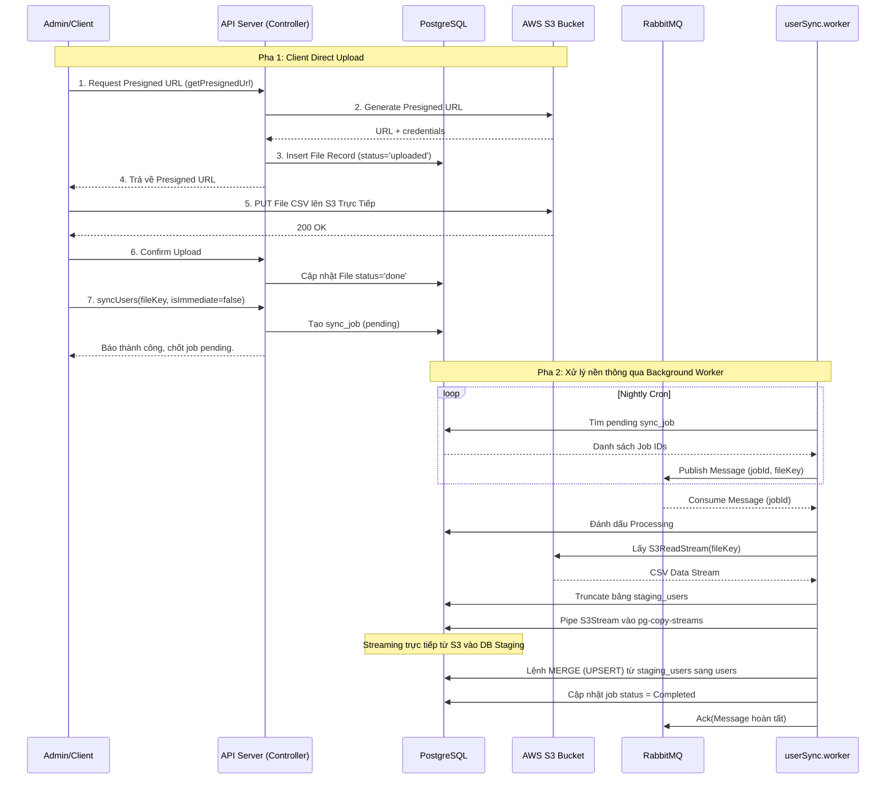
```mermaid
sequenceDiagram
    participant C as Admin/Client
    participant API as API Server (Controller)
    participant DB as PostgreSQL
    participant S3 as AWS S3 Bucket
    participant RMQ as RabbitMQ
    participant W as userSync.worker

    Note over C, S3: Pha 1: Client Direct Upload
    C->>API: 1. Request Presigned URL (getPresignedUrl)
    API->>S3: 2. Generate Presigned URL
    S3-->>API: URL + credentials
    API->>DB: 3. Insert File Record (status='uploaded')
    API-->>C: 4. Trả về Presigned URL
    
    C->>S3: 5. PUT File CSV lên S3 Trực Tiếp
    S3-->>C: 200 OK
    C->>API: 6. Confirm Upload
    API->>DB: Cập nhật File status='done'
    
    C->>API: 7. syncUsers(fileKey, isImmediate=false)
    API->>DB: Tạo sync_job (pending)
    API-->>C: Báo thành công, chốt job pending.
    
    Note over DB, W: Pha 2: Xử lý nền thông qua Background Worker
    loop Nightly Cron
        W->>DB: Tìm pending sync_job
        DB-->>W: Danh sách Job IDs
        W->>RMQ: Publish Message (jobId, fileKey)
    end
    
    RMQ-->>W: Consume Message (jobId)
    W->>DB: Đánh dấu Processing
    W->>S3: Lấy S3ReadStream(fileKey)
    S3-->>W: CSV Data Stream
    
    W->>DB: Truncate bảng staging_users
    W->>DB: Pipe S3Stream vào pg-copy-streams
    Note over DB: Streaming trực tiếp từ S3 vào DB Staging
    
    W->>DB: Lệnh MERGE (UPSERT) từ staging_users sang users
    W->>DB: Cập nhật job status = Completed
    W->>RMQ: Ack(Message hoàn tất)
```

## Đánh giá thiết kế thuật toán Streaming

### Ưu điểm (Pros):
- **Phân tách I/O & Băng Thông**: Client tự trao đổi File đồ sộ với Amazon, Server API của ta không bị ngậm băng thông tải lên.
- **NodeJS Memory Tối ưu**: Thao tác `Stream S3 -> Stream Database` bỏ qua vòng đời ReadFile lên Memory, ngăn chặn các sự cố Out Of Memory (OOM) nếu file CSV lên tới vài Gigabytes. 
- **DB Bulk Khối lượng lớn cực nhanh**: Cơ chế `psql \copy` (hay thư viện pg-copy-streams dưới Node) nhanh chóng ghi đè vạn bản ghi mà không sinh ra logs I/O rác. Staging Table lại giảm thiểu DeadLock trên bảng Main.
- **An toàn Fault Tolerant**: `prefetch(1)` của Rabbit MQ làm quá trình này trở nên trơn tru và an toàn (sập 1 Process/Container thì MQ trả file lại cho Worker khác làm).

### Nhược điểm (Cons) / Điểm cần cải thiện:
- Quá trình Upsert từ Staging Table vào Main Table tuy xử lí bằng SQL nhanh, nhưng nếu có quá nhiều Index, DB sẽ chịu sức ép I/O khổng lồ.
- Không thể nhận về thông báo lỗi Import từng row nếu dùng SQL Merge 1 Batch như vậy (Khó Report dòng nào trong Excel đã thất bại và lý do vì sao).
- Thất bại giữa chừng ở quá trình Stream Copy đồng nghĩa với File đó phải Sync lại từ dòng mốc số 0, không có Checkpoint Recovery nếu mạng đứt do dữ liệu đang Stream.


---


# Workshop Creation Design

Tài liệu này mô tả chi tiết luồng xử lý chức năng đăng/tạo mới Workshop dành cho Admin trong hệ thống, bao gồm các thành phần về lưu trữ và cache, cũng như liên kết giảng viên/staff.

## Luồng thực thi chính (Flow)

Khi Admin gửi yêu cầu tạo/đăng Workshop lên API:

1. **Validation**: Kiểm tra các trường bắt buộc như `title`, `capacity`, `start_time`, `end_time`. Chuyển đổi và kiểm tra giá trị của chúng (thời gian `start_time` phải nhỏ hơn `end_time`, capacity phải $> 0$).
2. **Lưu DB**: Hệ thống gọi `createWorkshopRepo` để Insert record Workshop mới vào CSDL (PostgreSQL).
3. **Quản lý Staff (syncWorkshopStaff)**:
   - Nếu Admin có truyền vào mảng `staff_emails`.
   - Hàm `syncWorkshopStaff` sẽ:
     + Xoá toàn bộ record staff cũ của workshop này (Bulk Delete: `DELETE FROM workshop_staffs WHERE workshop_id = ...`).
     + Lọc mảng `staff_emails`, tra cứu tìm `id` tương ứng của các user có role là `staff`.
     + Lặp qua từng `staff_id` và Insert lại vào bảng `workshop_staffs` với tuỳ chọn `ON CONFLICT DO NOTHING`.
4. **Caching (setCachedWorkshop)**:
   - Sau khi tạo xong (và cập nhật staff nếu có), hệ thống gọi `getWorkshopById` để lấy đầy đủ chi tiết của Workshop.
   - Ghi dữ liệu vào Redis thông qua `setCachedWorkshop`. Đặc biệt, thời gian Cache (TTL) được tính toán tinh tế (`calculateCacheTTL`) theo 2 giai đoạn (Windows):
     + **Giai đoạn 1 (Mới phát hành):** Duy trì TTL tính từ thời điểm `created_at` cộng thêm `CACHE_WORKSHOP_NEW_DURATION` (Mặc định: 1 giờ / 3600s).
     + **Giai đoạn 2 (Xung quanh thời gian sự kiện):** Kích hoạt trong khung thời gian diễn ra sự kiện, bao gồm trước `start_time` và sau `end_time` một khoảng `CACHE_WORKSHOP_EVENT_WINDOW` (Mặc định: 30 phút / 1800s).
     + *Hệ thống sẽ lấy giá trị TTL lớn nhất (maxTTL) giữa các cửa sổ thời gian đang có hiệu lực để lưu lên Redis, đảm bảo lúc event đang diễn ra workshop luôn có cache*.
5. **Trả về kết quả**: Trả về Response cho Admin gồm đối tượng Workshop vừa tạo.

## Sơ đồ luồng (Workflow Diagram)

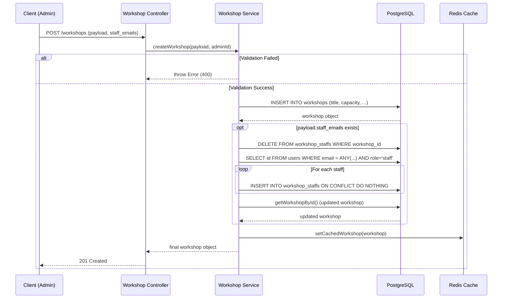
```mermaid
sequenceDiagram
    participant Admin as Client (Admin)
    participant C as Workshop Controller
    participant S as Workshop Service
    participant DB as PostgreSQL
    participant R as Redis Cache
    
    Admin->>C: POST /workshops (payload, staff_emails)
    C->>S: createWorkshop(payload, adminId)
    
    alt Validation Failed
        S-->>C: throw Error (400)
    else Validation Success
        S->>DB: INSERT INTO workshops (title, capacity, ...)
        DB-->>S: workshop object
        
        opt payload.staff_emails exists
            S->>DB: DELETE FROM workshop_staffs WHERE workshop_id
            S->>DB: SELECT id FROM users WHERE email = ANY(...) AND role='staff'
            loop For each staff
                S->>DB: INSERT INTO workshop_staffs ON CONFLICT DO NOTHING
            end
            S->>DB: getWorkshopById() (updated workshop)
            DB-->>S: updated workshop
        end
        
        S->>R: setCachedWorkshop(workshop)
        S-->>C: final workshop object
        C-->>Admin: 201 Created
    end
```

## Đánh giá thiết kế thuật toán & Caching

### Ưu điểm (Pros):
- **Tính nhất quán dữ liệu ở mức Cơ bản**: Pattern thay thế toàn bộ (Bulk Delete rồi Insert) đối với cấu hình `workshop_staffs` giúp logic sync dễ hiểu, tránh các bài toán conflict phức tạp và không cần phân biệt danh sách xoá hay thêm mới từ client gửi lên.
- **Tối ưu tốc độ Đọc**: Bằng cách chủ động cache (Write-through) thông qua `setCachedWorkshop` ngay tại thời điểm khởi tạo, các lượt khách (sinh viên) vừa vào xem chi tiết lớp sẽ có data ngay lập tức từ Redis, giảm áp lực truy vấn cho DB.

### Nhược điểm (Cons) / Điểm cần cải thiện:
- Bất lợi của *Bulk Delete / Insert*: Khi scale số lượng giảng viên, transaction xoá sau đó lặp vòng lặp thực hiện Insert `1-by-1` vào PostgreSQL sẽ gây phí phạm tài nguyên I/O và lock cục bộ trên database. Thay vì insert một lượt với tính năng bulk insert `insert (...) values (...), (...), ...`, hiện tại database bị hit liên tục.
- Lỗ hổng về Transaction: Chuỗi hành động từ cập nhật bảng `workshops` cho đến `workshop_staffs` chưa được bọc hoàn toàn bên trong 1 Database Transaction (`BEGIN ... COMMIT`). Nếu bước thiết lập Staff xảy ra lỗi (crash app/ngắt mạng), thì Workshop đã được tạo nhưng danh sách Staff bị lỗi, tạo ra trạng thái Inconsistent (chưa toàn vẹn dữ liệu).


---


# Đặc tả: Hệ thống Thông báo (Notification)

## Mô tả
Hệ thống gửi thông báo cho sinh viên sau các sự kiện quan trọng: đăng ký workshop thành công, thanh toán hoàn tất, nhắc nhở trước giờ workshop. Hiện tại chỉ hỗ trợ Email, được thiết kế theo Strategy Pattern để dễ dàng mở rộng thêm kênh mới (SMS, Telegram, Push Notification) mà không sửa code hiện có.

## Người dùng liên quan
- **Sinh viên**: Người nhận thông báo.
- **Hệ thống (Worker)**: Tự động gửi thông báo qua RabbitMQ.

## Kiến trúc Strategy Pattern

```
NotificationContext
    └── strategy: BaseStrategy
            ├── EmailStrategy (hiện tại)
            ├── SmsStrategy (tương lai)
            ├── TelegramStrategy (tương lai)
            └── PushStrategy (tương lai)
```

## Luồng chính

1. API publish message vào `notification_queue` của RabbitMQ sau các sự kiện:
   - Sinh viên đăng ký workshop thành công.
   - Thanh toán được xác nhận (webhook PayOS).
   - Admin tạo tài khoản staff mới.
2. Notification Worker consume message với `prefetch(1)`.
3. Worker kiểm tra `type` trong message, chọn strategy tương ứng qua `NotificationContext`.
4. Strategy thực thi gửi thông báo (VD: EmailStrategy gọi SMTP).
5. Nếu thành công: `channel.ack(msg)`, lưu `notifications` với `status = 'sent'`.
6. Nếu thất bại: retry qua DLX pattern (max 3 lần, exponential backoff).
7. Nếu thất bại hoàn toàn (retry >= 3): lưu vào `failed_jobs` để admin xem lại.

## Sơ đồ luồng (Sequence Diagram)

```mermaid
sequenceDiagram
    participant API as Backend API
    participant MQ as RabbitMQ
    participant W as Notification Worker
    participant SMTP as SMTP Server
    participant DB as PostgreSQL

    Note over API,MQ: === Các trigger tạo thông báo ===
    API->>DB: INSERT notifications (status='pending')
    API->>MQ: Publish notification_queue<br/>{ type: 'email', userId, subject, content }

    Note over MQ,DB: === Worker xử lý (với retry) ===
    W->>MQ: Consume message (prefetch=1)
    W->>W: NotificationContext.selectStrategy('email')
    W->>W: EmailStrategy.send(to, subject, content)
    
    W->>SMTP: Send email
    alt Gửi thành công
        SMTP-->>W: 250 OK
        W->>DB: UPDATE notifications SET status='sent'
        W->>MQ: ACK (xóa message)
    else Gửi thất bại, retryCount < 3
        SMTP-->>W: Error (timeout/5xx)
        W->>W: retryCount++
        W->>MQ: Publish notification_wait_queue_{delay}<br/>(DLX → TTL → auto requeue)
        W->>MQ: ACK (xóa message khỏi main queue)
    else Gửi thất bại, retryCount >= 3
        SMTP-->>W: Error
        W->>DB: INSERT failed_jobs (payload, error_message)
        W->>DB: UPDATE notifications SET status='failed'
        W->>MQ: ACK (xóa message, tránh infinite loop)
    end
```

## Sơ đồ Retry với DLX Pattern

```mermaid
flowchart TD
    MQ["notification_queue<br/>(main queue)"] -->|consume| W["Worker<br/>gửi email"]
    
    W -->|"thành công"| ACK["ACK ✅"]
    W -->|"lỗi + retry<3"| WAIT["notification_wait_queue<br/>(DLX + TTL = delay)"]
    W -->|"lỗi + retry>=3"| FJ["failed_jobs<br/>(PostgreSQL)"]
    
    WAIT -->|"TTL expire →<br/>auto requeue"| MQ
    FJ -->|"Admin xem & retry"| MQ

    style ACK fill:#4caf50,color:#fff
    style FJ fill:#f44336,color:#fff
    style WAIT fill:#ff9800,color:#fff
```

## Kịch bản lỗi
- **SMTP timeout**: Worker retry với exponential backoff (5s → 15s → 30s). Sau 3 lần, chuyển vào `failed_jobs`.
- **Worker crash giữa chừng**: RabbitMQ không nhận ACK → message được requeue sang worker khác. Không mất message.
- **Message format sai**: Worker catch lỗi parse, ACK message ngay (tránh retry vô ích với lỗi format), log lỗi.

## Ràng buộc
- `prefetch(1)` — mỗi worker chỉ xử lý 1 message/lần, tránh OOM khi gửi email hàng loạt.
- Không dùng `auto-ack = true` — bắt buộc manual ACK để đảm bảo không mất message.
- DLX queues phải là `durable: true` — message tồn tại trên disk của RabbitMQ.
- Retry delay phải là exponential backoff (5s, 15s, 30s) để tránh spam SMTP server.
- Nội dung email phải chứa QR code (`workshop_id|registration_id`) cho check-in.

## Tiêu chí chấp nhận
- Sinh viên nhận email xác nhận trong vòng 30s sau khi đăng ký thành công.
- Khi SMTP server tắt, email không bị mất mà được retry tối đa 3 lần.
- Sau 3 lần retry thất bại, admin thấy job trong `AdminFailedJobs` dashboard.
- Thêm một strategy mới (VD: Telegram) chỉ cần tạo class mới implement `BaseStrategy.send()` — không sửa code hiện có.


---


# Đặc tả: AI Tóm tắt Tài liệu Workshop (AI Summary)

## Mô tả
Cho phép Ban tổ chức upload file PDF giới thiệu workshop. Hệ thống sẽ tự động parse PDF, làm sạch văn bản, gửi sang AI model (DeepSeek) để sinh bản tóm tắt, và hiển thị kết quả trên trang workshop cho sinh viên xem. Toàn bộ quá trình xử lý được thực hiện bất đồng bộ qua RabbitMQ và Pipeline Pattern.

## Người dùng liên quan
- **Ban tổ chức (Admin)**: Upload PDF tài liệu workshop.
- **Sinh viên**: Xem bản tóm tắt AI trên trang workshop.
- **Hệ thống (AI Worker)**: Tự động xử lý pipeline qua RabbitMQ.

## Pipeline xử lý (Pipeline Pattern)

```
PDF Upload → pdfExtractor → textCleaner → aiSummarizer → responseParser → DB
```

Mỗi filter là một class độc lập implement interface `Filter.process(input) → output`, cho phép thêm/bớt/sắp xếp các bước linh hoạt.

| Filter | Chức năng | Input | Output |
|---|---|---|---|
| `pdfExtractor` | Parse PDF, trích xuất text thô | PDF Buffer | Raw text string |
| `textCleaner` | Làm sạch text: xóa whitespace thừa, ký tự đặc biệt, chuẩn hóa encoding | Raw text | Clean text |
| `aiSummarizer` | Gửi text sang DeepSeek API, nhận tóm tắt | Clean text | AI JSON response |
| `responseParser` | Parse JSON response, trích xuất summary và key points | AI JSON | Structured summary |

## Luồng chính

1. Admin upload file PDF qua Presigned URL lên AWS S3.
2. Admin gọi API confirm upload → hệ thống tạo record `files` và `ai_summaries`.
3. API publish message vào `notification_queue` với `type = 'ai_summary'`.
4. AI Worker consume message, cập nhật `ai_summaries.status = 'processing'`.
5. Worker thực thi pipeline:
   - `pdfExtractor`: Tải PDF từ S3, parse thành text thô.
   - `textCleaner`: Làm sạch text.
   - `aiSummarizer`: Gửi text + prompt "Tóm tắt nội dung workshop dưới dạng JSON" sang DeepSeek API.
   - `responseParser`: Parse kết quả JSON, trích xuất `summary` và `key_points`.
6. Worker lưu kết quả vào `ai_summaries` và cập nhật `workshops.ai_summary`.
7. Sinh viên xem trang workshop → hiển thị bản tóm tắt AI.

## Sơ đồ luồng (Sequence Diagram)

```mermaid
sequenceDiagram
    participant A as Admin (Web)
    participant API as Backend API
    participant S3 as AWS S3
    participant DB as PostgreSQL
    participant MQ as RabbitMQ
    participant W as AI Worker
    participant AI as DeepSeek API

    Note over A,S3: === Pha 1: Upload PDF ===
    A->>API: POST /uploads/presigned-url (PDF)
    API->>S3: Generate Presigned URL
    S3-->>API: presignedUrl
    API-->>A: { presignedUrl, fileKey }

    A->>S3: PUT PDF (upload trực tiếp)
    A->>API: POST /uploads/confirm
    API->>DB: INSERT files (status='done')
    API->>DB: INSERT ai_summaries (status='pending')
    API->>MQ: Publish notification_queue<br/>{ type: 'ai_summary', fileId }
    API-->>A: 200 "Đã nhận, đang xử lý AI..."

    Note over MQ,AI: === Pha 2: Pipeline xử lý ===
    W->>MQ: Consume message
    W->>DB: UPDATE ai_summaries SET status='processing'
    
    W->>S3: GetObject (PDF ReadStream)
    S3-->>W: PDF Byte Stream
    
    Note over W: Pipeline:<br/>pdfExtractor → textCleaner →<br/>aiSummarizer → responseParser

    W->>W: pdfExtractor.process(pdfBuffer)
    W->>W: textCleaner.process(rawText)
    
    W->>AI: POST /chat/completions<br/>{ model: 'deepseek-chat',<br/>  prompt: 'Tóm tắt workshop...' }
    AI-->>W: JSON { summary, key_points, topics }
    
    W->>W: responseParser.process(aiResponse)
    W->>DB: UPDATE ai_summaries<br/>SET summary, status='done'
    W->>DB: UPDATE workshops<br/>SET ai_summary = generated_summary
    W->>MQ: ACK

    Note over A: === Pha 3: Hiển thị ===
    A->>API: GET /api/workshops/:id
    API->>DB: SELECT workshops JOIN ai_summaries
    API-->>A: { workshop, ai_summary }
```

## Prompt Template cho AI

```
Bạn là trợ lý tóm tắt nội dung workshop. Hãy đọc tài liệu sau và trả về JSON:

{
  "summary": "Tóm tắt 2-3 câu về workshop",
  "key_points": ["Điểm chính 1", "Điểm chính 2", "Điểm chính 3"],
  "topics": ["Chủ đề 1", "Chủ đề 2"],
  "target_audience": "Đối tượng phù hợp",
  "prerequisites": "Yêu cầu đầu vào (nếu có)"
}

Nội dung tài liệu:
{clean_text}
```

## Kịch bản lỗi
- **PDF không parse được (corrupted file)**: `pdfExtractor` throw error → Worker catch, cập nhật `ai_summaries.status = 'failed'`, ACK message.
- **DeepSeek API timeout/lỗi**: Retry qua DLX pattern (max 3 lần, exponential backoff). Sau 3 lần thất bại → lưu `failed_jobs`.
- **PDF quá lớn (>10MB)**: Reject ở bước upload (S3 Presigned URL có size limit).
- **AI trả về format không đúng**: `responseParser` fallback về text thô nếu JSON parse thất bại.

## Ràng buộc
- PDF upload qua Presigned URL (không qua API server) để tránh chiếm băng thông.
- File PDF phải < 10MB (giới hạn ở S3 Presigned URL).
- Pipeline pattern cho phép thay đổi AI model (từ DeepSeek sang GPT, Gemini) chỉ bằng cách thay `aiSummarizer` filter.
- Prompt template được lưu riêng trong `services/pipeline/prompts/workshopPrompt.js` để dễ chỉnh sửa.
- Kết quả AI summary được lưu vào cả `ai_summaries` (tracking) và `workshops.ai_summary` (hiển thị nhanh).

## Tiêu chí chấp nhận
- Upload PDF workshop → sau 30-60s, bản tóm tắt xuất hiện trên trang workshop.
- Bản tóm tắt có định dạng rõ ràng: summary, key_points, topics.
- Khi DeepSeek API lỗi, job được retry và admin thấy trạng thái trong dashboard.
- Đổi AI model (VD: từ DeepSeek sang GPT) chỉ cần thay 1 file filter — không sửa pipeline code.

