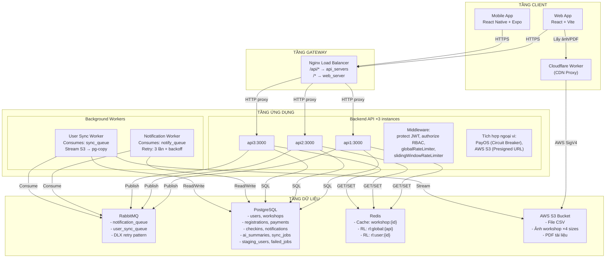
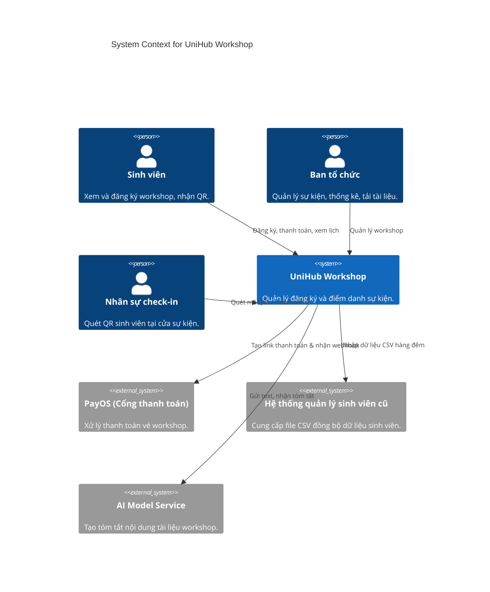
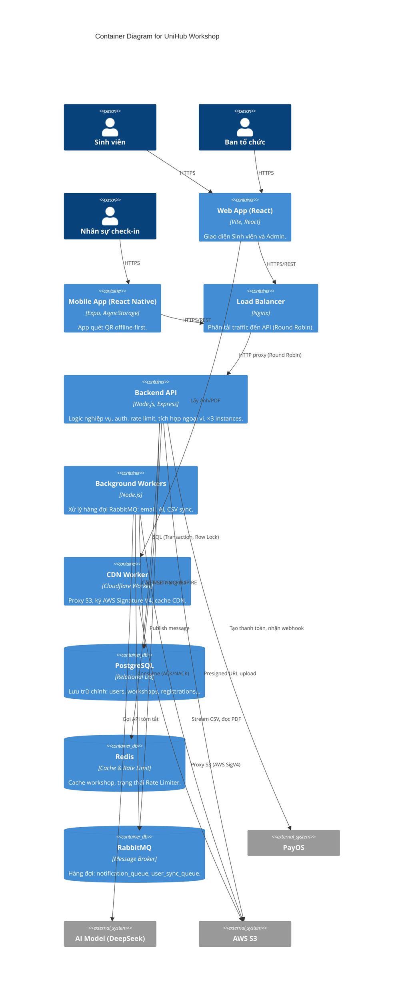
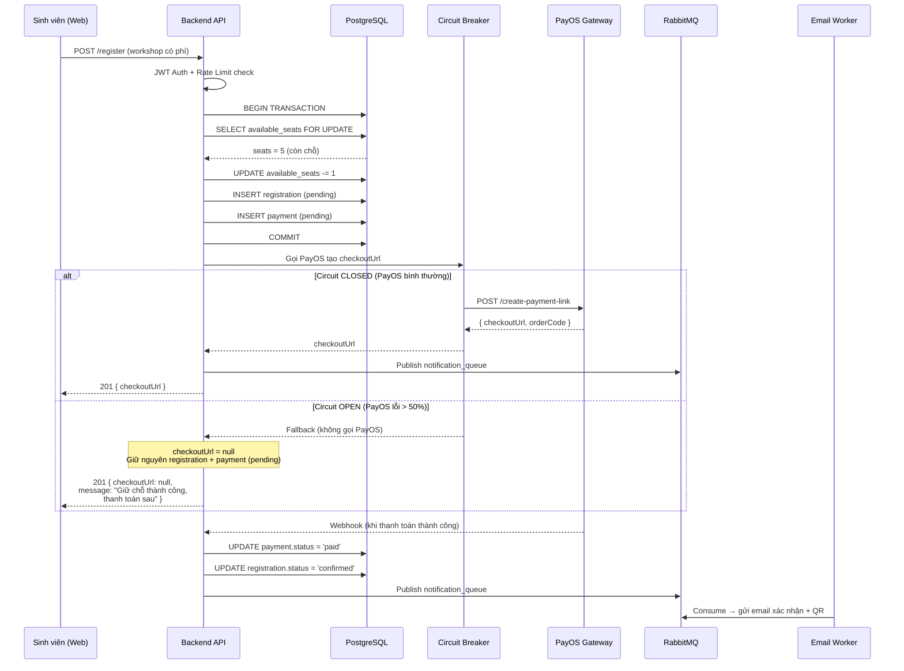
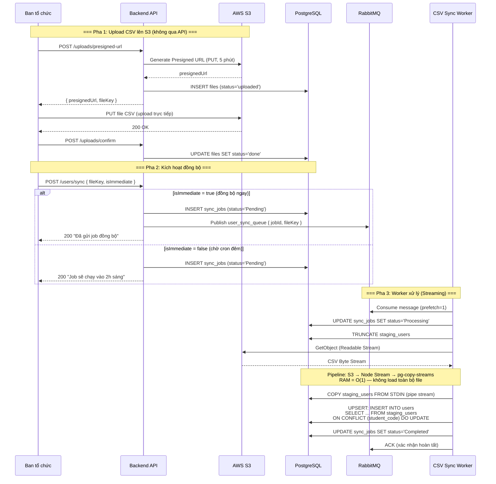
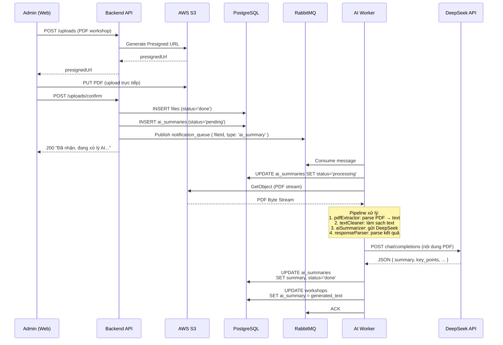
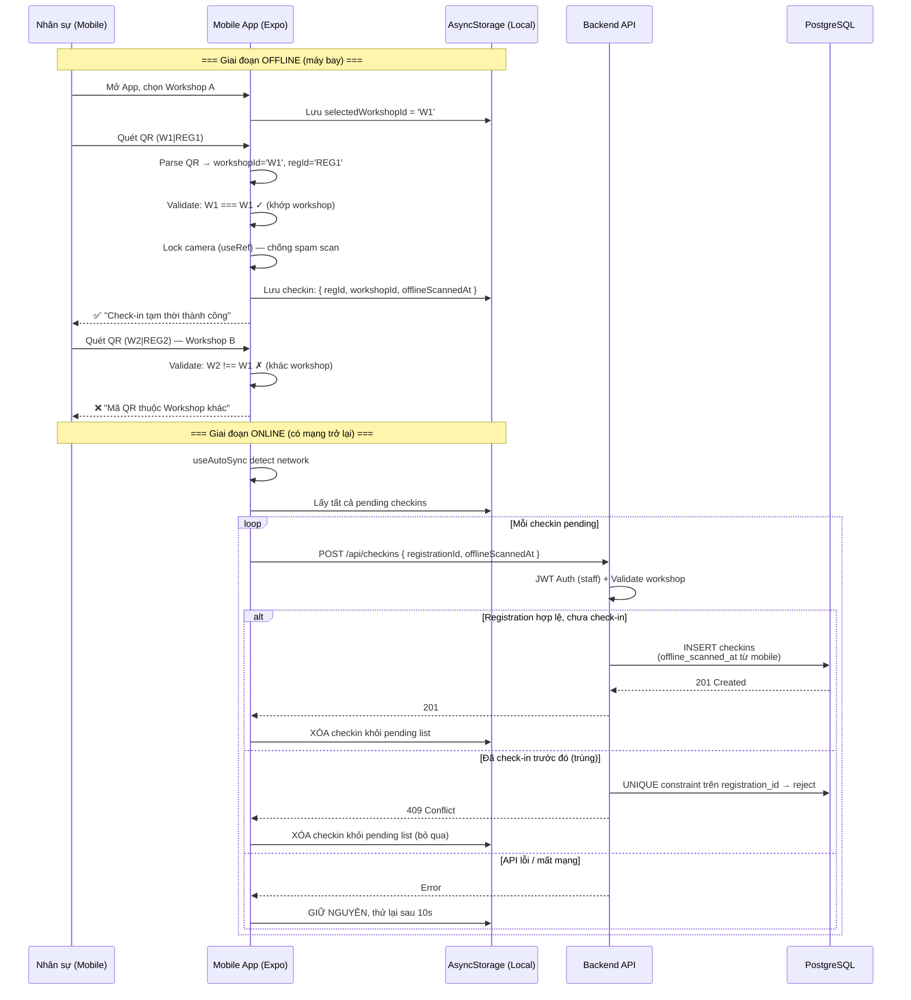
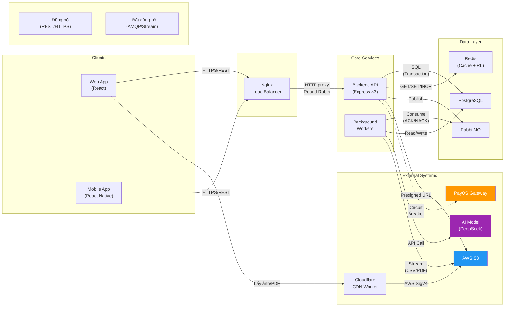
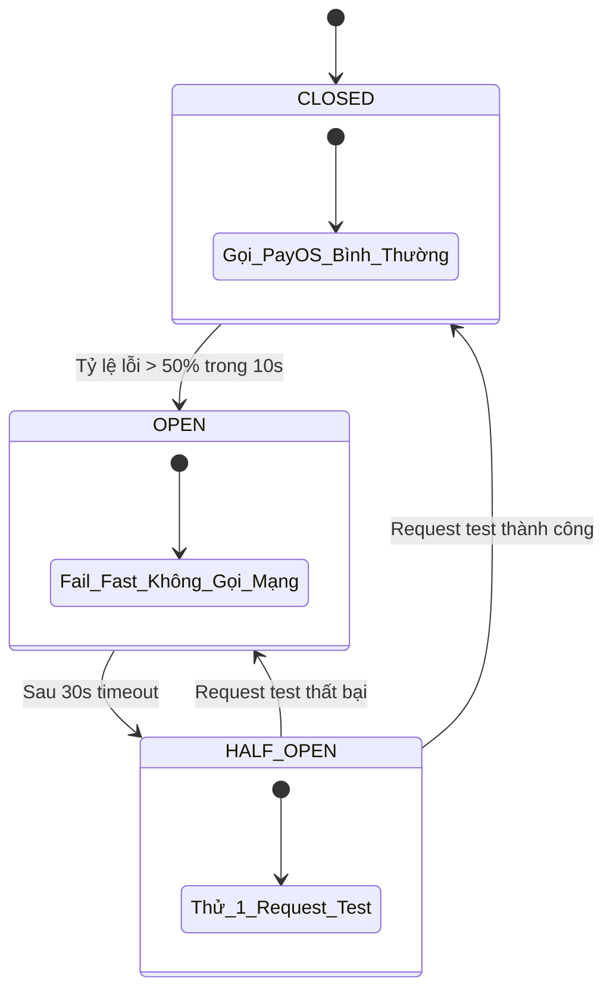
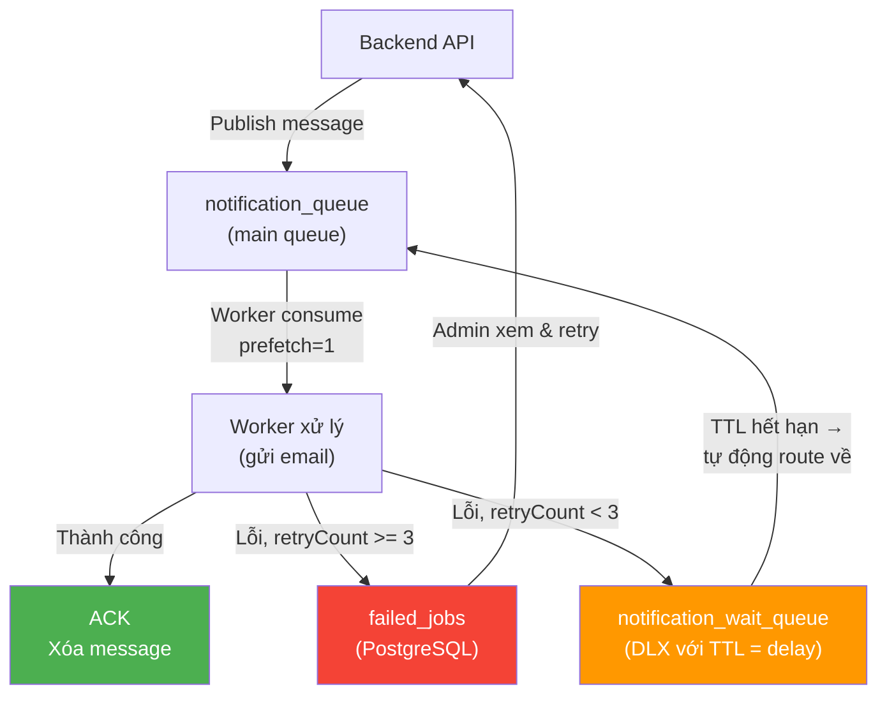

# UniHub Workshop — Technical Design

## Kiến trúc tổng thể

### Phong cách kiến trúc

UniHub Workshop được thiết kế theo mô hình **Service-Oriented Architecture (SOA)** kết hợp với **Event-Driven Architecture** cho các tác vụ bất đồng bộ, đóng gói toàn bộ trong **Docker Containers**.

**Lý do lựa chọn:**

| Yếu tố | Lựa chọn | Lý do |
|---|---|---|
| **Phong cách tổng thể** | SOA + Event-Driven | Hệ thống có các tác vụ với đặc tính khác biệt rõ rệt: đồng bộ (đăng ký, thanh toán — cần phản hồi ngay) và bất đồng bộ (gửi email, import CSV, AI tóm tắt — mất nhiều thời gian). Event-Driven qua RabbitMQ giúp tách biệt hai luồng này, API phản hồi nhanh còn worker xử lý ngầm. |
| **Giao tiếp** | REST (HTTPS) + AMQP (RabbitMQ) | REST cho các request đồng bộ từ client; AMQP cho các tác vụ nền giữa API và Worker. |
| **Xác thực** | JWT (Stateless) | Kiến trúc phân tán với 3 instance API sau Nginx. JWT không cần lưu session server-side, mọi instance đều có thể xác thực độc lập. |
| **Cơ sở dữ liệu** | PostgreSQL (chính) + Redis (cache/Rate Limit) | Nghiệp vụ giữ chỗ và thanh toán đòi hỏi ACID Transactions với Row-Level Locking. Redis bổ trợ cache giảm tải DB và lưu trạng thái Rate Limiter phân tán. |
| **Containerization** | Docker + Docker Compose | Đóng gói toàn bộ hạ tầng (Nginx, API×3, Web, Redis, RabbitMQ) vào một file duy nhất. Khởi chạy bằng một lệnh `docker-compose up`. Hỗ trợ scale-out bằng `--scale`. |

---

### Thành phần hệ thống và cách giao tiếp

Hệ thống gồm **10 thành phần** trải trên 4 tầng:



#### Mô tả chi tiết từng thành phần

##### 1. Nginx Load Balancer
- **Vai trò:** Reverse proxy duy nhất tiếp nhận mọi request từ bên ngoài.
- **Cấu hình:** 
  - `upstream api_servers` gồm 3 backend: `api1:3000`, `api2:3000`, `api3:3000`.
  - `upstream web_server` trỏ đến `web:80`.
  - Request `/api/*` → proxy pass đến cụm API.
  - Request `/*` → proxy pass đến Web App (React).
  - Thuật toán mặc định: **Round Robin**.
- **Giao tiếp:** HTTP/1.1, truyền header `X-Real-IP`, `X-Forwarded-For`.
- **Khi sập:** Nếu Nginx chết, **toàn bộ hệ thống không thể truy cập từ bên ngoài**. Đây là single point of failure trong cấu hình development. Ở production, có thể thêm keepalived hoặc cloud load balancer.

##### 2. Backend API (× 3 instances)
- **Vai trò:** Xử lý toàn bộ logic nghiệp vụ cốt lõi.
- **Công nghệ:** Node.js 20+ với Express, kiến trúc phân lớp:
  - `routes/` — Định nghĩa endpoint, gắn middleware.
  - `controllers/` — Parse request, gọi service, trả response.
  - `services/` — Logic nghiệp vụ thuần (không biết về HTTP).
  - `repositories/` — Truy vấn SQL qua `pg.Pool`.
- **Stateless:** Không lưu session, mỗi instance xác thực độc lập qua JWT. Nhờ đó Nginx có thể phân tải tự do.
- **Giao tiếp:**
  - **Với PostgreSQL:** Qua `pg` connection pool (tối đa 20 connections/pool). Sử dụng transaction (`BEGIN/COMMIT`) và `SELECT ... FOR UPDATE` cho nghiệp vụ đăng ký.
  - **Với Redis:** Qua thư viện `redis`. Gửi lệnh `GET/SET/DEL` cho cache, `INCR/EXPIRE` và Lua scripts cho Rate Limiter.
  - **Với RabbitMQ:** Qua `amqplib`. Publish message vào `notification_queue` và `user_sync_queue`.
  - **Với PayOS:** Qua HTTPS REST, được bọc trong Circuit Breaker (`opossum`).
  - **Với AWS S3:** Qua AWS SDK. Tạo Presigned URL cho upload, không trực tiếp nhận file.
- **Khi sập 1 instance:** Nginx tự động chuyển request sang 2 instance còn lại (health check ngầm của Nginx). User không bị ảnh hưởng.
- **Khi sập cả 3 instance:** Toàn bộ API ngừng hoạt động. Web App vẫn hiển thị giao diện (SPA) nhưng không thể fetch dữ liệu mới. Mobile App không thể đồng bộ check-in. RabbitMQ, Redis, PostgreSQL vẫn chạy — dữ liệu không mất.

##### 3. Web App (React + Vite)
- **Vai trò:** Giao diện Sinh viên và Admin.
- **Công nghệ:** React 18, Vite, React Router.
- **Trang chính:**
  - `StudentDashboard` — Danh sách workshop, đăng ký, xem QR.
  - `StudentPayments` — Quản lý thanh toán.
  - `AdminWorkshops` — CRUD workshop.
  - `AdminStats` — Thống kê đăng ký.
  - `AdminPayments` — Quản lý thanh toán toàn hệ thống.
  - `AdminSyncUsers` — Đồng bộ CSV.
  - `AdminFailedJobs` — Xem job thất bại.
  - `Login`, `Profile`, `QrGenerator`.
- **Giao tiếp:** Gọi API qua `/api/*` (Nginx proxy). Client dùng JWT lưu trong localStorage.
- **Khi sập:** Nếu Web container chết, Nginx trả về 502 Bad Gateway. Không ảnh hưởng đến Mobile App và API. Sinh viên không xem được giao diện web nhưng dữ liệu trong DB vẫn nguyên vẹn.

##### 4. Mobile App (React Native + Expo)
- **Vai trò:** Ứng dụng quét QR check-in cho Staff.
- **Công nghệ:** React Native, Expo, AsyncStorage (lưu offline), expo-camera (quét QR), expo-network (phát hiện mạng).
- **Offline-first:** 
  - QR code chứa `workshop_id|registration_id` để app validate workshop ngay cả khi offline.
  - Dữ liệu check-in lưu vào AsyncStorage cục bộ.
  - Background hook `useAutoSync` phát hiện mạng và đồng bộ hàng loạt.
  - Cơ chế lock state (useRef) ngăn camera spam request.
- **Giao tiếp:** HTTPS REST đến Nginx → API. Khi mất mạng, lưu cục bộ và chờ đồng bộ.
- **Khi sập:** App vẫn quét QR và lưu offline bình thường. Không ảnh hưởng gì đến các thành phần khác.

##### 5. Background Workers (Node.js)
- **Vai trò:** Xử lý các tác vụ nền không cần phản hồi tức thời.
- **Hai worker riêng biệt** (cùng Docker image, khởi động trong `index.js`):
  
  **Notification Worker** (`notification.worker.js`):
  - Consume từ `notification_queue`.
  - Gửi email qua EmailStrategy (Strategy Pattern).
  - Retry tối đa 3 lần với exponential backoff (5s → 15s → 30s).
  - Sử dụng RabbitMQ DLX (Dead Letter Exchange) để tự động requeue sau TTL.
  - Khi thất bại hoàn toàn: lưu vào bảng `failed_jobs` để admin xem lại.
  
  **User Sync Worker** (`userSync.worker.js`):
  - Consume từ `user_sync_queue`.
  - Download CSV stream từ S3, pipe thẳng vào PostgreSQL qua `pg-copy-streams`.
  - Merge dữ liệu từ `staging_users` sang `users` bằng SQL `UPSERT`.
  - Tích hợp `node-cron` để quét `sync_jobs` pending theo lịch (`SYNC_CRON_SCHEDULE`).
  - `prefetch(1)` — chỉ xử lý 1 file/lần, tránh OOM.

- **Giao tiếp:** Nhận message từ RabbitMQ, đọc/ghi PostgreSQL, gọi API ngoài (email SMTP, AI model), stream từ S3.
- **Khi sập:** RabbitMQ không nhận ACK → message được requeue tự động. Khi worker khởi động lại, tiếp tục xử lý từ đầu. Không mất dữ liệu. API vẫn hoạt động bình thường (chỉ các tác vụ nền bị trì hoãn).

##### 6. PostgreSQL
- **Vai trò:** Cơ sở dữ liệu quan hệ chính, lưu toàn bộ dữ liệu nghiệp vụ.
- **Đặc điểm:**
  - OLTP workload: đọc/ghi nhỏ, tần suất cao, yêu cầu latency thấp.
  - 9 bảng chính + 2 bảng staging/sync.
  - Row-Level Locking (`SELECT ... FOR UPDATE`) cho nghiệp vụ đăng ký.
  - Trigger `sync_workshop_available_seats()` tự động cập nhật `available_seats`.
  - Constraint `CHECK (available_seats >= 0)` bảo vệ ở tầng DB.
  - Unique constraints chống trùng lặp (registration, payment, checkin).
  - UUID làm khóa chính (bảo mật, tránh lộ số lượng).
- **Giao tiếp:** Qua TCP/IP. API và Worker kết nối qua connection pool.
- **Khi sập:** **Toàn bộ hệ thống ngừng hoạt động** — API không thể đọc/ghi dữ liệu, Worker không thể xử lý job. Đây là single point of failure. Trong môi trường development, sử dụng Supabase (managed PostgreSQL) để giảm rủi ro.

##### 7. Redis
- **Vai trò:** Cache và Rate Limiter phân tán.
- **Hai chức năng chính:**
  - **Cache Workshop:** Lưu thông tin workshop với TTL động (`calculateCacheTTL`): 1 giờ cho workshop mới tạo, 30 phút quanh thời gian diễn ra sự kiện.
  - **Rate Limiter:** Lưu trạng thái cho 2 tầng rate limit:
    - Global: giới hạn tổng request vào API đăng ký.
    - User-level (Sliding Window): mỗi user tối đa 1 req/5s, dùng ZSET (Sorted Set).
- **Giao tiếp:** TCP, thư viện `redis` npm. API kết nối khi khởi động.
- **Khi sập:** 
  - Cache miss: API fallback về đọc trực tiếp từ PostgreSQL → chậm hơn nhưng **không mất chức năng**.
  - Rate Limiter mất: Mọi request vượt qua rate limit → tăng áp lực lên DB. Hệ thống vẫn chạy nhưng dễ bị quá tải.
  - Worker vẫn hoạt động bình thường (không phụ thuộc Redis).

##### 8. RabbitMQ
- **Vai trò:** Message broker điều phối tác vụ bất đồng bộ.
- **Hai queue chính:**
  - `notification_queue` (durable, persistent) — gửi email xác nhận.
  - `user_sync_queue` (durable, persistent) — đồng bộ CSV.
- **Cơ chế:**
  - Manual ACK (không auto-ack) để đảm bảo không mất message.
  - DLX pattern cho retry với delay.
  - `prefetch(1)` giới hạn mỗi worker xử lý 1 message/lần.
- **Giao tiếp:** AMQP (port 5672). Management UI tại port 15672.
- **Khi sập:** 
  - API vẫn publish message (sẽ fail nhưng không crash nhờ error handling).
  - Worker không consume được → email không gửi, CSV không đồng bộ.
  - **Dữ liệu nghiệp vụ chính (đăng ký, thanh toán) không bị ảnh hưởng.**
  - Khi RabbitMQ khởi động lại, message trong durable queue vẫn tồn tại.

##### 9. Cloudflare Worker (CDN Proxy)
- **Vai trò:** Proxy CDN cho AWS S3, ký AWS Signature V4.
- **Hoạt động:** Nhận request HTTP, ký chữ ký AWS, forward sang S3, trả về response với Cache-Control header.
- **Cache policy:** Ảnh đã xử lý (`/processed/`) cache 30 ngày; file khác cache 1 giờ.
- **Giao tiếp:** HTTPS (từ client) → S3 API (từ worker).
- **Khi sập:** Ảnh workshop và PDF không hiển thị được. Các chức năng khác không bị ảnh hưởng.

##### 10. AWS S3
- **Vai trò:** Lưu trữ file tĩnh.
- **Dữ liệu lưu trữ:**
  - File CSV đồng bộ sinh viên.
  - Ảnh workshop (gốc + 3 kích thước: thumb, medium, large).
  - PDF tài liệu workshop.
- **Giao tiếp:** 
  - Presigned URL cho upload (client upload trực tiếp, không qua API).
  - GetObject qua Cloudflare Worker (CDN) hoặc trực tiếp từ Worker (stream pipe).
- **Khi sập:** Upload và download file không hoạt động. Chức năng đăng ký, thanh toán, check-in không bị ảnh hưởng.

---

### Ma trận ảnh hưởng khi sự cố (Failure Impact Matrix)

| Thành phần sập ↓ | API | Web App | Mobile App | Worker | DB | Cache | Queue | Ảnh hưởng người dùng |
|---|---|---|---|---|---|---|---|---|
| **Nginx** | 🔴 Mất kết nối | 🔴 502 | 🔴 502 | 🟢 | 🟢 | 🟢 | 🟢 | **Toàn bộ hệ thống không truy cập được** |
| **API (1 instance)** | 🟡 Nginx chuyển | 🟢 | 🟢 | 🟢 | 🟢 | 🟢 | 🟢 | Không ảnh hưởng |
| **API (cả 3)** | 🔴 Ngừng | 🔴 Không fetch | 🔴 Không sync | 🟢 | 🟢 | 🟢 | 🟢 | **Không đăng ký/thanh toán được** |
| **Web App** | 🟢 | 🔴 502 | 🟢 | 🟢 | 🟢 | 🟢 | 🟢 | Sinh viên không xem được web |
| **Mobile App** | 🟢 | 🟢 | 🔴 | 🟢 | 🟢 | 🟢 | 🟢 | Staff không quét QR được |
| **Worker** | 🟢 | 🟢 | 🟢 | 🔴 | 🟢 | 🟢 | 🟡 Pending | Email chậm, CSV chưa sync |
| **PostgreSQL** | 🔴 Lỗi DB | 🔴 Lỗi fetch | 🔴 Lỗi sync | 🔴 Lỗi DB | 🔴 | 🟢 | 🟢 | **Toàn bộ hệ thống ngừng** |
| **Redis** | 🟡 Chậm hơn | 🟡 Chậm hơn | 🟡 Chậm hơn | 🟢 | 🟢 | 🔴 | 🟢 | Chậm, mất rate limit |
| **RabbitMQ** | 🟡 Fail publish | 🟢 | 🟢 | 🔴 Không consume | 🟢 | 🟢 | 🔴 | Email không gửi, CSV không sync |
| **Cloudflare Worker** | 🟢 | 🔴 Thiếu ảnh | 🔴 Thiếu ảnh | 🟢 | 🟢 | 🟢 | 🟢 | Ảnh/PDF không hiển thị |
| **AWS S3** | 🟡 Upload lỗi | 🔴 Thiếu ảnh | 🟢 | 🔴 Sync lỗi | 🟢 | 🟢 | 🟢 | Upload/sync file không hoạt động |

> 🔴 = Ngừng hoạt động hoàn toàn  
> 🟡 = Suy giảm chức năng  
> 🟢 = Không ảnh hưởng

### Single Points of Failure & Biện pháp giảm thiểu

| Điểm yếu | Mức độ nghiêm trọng | Biện pháp trong hiện tại | Hướng cải thiện cho production |
|---|---|---|---|
| **Nginx** | Rất cao — mất toàn bộ kết nối | Restart policy: `unless-stopped` | Thêm cloud load balancer (AWS ALB), multi-AZ |
| **PostgreSQL** | Rất cao — mất toàn bộ dữ liệu | Supabase managed (có backup, replication) | Multi-region replication, read replicas |
| **RabbitMQ** | Trung bình — chỉ ảnh hưởng tác vụ nền | Durable queues, persistent messages | RabbitMQ cluster với mirrored queues |
| **Redis** | Thấp — hệ thống chạy chậm nhưng không sập | Fallback về DB khi cache miss | Redis Sentinel / Cluster |

---

## C4 Diagram

### Level 1 — System Context


### Level 2 — Container


---

## High-Level Architecture Diagram

Sơ đồ dưới đây thể hiện luồng dữ liệu và sự phụ thuộc giữa các thành phần tại các điểm tích hợp chính của hệ thống.

### 1. Tích hợp cổng thanh toán (PayOS)

Đây là luồng dữ liệu giữa UniHub Workshop và cổng thanh toán PayOS, bao gồm cả nhánh xử lý khi PayOS gặp sự cố (Circuit Breaker Open):



**Điểm mấu chốt**: Khi Circuit Breaker OPEN, hệ thống **không trả về lỗi** mà chuyển sang chế độ Graceful Degradation — sinh viên vẫn được giữ chỗ, frontend hiển thị nút "Thanh toán lại" để sinh viên chủ động gọi khi PayOS hồi phục.

### 2. Tích hợp hệ thống cũ (CSV Sync)

Luồng dữ liệu từ hệ thống quản lý sinh viên cũ (chỉ xuất CSV, không có API) vào UniHub Workshop:



**Điểm mấu chốt**: Dữ liệu CSV **chưa từng được nạp toàn bộ vào RAM** — pipeline stream trực tiếp từ S3 qua Node.js (chỉ giữ buffer nhỏ) vào PostgreSQL, cho phép xử lý file hàng GB trên server 512MB RAM.

### 3. Tích hợp AI Model (DeepSeek)

Luồng dữ liệu khi Admin upload PDF giới thiệu workshop và hệ thống sinh tóm tắt bằng AI:



**Điểm mấu chốt**: Pipeline pattern (`pdfExtractor → textCleaner → aiSummarizer → responseParser`) cho phép thêm/bớt/sắp xếp các bước xử lý mà không thay đổi code lõi. Mỗi filter là một class độc lập implement cùng interface.

### 4. Check-in Offline (Luồng dữ liệu khi mất mạng)



**Nguyên tắc cốt lõi**: **Không bao giờ xóa dữ liệu offline** cho đến khi nhận HTTP 201 từ server. Nếu API lỗi hoặc mạng lại mất giữa chừng, dữ liệu vẫn an toàn trong AsyncStorage.

### 5. Sơ đồ phụ thuộc tổng thể (Dependency Map)



---

## Thiết kế cơ sở dữ liệu

Hệ thống sử dụng **PostgreSQL** làm cơ sở dữ liệu chính, kết hợp với **Redis** cho cache và rate limiting.

### Lựa chọn công nghệ

| Tiêu chí | PostgreSQL | Redis |
|---|---|---|
| **Vai trò** | Source of truth — toàn bộ dữ liệu nghiệp vụ | Cache & Rate Limiter state |
| **Tính nhất quán** | Strong Consistency (ACID) | Best-effort (cache TTL) |
| **Mô hình dữ liệu** | Relational (bảng, khóa ngoại, constraint) | Key-Value + Sorted Sets |
| **Khả năng mở rộng** | Vertical (scale-up) + Read Replica | Horizontal (cluster/sentinel) |
| **Lý do chọn** | Row-level locking cho chống overselling; ACID cho thanh toán; Schema cố định phù hợp nghiệp vụ | In-memory tốc độ cao cho rate limit; TTL tự động hết hạn cache; ZSET cho sliding window |

### Vì sao PostgreSQL mà không phải MongoDB?

Nghiệp vụ cốt lõi của hệ thống là **giữ chỗ** và **thanh toán** — cả hai đều yêu cầu:
- **Tính toàn vẹn giao dịch (ACID)**: Một đăng ký phải đồng thời tạo `registration` + giảm `available_seats`. Nếu một bước thất bại, toàn bộ phải rollback.
- **Row-Level Locking**: Khi 2 sinh viên cùng giành chỗ cuối, database phải xếp hàng tuần tự — PostgreSQL làm được điều này với `SELECT ... FOR UPDATE`.
- **Ràng buộc phức tạp**: `CHECK (available_seats >= 0)`, `UNIQUE (student_id, workshop_id)`, `UNIQUE INDEX ... WHERE status = 'success'`.

MongoDB không đảm bảo được multi-document ACID transaction với hiệu suất cao như PostgreSQL trong kịch bản này.

### Lược đồ (Schema) chính

Chi tiết đầy đủ tại `blueprint/database/script_schema.sql`. Dưới đây là các bảng cốt lõi:

#### `users` — Quản lý định danh & phân quyền
| Cột | Kiểu | Ràng buộc | Mô tả |
|---|---|---|---|
| `id` | UUID | PK, DEFAULT gen_random_uuid() | Khóa chính |
| `student_code` | TEXT | UNIQUE | Mã số sinh viên (đối chiếu CSV) |
| `name` | TEXT | NOT NULL | Họ tên |
| `email` | TEXT | NOT NULL UNIQUE | Email đăng nhập |
| `password_hash` | TEXT | NOT NULL | Mật khẩu đã băm (bcrypt + salt) |
| `role` | TEXT | NOT NULL, CHECK (IN 'student','admin','staff') | Phân quyền |
| `created_at` | TIMESTAMP | DEFAULT NOW() | Thời gian tạo |

#### `workshops` — Thông tin sự kiện
| Cột | Kiểu | Ràng buộc | Mô tả |
|---|---|---|---|
| `id` | UUID | PK | Khóa chính |
| `title` | TEXT | NOT NULL | Tên workshop |
| `description` | TEXT | | Mô tả chi tiết |
| `capacity` | INT | NOT NULL, CHECK (> 0) | Tổng số chỗ |
| `available_seats` | INT | NOT NULL, CHECK (>= 0), CHECK (<= capacity) | Chỗ còn trống (tự động cập nhật bởi trigger) |
| `price` | DECIMAL | DEFAULT 0, CHECK (>= 0) | Phí tham dự (0 = miễn phí) |
| `start_time` | TIMESTAMP | NOT NULL | Thời gian bắt đầu |
| `end_time` | TIMESTAMP | NOT NULL, CHECK (> start_time) | Thời gian kết thúc |
| `location` | TEXT | | Phòng tổ chức |
| `speaker` | TEXT | | Diễn giả |
| `room_map_url` | TEXT | | Sơ đồ phòng |
| `created_by` | UUID | FK → users(id), ON DELETE SET NULL | Admin tạo workshop |

#### `registrations` — Liên kết Sinh viên ↔ Workshop
| Cột | Kiểu | Ràng buộc | Mô tả |
|---|---|---|---|
| `id` | UUID | PK | Khóa chính |
| `student_id` | UUID | NOT NULL, FK → users(id) CASCADE | Sinh viên đăng ký |
| `workshop_id` | UUID | NOT NULL, FK → workshops(id) CASCADE | Workshop được đăng ký |
| `status` | TEXT | NOT NULL, CHECK (IN 'pending','confirmed','cancelled') | Trạng thái |
| `created_at` | TIMESTAMP | DEFAULT NOW() | Thời gian đăng ký |

Ràng buộc đặc biệt: `UNIQUE (student_id, workshop_id)` — mỗi sinh viên chỉ đăng ký 1 workshop 1 lần.

**Trigger `sync_workshop_available_seats()`**: Tự động cập nhật `workshops.available_seats` khi INSERT/UPDATE/DELETE trên `registrations`, đảm bảo số ghế luôn nhất quán.

#### `payments` — Quản lý thanh toán
| Cột | Kiểu | Ràng buộc | Mô tả |
|---|---|---|---|
| `id` | UUID | PK | Khóa chính |
| `registration_id` | UUID | NOT NULL, FK → registrations(id) CASCADE | Đăng ký liên quan |
| `amount` | DECIMAL | NOT NULL, CHECK (>= 0) | Số tiền |
| `status` | TEXT | NOT NULL, CHECK (IN 'pending','paid','failed','expired') | Trạng thái |
| `idempotency_key` | TEXT | UNIQUE | Khóa chống trừ 2 lần |
| `order_code` | SERIAL | UNIQUE | Mã đơn hàng PayOS |
| `checkout_url` | TEXT | | Link thanh toán |
| `external_id` | TEXT | | paymentLinkId từ PayOS |
| `created_at` | TIMESTAMP | DEFAULT NOW() | Thời gian tạo |

Ràng buộc đặc biệt: `UNIQUE INDEX unique_success_payment ON payments(registration_id) WHERE status = 'success'` — mỗi đăng ký chỉ có 1 thanh toán thành công.

#### `checkins` — Lịch sử quét QR
| Cột | Kiểu | Ràng buộc | Mô tả |
|---|---|---|---|
| `id` | UUID | PK | Khóa chính |
| `registration_id` | UUID | NOT NULL UNIQUE, FK → registrations(id) CASCADE | Đăng ký được check-in |
| `checkin_time` | TIMESTAMP | | Thời điểm đồng bộ lên server |
| `offline_scanned_at` | TIMESTAMP | | Thời điểm quét QR thực tế (offline) |
| `status` | TEXT | NOT NULL, CHECK (IN 'pending','synced') | Trạng thái đồng bộ |
| `staff_id` | UUID | FK → users(id), ON DELETE SET NULL | Nhân sự quét QR |

#### Bảng phụ trợ
- **`workshop_staffs`**: Phân công staff cho từng workshop. `UNIQUE (workshop_id, staff_id)`.
- **`notifications`**: Lịch sử gửi thông báo (`type`: email/sms/push, `status`: pending/sent/failed).
- **`ai_summaries`**: Kết quả tóm tắt AI từ PDF. `UNIQUE (file_id)`.
- **`files`**: Metadata file upload lên S3 (`status`: uploaded/processing/done).
- **`workshop_images`**: Ảnh workshop với 3 kích thước (thumb, medium, large) + CDN URL.
- **`sync_jobs`**: Tracking tiến độ đồng bộ CSV (`status`: Pending/Processing/Completed/Failed).
- **`staging_users`**: Bảng tạm không constraint để đổ CSV siêu tốc qua `COPY`.
- **`failed_jobs`**: Lưu payload của job thất bại để admin xem lại.

### Chiến lược Indexing

Chỉ tạo index tối thiểu trên khóa chính và khóa ngoại bắt buộc trong giai đoạn đầu. Lý do: 12.000 sinh viên tạo ra lượng `INSERT` khổng lồ vào `registrations` trong 10 phút đầu — index làm chậm quá trình ghi. Chiến lược dài hạn: monitor slow query log để thêm composite index chính xác theo pattern truy xuất thực tế.

### Trade-off: Strong vs Eventual Consistency

| Luồng nghiệp vụ | Mức nhất quán | Lý do |
|---|---|---|
| **Đăng ký + Thanh toán** | **Strong Consistency** | Số chỗ trống và trạng thái thanh toán phải chính xác tuyệt đối, chấp nhận latency cao hơn do transaction. |
| **Cache Workshop (Redis)** | **Eventual Consistency** | Chấp nhận dữ liệu cache lệch vài giây so với DB. Khi cache TTL hết hạn, đọc lại từ DB. |
| **Email Notification** | **Eventual Consistency** | Gửi email có thể trễ vài giây, không ảnh hưởng đến nghiệp vụ chính. |
| **AI Summary** | **Eventual Consistency** | Sinh tóm tắt mất vài chục giây, không cần đồng bộ tức thời. |
| **CSV Sync** | **Eventual Consistency** | Dữ liệu sinh viên mới có độ trễ vài phút, chấp nhận được với lịch sync đêm. |

---

## Thiết kế kiểm soát truy cập

Hệ thống sử dụng mô hình **RBAC (Role-Based Access Control)** với **JWT (JSON Web Tokens)**.

### Ba nhóm người dùng

| Role | Quyền hạn | API được phép |
|---|---|---|
| **`student`** | Xem danh sách workshop, đăng ký, thanh toán, xem QR của bản thân | `GET /api/workshops`, `POST /api/workshops/:id/register`, `GET/POST /api/payments/*`, `GET /api/registrations/my` |
| **`admin`** | Toàn quyền CRUD workshop, xem thống kê, quản lý đồng bộ CSV, upload PDF, phân công staff | `POST/PUT/DELETE /api/workshops`, `GET /api/admin/stats`, `POST /api/users/sync`, `POST /api/uploads/*` |
| **`staff`** | Chỉ quét QR check-in tại workshop được phân công | `POST /api/checkins`, `GET /api/workshops/:id/checkins` |

### Luồng xác thực

1. **Login**: Client gửi `POST /api/auth/login` với `{ email, password }`.
2. **Xác thực**: Backend tìm user trong DB, so sánh password_hash với bcrypt.
3. **Cấp JWT**: Backend sinh token chứa payload `{ id, role }`, ký bằng `JWT_SECRET`, trả về client.
4. **Gửi request**: Client gắn `Authorization: Bearer <token>` vào mọi request.
5. **Middleware `protect`**: Decode JWT, trích xuất `userId` và `role`, kiểm tra user tồn tại trong DB.
6. **Middleware `authorize(...roles)`**: Kiểm tra role của user có nằm trong danh sách cho phép không. Nếu không → 403 Forbidden.

### Các kịch bản lỗi xác thực

| Tình huống | HTTP Status | Hành vi |
|---|---|---|
| Token hết hạn/sai chữ ký | 401 Unauthorized | Client logout, chuyển về trang login |
| User bị xóa nhưng token còn hạn | 401 Unauthorized | `protect` kiểm tra DB, không tìm thấy user |
| Role không đủ quyền | 403 Forbidden | Student gọi API Admin, Staff gọi API đăng ký |
| Thiếu token | 401 Unauthorized | Request không có header Authorization |

### Ràng buộc bảo mật

- **Mật khẩu**: Băm bằng `bcrypt` với salt ngẫu nhiên trước khi lưu vào DB.
- **JWT TTL**: 7 ngày cho mobile app (offline check-in), 24 giờ cho Web App.
- **JWT_SECRET**: Lưu trong biến môi trường, không hardcode.
- **UUID làm khóa chính**: Tránh lộ số lượng người dùng (so với auto-increment integer).

---

## Thiết kế các cơ chế bảo vệ hệ thống

### 1. Kiểm soát tải đột biến (Rate Limiting)

**Bài toán**: 12.000 sinh viên truy cập đồng loạt, 60% (7.200 người) dồn vào 3 phút đầu → ~40 req/s chỉ riêng API đăng ký. Nếu không kiểm soát, PostgreSQL cạn kiệt connection pool (tối đa 20 connections/pool × 3 instances = 60 connections), gây timeout hàng loạt.

**Thiết kế 2 tầng Rate Limiter trên Redis**:

#### Tầng 1: Global Rate Limiter (Fixed Window)
- **Mục tiêu**: Bảo vệ PostgreSQL connection pool.
- **Thuật toán**: Fixed Window Counter trên Redis.
- **Giới hạn**: Toàn bộ hệ thống tối đa N request/giây cho endpoint đăng ký.
- **Key pattern**: `rl:global:{api_endpoint}:{window_timestamp}`
- **Redis command**: `INCR` + `EXPIRE`.
- **Middleware**: `globalRateLimiter` — áp dụng cho `POST /api/workshops/:id/register`.

#### Tầng 2: User-level Sliding Window Rate Limiter
- **Mục tiêu**: Ngăn một user spam đăng ký liên tục.
- **Thuật toán**: Sliding Window Log trên Redis Sorted Set (ZSET).
- **Giới hạn**: Mỗi user tối đa 1 request/5 giây cho endpoint đăng ký.
- **Key pattern**: `rl:user:{user_id}:{api_endpoint}`
- **Redis command**: 
  1. `ZREMRANGEBYSCORE` xóa entries cũ ngoài window.
  2. `ZCARD` đếm số request trong window.
  3. Nếu < limit: `ZADD` thêm timestamp mới.
- **Middleware**: `slidingWindowRateLimiter(1, 5000)` — 1 request mỗi 5000ms.

#### Hành vi khi vượt ngưỡng
- HTTP 429 Too Many Requests.
- Response body: `{ message: "Hệ thống đang quá tải, vui lòng thử lại sau vài giây" }`.
- Frontend hiển thị thông báo thân thiện, không crash.

### 2. Xử lý cổng thanh toán không ổn định (Circuit Breaker)

**Bài toán**: PayOS có thể timeout hoặc trả về 5xx. Nếu API Node.js chờ đợi đồng bộ, thread bị kẹt → kéo theo request xem danh sách workshop của sinh viên khác cũng thất bại (cascading failure).

**Giải pháp: Circuit Breaker Pattern với thư viện `opossum`**:



#### Graceful Degradation (Fallback)
Khi Circuit Breaker ở trạng thái **OPEN**, thay vì ném lỗi 500 cho sinh viên, hệ thống thực thi hàm Fallback:

1. Vẫn tạo `Registration` với `status = 'pending'`.
2. Vẫn tạo `Payment` với `status = 'pending'`, `checkout_url = null`.
3. Vẫn giảm `available_seats` của workshop.
4. Trả về response: `{ checkoutUrl: null, message: "Cổng thanh toán đang bảo trì. Bạn đã được giữ chỗ và có thể thanh toán sau." }`.
5. Frontend hiển thị nút "Thanh toán lại" để sinh viên chủ động gọi lại.

→ **Sinh viên không bị mất chỗ dù cổng thanh toán sập.**

### 3. Chống trừ tiền hai lần & Tranh chấp chỗ ngồi (Idempotency)

**Bài toán A — Tranh chấp chỗ ngồi (Race Condition)**:
Workshop 60 chỗ, 100 sinh viên cùng bấm đăng ký. Nếu dùng code JavaScript kiểm tra ghế trống rồi trừ (check-then-act), hai request có thể cùng thấy `available_seats = 1` và cùng đăng ký thành công → 61 người / 60 chỗ.

**Giải pháp**: Database Transaction + Row-Level Locking
```sql
BEGIN;
  -- Khóa dòng workshop này, các request khác phải xếp hàng
  SELECT available_seats FROM workshops WHERE id = $1 FOR UPDATE;
  -- Kiểm tra còn chỗ không
  IF available_seats <= 0 THEN ROLLBACK; -- Hết chỗ
  -- Giảm ghế
  UPDATE workshops SET available_seats = available_seats - 1;
  -- Tạo registration
  INSERT INTO registrations ...;
COMMIT;
```
Request thứ hai sẽ bị block ở `SELECT ... FOR UPDATE` cho đến khi request đầu COMMIT. Lúc đó `available_seats = 0` → bị từ chối.

**Bảo vệ tầng DB**: Constraint `CHECK (available_seats >= 0)` và trigger `sync_workshop_available_seats()` đảm bảo ngay cả khi code có bug, DB vẫn từ chối overselling.

**Bài toán B — Trùng lặp thanh toán (Double Charge)**:
Sinh viên bấm đăng ký liên tục, sinh ra nhiều payment.

**Giải pháp**: Idempotency Key + Unique Constraint
1. Khi sinh viên gửi request thanh toán, API kiểm tra: đã có `Registration` với `status = 'pending'` của workshop này chưa?
2. Nếu **đã có**: Không tạo mới, lấy `order_code` của Payment cũ, gọi lại PayOS lấy link (hoặc trả link cũ nếu còn hạn).
3. Nếu **chưa có**: Tạo mới với `idempotency_key` UNIQUE.
4. Tầng DB: `UNIQUE INDEX unique_success_payment ON payments(registration_id) WHERE status = 'success'` — không thể có 2 payment thành công cho cùng 1 registration.

### 4. Dead Letter Queue & Message Retry (DLQ Pattern)

**Bài toán**: Khi Worker xử lý tác vụ nền (gửi email, AI summary, CSV sync) gặp lỗi, nếu message bị hủy ngay thì:
- Email xác nhận không bao giờ được gửi → sinh viên không nhận QR.
- AI summary thất bại âm thầm → admin không biết để xử lý lại.
- CSV sync lỗi → dữ liệu sinh viên lỗi thời.

**Giải pháp**: Hệ thống triển khai **Dead Letter Exchange (DLX) Pattern** trên RabbitMQ kết hợp với bảng `failed_jobs` trong PostgreSQL:

#### Cơ chế Retry với Exponential Backoff (Notification Worker)



#### Cấu hình RabbitMQ DLX cho Retry

```javascript
// Tạo các Wait Queue với TTL và DLX
const delays = [5000, 15000, 30000]; // 5s, 15s, 30s (exponential backoff)

for (const delay of delays) {
  await channel.assertQueue(`notification_wait_queue_${delay}`, {
    durable: true,
    arguments: {
      'x-dead-letter-exchange': '',           // Default exchange
      'x-dead-letter-routing-key': 'notification_queue', // Route về main queue
      'x-message-ttl': delay,                 // Tự động expire sau delay
    },
  });
}
```

#### Luồng xử lý

1. Worker nhận message từ `notification_queue`.
2. Gửi email. Nếu **thành công**: `channel.ack(msg)` — message bị xóa khỏi queue.
3. Nếu **thất bại**:
   - Tăng `retryCount` trong message payload.
   - Nếu `retryCount < 3`: publish vào `notification_wait_queue_{delay}` tương ứng. Message sẽ tự động quay lại `notification_queue` sau TTL. **Không cần code timer.**
   - Nếu `retryCount >= 3`: lưu payload vào bảng `failed_jobs` của PostgreSQL, gửi `channel.ack(msg)` để xóa khỏi RabbitMQ (tránh infinite loop).
4. Admin có thể xem danh sách job thất bại tại `AdminFailedJobs.jsx` và quyết định retry thủ công hoặc bỏ qua.

```
Retry attempt 1: delay 5s  → Wait Queue (TTL 5s)  → notification_queue → Worker
Retry attempt 2: delay 15s → Wait Queue (TTL 15s) → notification_queue → Worker
Retry attempt 3: delay 30s → Wait Queue (TTL 30s) → notification_queue → Worker
Retry attempt 4: ❌ → failed_jobs (PostgreSQL)
```

### 5. Bảng Failed Jobs & Admin Dashboard

**Bài toán**: Khi tác vụ nền thất bại hoàn toàn (sau 3 lần retry), admin cần biết để xử lý. Không thể để email thất bại âm thầm.

**Giải pháp**: Bảng `failed_jobs` lưu mọi job thất bại để admin xem và retry:

| Cột | Kiểu | Mô tả |
|---|---|---|
| `id` | SERIAL PK | ID tự động tăng |
| `payload` | JSONB NOT NULL | Toàn bộ payload của message gốc |
| `error_message` | TEXT | Thông báo lỗi (vd: "SMTP connection timeout") |
| `failed_at` | TIMESTAMP DEFAULT NOW() | Thời điểm thất bại |
| `status` | TEXT DEFAULT 'failed' | Trạng thái: `failed`, `retried` |

**Admin Dashboard** (`AdminFailedJobs.jsx`):
- Hiển thị danh sách job thất bại theo thời gian gần nhất.
- Mỗi job hiển thị: loại (email/ai/csv), payload (tóm tắt), lỗi, thời gian.
- Nút **Retry**: Admin bấm → job được publish lại vào queue tương ứng → status chuyển thành `retried`.
- Nút **Dismiss**: Đánh dấu đã xem, không retry.

Việc có dashboard này đảm bảo **không có lỗi nào bị bỏ sót** — admin luôn biết chính xác email nào chưa gửi được, AI summary nào thất bại, CSV sync nào lỗi.

### 6. Bảo vệ Database Connection Pool

**Bài toán**: 12.000 sinh viên tạo ra lượng request khổng lồ. Mỗi API instance có connection pool tối đa 20 connections. Nếu tất cả request cùng cố gắng lấy connection từ pool, pool cạn kiệt → các request khác phải chờ → timeout hàng loạt.

**Giải pháp**:

| Cơ chế | Mô tả |
|---|---|
| **Connection Pool Limit** | `pg.Pool({ max: 20 })` — mỗi API instance tối đa 20 connections. Tổng 60 connections cho 3 instances. |
| **Connection Timeout** | `connectionTimeoutMillis: 2000` — nếu không lấy được connection trong 2s, báo lỗi ngay thay vì chờ vô hạn. |
| **Idle Timeout** | `idleTimeoutMillis: 30000` — connection idle 30s sẽ bị đóng, giải phóng tài nguyên. |
| **Rate Limiter bảo vệ pool** | Global Rate Limiter giới hạn tổng request/giây vào DB < connection pool capacity. |
| **Cache giảm DB hit** | Redis cache danh sách workshop → phần lớn request đọc không cần query DB. |
| **Bất đồng bộ hóa tác vụ nặng** | CSV sync, AI summary được đẩy vào RabbitMQ → Worker có connection pool riêng, không cạnh tranh với API. |

### 7. Input Validation & Sanitization

**Bài toán**: Dữ liệu đầu vào từ client có thể chứa SQL injection, XSS, hoặc payload quá lớn gây crash server.

**Giải pháp**:

| Lớp bảo vệ | Công cụ / Kỹ thuật | Mô tả |
|---|---|---|
| **Body size limit** | `express.json({ limit: '1mb' })` | Từ chối request có body > 1MB — chống DoS qua payload lớn. |
| **SQL Injection** | Parameterized queries (`$1`, `$2`) trong repository | Mọi query đều dùng prepared statements, không nối chuỗi SQL. |
| **XSS** | Helmet middleware | Set security headers: CSP, X-Frame-Options, X-Content-Type-Options. |
| **Input sanitization** | Validation trong controller | Kiểm tra kiểu dữ liệu, format (email regex, UUID format), required fields. |
| **CORS** | `cors({ origin: ... })` | Chỉ cho phép origin của Web App và Mobile App. |
| **File upload** | Presigned URL (không qua API) | File không đi qua server Node.js — tránh upload bomb. File size limit được cấu hình ở S3. |

### 8. Graceful Shutdown (Tắt hệ thống an toàn)

**Bài toán**: Khi `docker-compose down`, nếu các request đang xử lý dở dang bị ngắt đột ngột, transaction có thể bị treo, message bị mất.

**Giải pháp**: Express server lắng nghe tín hiệu `SIGTERM` / `SIGINT`:

```
Docker stop → SIGTERM → Server:
  1. Ngừng nhận request mới (health check báo unhealthy)
  2. Đợi các request đang xử lý hoàn tất (grace period 30s)
  3. Đóng connection pool PostgreSQL (pg.Pool.end())
  4. Đóng kết nối Redis (redis.quit())
  5. Đóng kết nối RabbitMQ (connection.close())
  6. Process exit (0)
```

Docker Compose có thể cấu hình `stop_grace_period: 30s` để đảm bảo container không bị kill cứng.

## Các quyết định kỹ thuật quan trọng (ADR)

### ADR 1: PostgreSQL (SQL) vs MongoDB (NoSQL)
- **Lựa chọn**: PostgreSQL.
- **Lý do**: Nghiệp vụ cốt lõi (giữ chỗ, thanh toán) đòi hỏi ACID Transactions với Row-Level Locking. PostgreSQL là chuẩn vàng cho OLTP với dữ liệu có quan hệ chặt chẽ. MongoDB không đảm bảo multi-document ACID transaction hiệu suất cao trong kịch bản race condition.
- **Đánh đổi**: Khó scale-out ngang. Giải quyết bằng cách thêm Redis cache và RabbitMQ để giãn tải đọc/ghi.

### ADR 2: JWT (Stateless) vs Session (Stateful)
- **Lựa chọn**: JWT.
- **Lý do**: 3 instance API sau Nginx Load Balancer. JWT stateless — mọi instance đều có thể xác thực độc lập mà không cần Redis Session Store. Token chứa `{ id, role }` giúp middleware `protect` và `authorize` không cần query DB mỗi request (chỉ query khi cần kiểm tra user còn tồn tại).
- **Đánh đổi**: Không thể revoke token ngay lập tức. Giải quyết bằng TTL ngắn (24h cho web, 7 ngày cho mobile) và kiểm tra DB trong middleware `protect`.

### ADR 3: RabbitMQ cho Background Jobs
- **Lựa chọn**: RabbitMQ thay vì xử lý trực tiếp trên Express thread hoặc dùng Redis Pub/Sub.
- **Lý do**: 
  - Các tác vụ (gửi email, import CSV, AI summary) tốn thời gian. Đẩy vào queue → API response ngay.
  - Durable queues + persistent messages → không mất dữ liệu khi worker crash.
  - ACK/NACK mechanism → tự động requeue.
  - DLX pattern → retry với delay thông minh.
  - `prefetch(1)` → mỗi worker chỉ xử lý 1 message, tránh OOM với CSV lớn.
- **Đánh đổi**: Tăng độ phức tạp hạ tầng (thêm 1 service, cần monitor queue).

### ADR 4: Presigned URL Upload (S3) vs Upload qua API
- **Lựa chọn**: Presigned URL — client upload trực tiếp lên S3.
- **Lý do**: File CSV có thể lên tới hàng trăm MB. Nếu upload qua API, Node.js phải buffer toàn bộ file → OOM, chiếm băng thông server, block thread. Presigned URL giúp API chỉ xử lý metadata (vài ms), còn việc upload do AWS chịu.
- **Đánh đổi**: Cần cấu hình CORS trên S3 bucket, quản lý lifecycle policy để xóa file cũ.

### ADR 5: Streaming Pipeline (S3 → pg-copy-streams) vs Load File vào RAM
- **Lựa chọn**: Streaming pipeline — S3 ReadStream → Node.js PassThrough → PostgreSQL COPY FROM STDIN.
- **Lý do**: Hỗ trợ file CSV kích thước bất kỳ (MB đến GB) với RAM O(1). Nếu load vào RAM rồi parse CSV, Node.js sẽ OOM với file lớn. `pg-copy-streams` là cách nhanh nhất để nạp dữ liệu vào PostgreSQL (nhanh hơn INSERT row-by-row hàng trăm lần).
- **Đánh đổi**: Không thể validate từng dòng trước khi import (không báo lỗi dòng nào thất bại). Staging table giúp cách ly dữ liệu bẩn trước khi merge.

### ADR 6: Database Trigger vs Application-Level Logic cho Seat Management
- **Lựa chọn**: Database Trigger `sync_workshop_available_seats()` + Application Transaction.
- **Lý do**: Trigger ở tầng DB là lớp bảo vệ cuối cùng — ngay cả khi application code có bug, DB vẫn đảm bảo `available_seats` nhất quán với `registrations`. Kết hợp với `CHECK (available_seats >= 0)`, không cách nào overselling xảy ra.
- **Đánh đổi**: Trigger ẩn logic, khó debug. Được cân bằng bởi application-level transaction vẫn là lớp chính, trigger chỉ là safety net.

### ADR 7: Retry với DLX (RabbitMQ) vs Manual Retry trong Code
- **Lựa chọn**: RabbitMQ Dead Letter Exchange (DLX) cho retry tự động, bảng `failed_jobs` cho retry thủ công.
- **Lý do**:
  - DLX + TTL tự động delay và requeue message **mà không cần code timer** trong JavaScript — tránh giữ message trong RAM của worker, tránh mất message khi worker crash giữa chừng.
  - Exponential backoff (5s → 15s → 30s) giúp xử lý lỗi tạm thời (SMTP timeout, API rate limit) mà không spam.
  - Sau 3 lần thất bại: lưu vào `failed_jobs` (PostgreSQL) thay vì dead-letter queue vô hạn — tránh infinite loop, cho phép admin kiểm tra và retry thủ công.
  - `prefetch(1)` đảm bảo mỗi worker chỉ xử lý 1 message/lần, tránh OOM với CSV lớn.
- **Đánh đổi**: Cấu hình DLX phức tạp hơn so với `setTimeout` + `channel.nack()`. Bù lại, độ tin cậy cao hơn nhiều — message tồn tại trên disk của RabbitMQ, không trong RAM của worker.

### ADR 8: Failed Jobs Table (PostgreSQL) vs RabbitMQ Dead Letter Queue cho Final Failure
- **Lựa chọn**: Bảng `failed_jobs` trong PostgreSQL cho các job thất bại hoàn toàn.
- **Lý do**:
  - RabbitMQ DLQ thuần túy không cung cấp giao diện quản lý thân thiện. Bảng `failed_jobs` cho phép admin xem, lọc, retry từng job từ Web Admin Dashboard.
  - Lưu trong PostgreSQL giúp dễ dàng query, phân tích lỗi theo thời gian, loại job.
  - Payload JSONB lưu toàn bộ message gốc — admin có thể xem chi tiết để debug.
  - Tích hợp trực tiếp vào Admin Web App (`AdminFailedJobs.jsx`) — không cần truy cập RabbitMQ Management UI.
- **Đánh đổi**: Tăng dung lượng DB theo thời gian. Giải quyết bằng cách thêm job định kỳ xóa `failed_jobs` cũ hơn 30 ngày, hoặc admin chủ động dismiss.

### ADR 9: 2-Tầng Rate Limiting (Global + User) vs Chỉ 1 Tầng
- **Lựa chọn**: 2 tầng — Global Rate Limiter (Fixed Window) + User-level Rate Limiter (Sliding Window).
- **Lý do**:
  - Chỉ dùng 1 tầng không đủ: nếu chỉ có Global Limit 100 req/s, một user có thể spam chiếm hết quota. Nếu chỉ có User Limit 1 req/5s, 1000 user khác nhau vẫn có thể đồng loạt gửi request và làm cạn connection pool.
  - Fixed Window cho Global vì đơn giản, hiệu quả — chỉ cần `INCR` + `EXPIRE`.
  - Sliding Window cho User vì công bằng hơn — ngăn user gửi 2 request ở cuối window cũ và đầu window mới (burst tại boundary).
- **Đánh đổi**: Tốn nhiều Redis memory hơn (ZSET cho sliding window). Cấu hình 2 middleware riêng biệt. Bù lại, bảo vệ toàn diện hơn.

### ADR 10: Strategy Pattern cho Notification vs Hardcode Email
- **Lựa chọn**: Strategy Pattern (`BaseStrategy` → `EmailStrategy`, có thể mở rộng `SmsStrategy`, `TelegramStrategy`).
- **Lý do**:
  - Requirements yêu cầu "dễ mở rộng thêm kênh thông báo mới". Strategy Pattern cho phép thêm kênh mới chỉ bằng cách tạo class mới implement `send()` — không sửa code hiện có (Open/Closed Principle).
  - `NotificationContext` chọn strategy dựa trên `type` trong message — dễ dàng thêm logic routing (vd: gửi Email + SMS cùng lúc).
- **Đánh đổi**: Tăng số lượng file/class. Với quy mô hiện tại (chỉ Email), có thể coi là over-engineering. Nhưng đây là yêu cầu tường minh từ đề bài, và chi phí triển khai thấp.

### ADR 11: Pipeline Pattern cho AI Summary vs Monolithic Function
- **Lựa chọn**: Pipeline Pattern (`pdfExtractor → textCleaner → aiSummarizer → responseParser`).
- **Lý do**:
  - Mỗi filter là một class độc lập implement cùng interface `Filter.process(input) → output`. Có thể thêm, bớt, sắp xếp lại thứ tự mà không ảnh hưởng filter khác.
  - Dễ test từng filter riêng lẻ.
  - Nếu sau này đổi AI model (từ DeepSeek sang GPT), chỉ cần thay `aiSummarizer`.
  - Nếu thêm bước dịch (translate) hoặc lọc ngôn ngữ nhạy cảm, chỉ cần chèn filter mới vào pipeline.
- **Đánh đổi**: Tăng số lượng file. Overhead nhỏ do chuyển dữ liệu qua lại giữa các filter. Với file PDF vài MB, overhead này không đáng kể.
