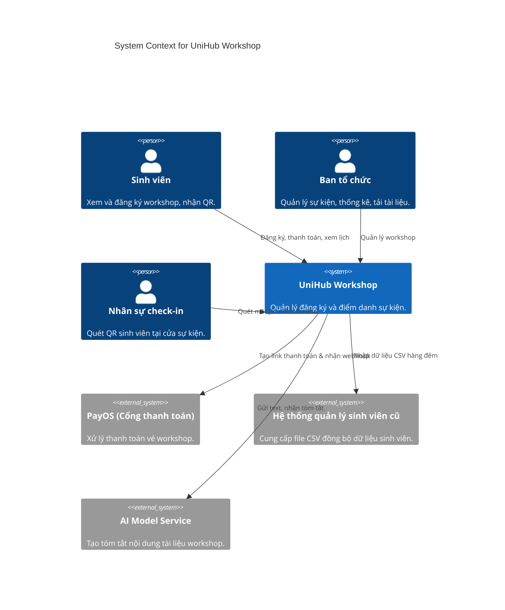
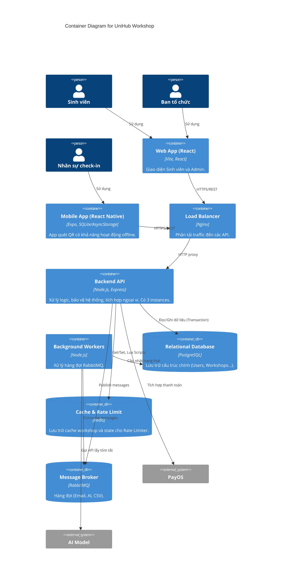

# UniHub Workshop — Technical Design

## Kiến trúc tổng thể
Hệ thống UniHub Workshop được thiết kế theo kiến trúc **Service-Oriented Architecture (SOA)** kết hợp với **Containerization** (Docker) để dễ dàng mở rộng (Scale-out) khi có lượng truy cập đột biến.
Hệ thống bao gồm các thành phần chính:
- **Load Balancer (Nginx):** Phân phối tải đều cho nhiều instance của Backend API (`api1`, `api2`, `api3`).
- **Backend API (Node.js/Express):** Xử lý toàn bộ logic nghiệp vụ cốt lõi. Stateless, xác thực bằng JWT để dễ dàng nhân bản.
- **Web App (React/Vite):** Dành cho Sinh viên (đăng ký) và Admin (quản trị).
- **Mobile App (React Native/Expo):** Dành cho Staff để quét QR Code check-in tại sự kiện. Hỗ trợ offline-first.
- **PostgreSQL:** Lưu trữ dữ liệu chính thức có tính quan hệ chặt chẽ và yêu cầu ACID (User, Workshop, Registration, Payment). Sử dụng `FOR UPDATE` để lock row chống tranh chấp chỗ ngồi.
- **Redis:** Lưu trữ Caching và phục vụ cơ chế Rate Limiting phân tán.
- **RabbitMQ:** Message Broker quản lý hàng đợi cho các tác vụ bất đồng bộ (gửi email, xử lý file CSV, xử lý AI Summary).

Lý do chọn kiến trúc này:
- **Khả năng mở rộng:** Tách biệt Load Balancer và chạy nhiều bản sao API giúp hệ thống chịu tải tốt trong 10 phút đầu mở đăng ký.
- **Tính chịu lỗi (Fault Tolerance):** Nếu một instance API sập, Nginx sẽ tự động chuyển request sang instance khác. RabbitMQ đảm bảo không mất dữ liệu các tác vụ nền như gửi email dù worker có sập.

---

## C4 Diagram

### Level 1 — System Context

### Level 2 — Container

---

## Thiết kế cơ sở dữ liệu
Hệ thống sử dụng **PostgreSQL** kết hợp với **Redis**.

- **PostgreSQL:** Thích hợp vì dữ liệu có tính ràng buộc toàn vẹn cao (VD: 1 Registration phải gắn với 1 Student và 1 Workshop hợp lệ). Hỗ trợ khóa cấp độ dòng (`SELECT ... FOR UPDATE`) rất cần thiết để giải quyết bài toán tranh chấp chỗ ngồi (Race Condition).
- **Redis:** Lưu Cache danh sách workshop giúp giảm tải cho DB trong đợt traffic tăng vọt. Đồng thời lưu bộ đếm cho thuật toán Sliding Window Rate Limiting.

### Lược đồ (Schema) chính:
- `users`: Thông tin sinh viên, staff, admin (`id`, `role`, `email`, `student_code`).
- `workshops`: Chứa `capacity` và `available_seats`. Quá trình đăng ký sẽ thực thi Transaction để giảm `available_seats`.
- `registrations`: Chứa `student_id`, `workshop_id`, `status` (`pending`, `confirmed`, `cancelled`).
- `payments`: Quản lý thông tin thanh toán, `order_code` (Idempotency Key).
- `checkins`: Ghi nhận lịch sử quét QR (`registration_id`, `offline_scanned_at`, `staff_id`).

---

## Thiết kế kiểm soát truy cập
Hệ thống sử dụng mô hình **RBAC (Role-Based Access Control)** với JWT (JSON Web Tokens).

**3 nhóm người dùng chính:**
1. **Student (`student`):** Được cấp quyền gọi API lấy danh sách, đăng ký và thanh toán.
2. **Admin (`admin`):** Được cấp quyền CRUD Workshops, xem danh sách đăng ký.
3. **Staff (`staff`):** Được truy cập API Check-in.

**Cơ chế bảo vệ:**
- Mọi request (trừ login/signup) phải đi qua middleware `protect`, làm nhiệm vụ decode JWT token, trích xuất `userId` và `role`.
- Middleware `authorize(...roles)` kiểm tra nếu role của user không nằm trong danh sách cho phép sẽ từ chối truy cập (403 Forbidden).

---

## Thiết kế các cơ chế bảo vệ hệ thống

### 1. Kiểm soát tải đột biến (Rate Limiting)
- **Vấn đề:** 12.000 sinh viên truy cập đồng loạt gây sập API và Database.
- **Giải pháp:** Áp dụng thuật toán **Sliding Window** và **Global Rate Limiter** bằng **Redis**.
  - **Global Limit:** Giới hạn tổng số lượng request vào API Đăng ký (VD: tối đa 100 req / giây cho toàn hệ thống) để bảo vệ Database không bị cạn kiệt Connection Pool.
  - **User Limit (Sliding Window):** Mỗi user chỉ được gửi tối đa 1 request đăng ký mỗi 5 giây (`slidingWindowRateLimiter(1, 5000)`). Redis thực thi thuật toán này nhanh gọn bằng lệnh `INCR` và `EXPIRE` hoặc sorted sets (ZSET).
  - Hành vi khi vượt ngưỡng: Trả về HTTP 429 Too Many Requests.

### 2. Xử lý cổng thanh toán không ổn định (Circuit Breaker)
- **Vấn đề:** Khi PayOS lỗi/timeout, chờ đợi quá lâu sẽ làm kẹt thread của Node.js, kéo sập luôn các request xem danh sách workshop của sinh viên khác.
- **Giải pháp:** Sử dụng **Circuit Breaker** Pattern (thư viện `opossum`).
  - **Trạng thái Closed:** Request gọi sang PayOS bình thường.
  - **Trạng thái Open:** Nếu tỷ lệ lỗi > 50% trong 10s, Circuit mở ra. Mọi request gọi PayOS sẽ thất bại ngay lập tức (Fail Fast) mà không cần gọi mạng, tiết kiệm tài nguyên.
  - **Graceful Degradation (Fallback):** Khi Circuit Breaker "Open", hệ thống chuyển sang hàm Fallback. Thay vì báo lỗi, hệ thống vẫn tạo `Registration` và `Payment` ở trạng thái `pending` trong DB, trả về cho FE `checkoutUrl = null` với lời nhắn: *"Cổng thanh toán đang bảo trì, bạn đã được giữ chỗ và có thể thanh toán sau"*. Sinh viên vẫn đăng ký thành công và không bị gián đoạn.

### 3. Chống trừ tiền hai lần (Tranh chấp chỗ ngồi & Idempotency)
- **Vấn đề tranh chấp:** Hai sinh viên giành nhau vé cuối cùng.
  - **Giải pháp:** Dùng DB Transaction (`BEGIN`, `COMMIT`) kết hợp `SELECT ... FOR UPDATE` row của Workshop đó. Postgres sẽ xếp hàng 2 request này. Request 2 sẽ thấy `available_seats = 0` và bị từ chối.
- **Vấn đề trùng lặp thanh toán:** Tránh user bấm đăng ký liên tục sinh ra 2 hóa đơn.
  - **Giải pháp:** Khi sinh viên gửi request tạo thanh toán, API kiểm tra xem đã tồn tại `Registration` có trạng thái `pending` của workshop đó hay chưa. Nếu đã có, hệ thống không tạo hóa đơn mới mà chỉ sinh lại link thanh toán cũ (hoặc tái sử dụng Idempotency Key dựa trên ID của Payment/Registration).

---

## Luồng nghiệp vụ quan trọng

### 1. Đồng bộ CSV ban đêm (CSV Sync)
- **Vấn đề:** Export file CSV từ hệ thống cũ không có API, dung lượng lớn, có thể gây tràn RAM và làm chết server chạy API nếu import trực tiếp bằng code tuần tự.
- **Quy trình giải quyết:**
  - **Upload:** File được upload lên AWS S3 và lấy `fileKey` trả về.
  - **Trigger:** Frontend gọi API `/sync` kèm `fileKey`. Backend ghi nhận Job vào bảng `sync_jobs` (Pending).
  - **Queue/Cron:** Sử dụng **RabbitMQ** hoặc **Cron Job** nạp event xử lý vào background worker dựa trên thiết lập môi trường (`SYNC_CRON_SCHEDULE`).
  - **Streaming:** Để bảo vệ RAM, giải pháp không phân tích CSV trên Node.js mà **Stream luồng byte trực tiếp** từ S3 (`GetObjectCommand` body stream) nối (pipe) thẳng vào PostgreSQL thông qua `pg-copy-streams` (`COPY staging_users FROM STDIN`).
  - **Merge:** Sau khi đổ vào bảng `staging_users`, sử dụng SQL hiệu suất cao (`INSERT ... SELECT ... ON CONFLICT DO UPDATE`) để merge dữ liệu qua bảng `users` chính. Chấm dứt tiến trình mà không gây gián đoạn hệ thống.

---

## Các quyết định kỹ thuật quan trọng (ADR)

1. **SQL (PostgreSQL) vs NoSQL (MongoDB):**
   - Lựa chọn: PostgreSQL.
   - Lý do: Đặc thù nghiệp vụ giữ chỗ và thanh toán cần tính toàn vẹn (ACID Transactions) để đảm bảo không bị Overselling (bán lố vé).

2. **JWT vs Session:**
   - Lựa chọn: JWT (JSON Web Tokens).
   - Lý do: Kiến trúc phân tán với Nginx cân bằng tải tới nhiều container `api1`, `api2`, `api3`. JWT là stateless, không cần lưu trữ session state trên server (tránh rườm rà cấu hình Redis Session Store).

3. **Background Jobs bằng RabbitMQ:**
   - Lựa chọn: Dùng RabbitMQ thay vì xử lý trực tiếp trên Express thread.
   - Lý do: Các tác vụ như Import CSV hay gọi AI model sinh tóm tắt mất rất nhiều thời gian. Đẩy vào Message Queue giúp API response ngay lập tức. Nếu Worker chết giữa chừng, RabbitMQ sẽ tự requeue lại (ACK/NACK mechanism) đảm bảo không mất dữ liệu.
