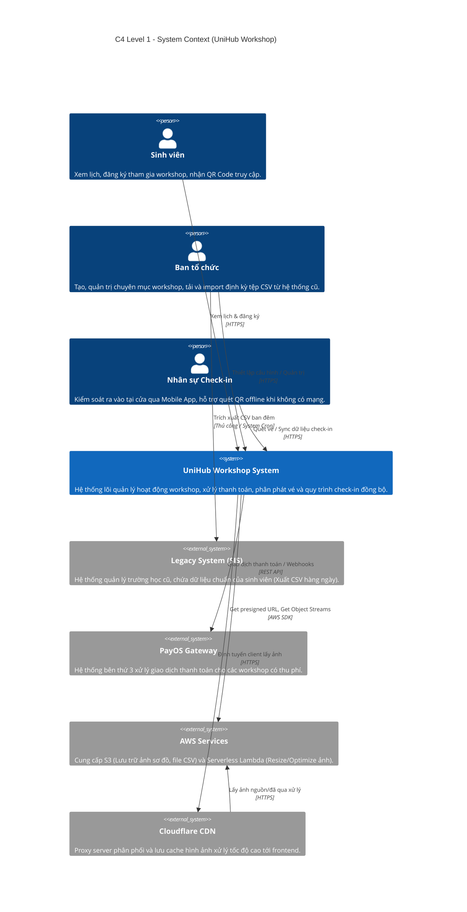
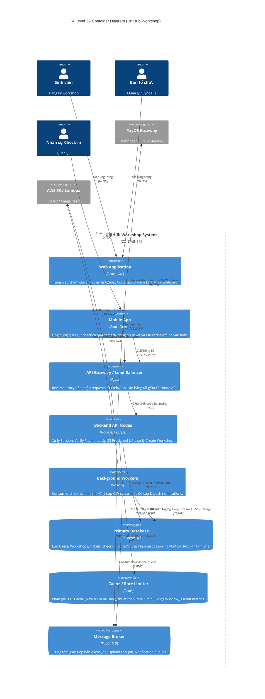

# C4 Model Diagrams - UniHub Workshop

Tài liệu này bao gồm sơ đồ kiến trúc hệ thống UniHub Workshop thiết kế theo chuẩn C4 Model, thể hiện rõ hệ sinh thái của phần mềm từ góc nhìn tương tác cho đến kiến trúc các Container kỹ thuật đang chạy thực tế hiện tại.

## Level 1: System Context Diagram

Mô tả tổng quan sự tương tác giữa các nhóm người dùng (Actors) với Hệ thống UniHub Workshop và các Hệ thống bên ngoài có liên kết.

 

## Level 2: Container Diagram

Chi tiết kiến trúc bên trong lớp `UniHub Workshop System`. Thể hiện các Container kỹ thuật chịu trách nhiệm vận hành theo đúng source code thực tế.

