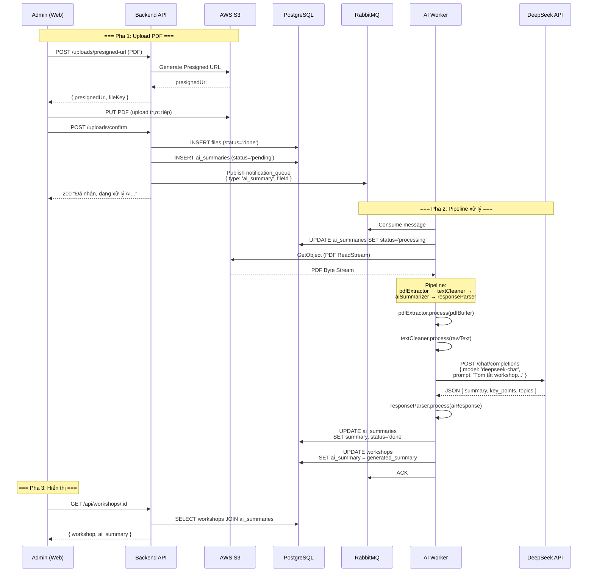

# Đặc tả: AI Tóm tắt Tài liệu Workshop (AI Summary)

## Mô tả
Cho phép Ban tổ chức upload file PDF giới thiệu workshop. Hệ thống sẽ tự động parse PDF, làm sạch văn bản, gửi sang AI model (DeepSeek) để sinh bản tóm tắt, và hiển thị kết quả trên trang workshop cho sinh viên xem. Toàn bộ quá trình xử lý được thực hiện bất đồng bộ qua RabbitMQ và Pipeline Pattern.

## Người dùng liên quan
- **Ban tổ chức (Admin)**: Upload PDF tài liệu workshop.
- **Sinh viên**: Xem bản tóm tắt AI trên trang workshop.
- **Hệ thống (AI Worker)**: Tự động xử lý pipeline qua RabbitMQ.

## Pipeline xử lý (Pipeline Pattern)

```
PDF Upload → pdfExtractor → textCleaner → aiSummarizer → responseParser → DB
```

Mỗi filter là một class độc lập implement interface `Filter.process(input) → output`, cho phép thêm/bớt/sắp xếp các bước linh hoạt.

| Filter | Chức năng | Input | Output |
|---|---|---|---|
| `pdfExtractor` | Parse PDF, trích xuất text thô | PDF Buffer | Raw text string |
| `textCleaner` | Làm sạch text: xóa whitespace thừa, ký tự đặc biệt, chuẩn hóa encoding | Raw text | Clean text |
| `aiSummarizer` | Gửi text sang DeepSeek API, nhận tóm tắt | Clean text | AI JSON response |
| `responseParser` | Parse JSON response, trích xuất summary và key points | AI JSON | Structured summary |

## Luồng chính

1. Admin upload file PDF qua Presigned URL lên AWS S3.
2. Admin gọi API confirm upload → hệ thống tạo record `files` và `ai_summaries`.
3. API publish message vào `notification_queue` với `type = 'ai_summary'`.
4. AI Worker consume message, cập nhật `ai_summaries.status = 'processing'`.
5. Worker thực thi pipeline:
   - `pdfExtractor`: Tải PDF từ S3, parse thành text thô.
   - `textCleaner`: Làm sạch text.
   - `aiSummarizer`: Gửi text + prompt "Tóm tắt nội dung workshop dưới dạng JSON" sang DeepSeek API.
   - `responseParser`: Parse kết quả JSON, trích xuất `summary` và `key_points`.
6. Worker lưu kết quả vào `ai_summaries` và cập nhật `workshops.ai_summary`.
7. Sinh viên xem trang workshop → hiển thị bản tóm tắt AI.

## Sơ đồ luồng (Sequence Diagram)



## Prompt Template cho AI

```
Bạn là trợ lý tóm tắt nội dung workshop. Hãy đọc tài liệu sau và trả về JSON:

{
  "summary": "Tóm tắt 2-3 câu về workshop",
  "key_points": ["Điểm chính 1", "Điểm chính 2", "Điểm chính 3"],
  "topics": ["Chủ đề 1", "Chủ đề 2"],
  "target_audience": "Đối tượng phù hợp",
  "prerequisites": "Yêu cầu đầu vào (nếu có)"
}

Nội dung tài liệu:
{clean_text}
```

## Kịch bản lỗi
- **PDF không parse được (corrupted file)**: `pdfExtractor` throw error → Worker catch, cập nhật `ai_summaries.status = 'failed'`, ACK message.
- **DeepSeek API timeout/lỗi**: Retry qua DLX pattern (max 3 lần, exponential backoff). Sau 3 lần thất bại → lưu `failed_jobs`.
- **PDF quá lớn (>10MB)**: Reject ở bước upload (S3 Presigned URL có size limit).
- **AI trả về format không đúng**: `responseParser` fallback về text thô nếu JSON parse thất bại.

## Ràng buộc
- PDF upload qua Presigned URL (không qua API server) để tránh chiếm băng thông.
- File PDF phải < 10MB (giới hạn ở S3 Presigned URL).
- Pipeline pattern cho phép thay đổi AI model (từ DeepSeek sang GPT, Gemini) chỉ bằng cách thay `aiSummarizer` filter.
- Prompt template được lưu riêng trong `services/pipeline/prompts/workshopPrompt.js` để dễ chỉnh sửa.
- Kết quả AI summary được lưu vào cả `ai_summaries` (tracking) và `workshops.ai_summary` (hiển thị nhanh).

## Tiêu chí chấp nhận
- Upload PDF workshop → sau 30-60s, bản tóm tắt xuất hiện trên trang workshop.
- Bản tóm tắt có định dạng rõ ràng: summary, key_points, topics.
- Khi DeepSeek API lỗi, job được retry và admin thấy trạng thái trong dashboard.
- Đổi AI model (VD: từ DeepSeek sang GPT) chỉ cần thay 1 file filter — không sửa pipeline code.
