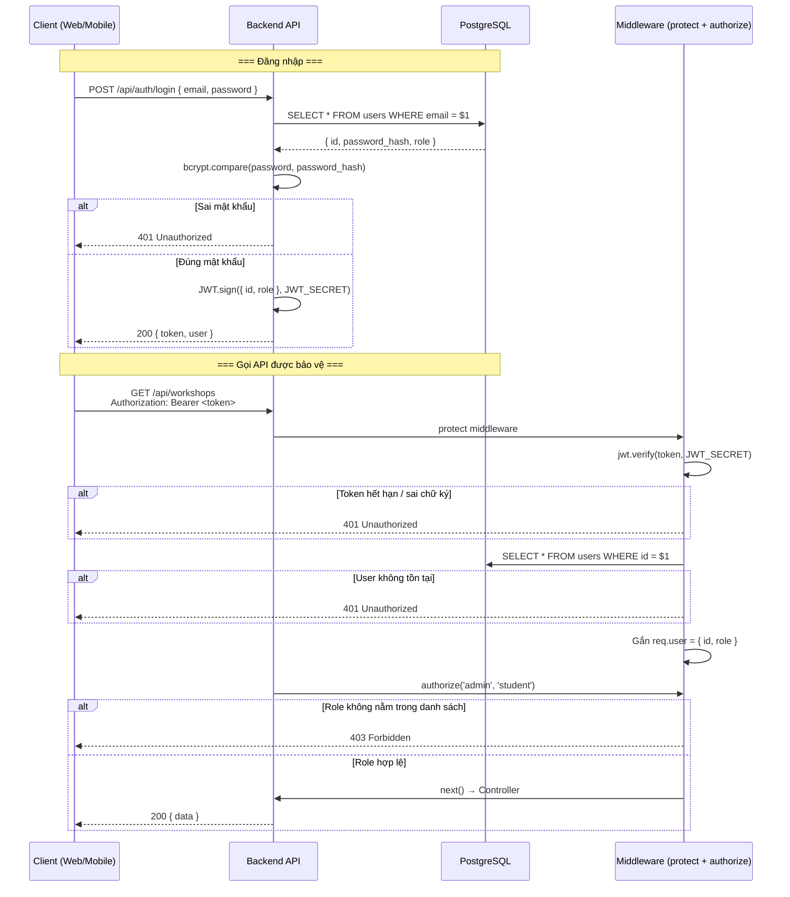
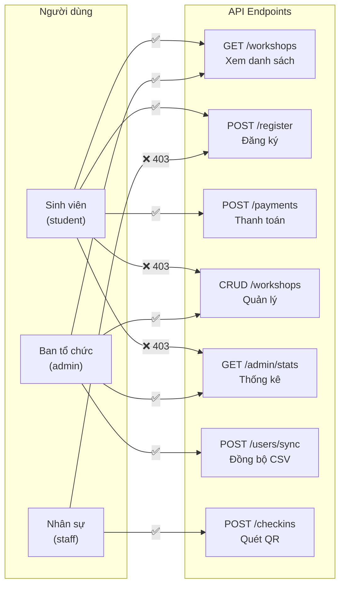

# Đặc tả: Kiểm soát truy cập và Phân quyền (Auth)

## Mô tả
Hệ thống sử dụng cơ chế xác thực không trạng thái (Stateless Authentication) dựa trên JSON Web Tokens (JWT). Việc phân quyền (Authorization) được thực thi ở mức Middleware của Backend API để đảm bảo chỉ những người dùng hợp lệ mới được truy cập vào các tài nguyên tương ứng.

## Luồng chính
1. Người dùng gửi thông tin đăng nhập (email, password) tới endpoint `/api/auth/login`.
2. Backend kiểm tra thông tin trong bảng `users`. Nếu hợp lệ, hệ thống sẽ mã hóa một chuỗi JWT bao gồm payload: `{ id, role }` kèm theo chữ ký bí mật.
3. Backend trả về JWT cho Client.
4. Client lưu trữ token ở Local Storage hoặc Async Storage.
5. Khi người dùng thực hiện các thao tác (vd: đăng ký workshop, thêm staff), Client gắn token vào Header: `Authorization: Bearer <token>`.
6. Hệ thống đi qua middleware `protect`:
   - Xác thực chữ ký token.
   - Giải mã lấy `id` và `role`.
   - Tìm user trong cơ sở dữ liệu để đảm bảo user vẫn còn tồn tại.
7. Hệ thống đi qua middleware `authorize('admin', 'student', ...)`:
   - Kiểm tra `role` của user có nằm trong danh sách được phép không.
   - Nếu có, cho qua (gọi controller tiếp theo).
   - Nếu không, chặn lại với lỗi 403 Forbidden.

## Kịch bản lỗi
- **Token hết hạn hoặc sai chữ ký:** Middleware `protect` trả về 401 Unauthorized. Client sẽ tự động logout người dùng.
- **Role không phù hợp:** Một sinh viên cố gắng truy cập endpoint của Admin (ví dụ `POST /api/workshops`). Middleware `authorize` trả về 403 Forbidden.
- **User bị xóa nhưng token còn hạn:** Middleware `protect` sẽ kiểm tra lại DB và không tìm thấy user, trả về 401 Unauthorized.

## Ràng buộc
- Token cần có thời gian hết hạn (Expiration Time - TTL) hợp lý (ví dụ: 7 ngày cho app check-in offline, 24 giờ cho Admin web).
- Mật khẩu lưu trong DB bắt buộc phải được băm (hashing) sử dụng `bcrypt` (kèm theo salt ngẫu nhiên) để đảm bảo tính an toàn nếu lộ lọt dữ liệu.

## Tiêu chí chấp nhận
- Người dùng `student` chỉ có thể gọi API xem và đăng ký, gọi API Admin sẽ bị lỗi 403.
- Người dùng `staff` chỉ có thể gọi API check-in.
- Admin không thể tự đăng ký Workshop dưới tư cách sinh viên (trừ phi dùng tài khoản sinh viên).
- Các API trả về đúng mã HTTP Status chuẩn: 401 khi chưa login, 403 khi thiếu quyền.

---

## Sơ đồ luồng (Sequence Diagram)

### Luồng đăng nhập và xác thực request

### Sơ đồ phân quyền (RBAC Matrix)

