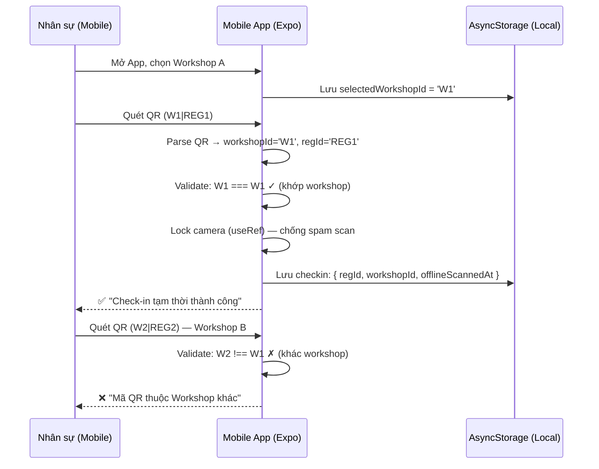
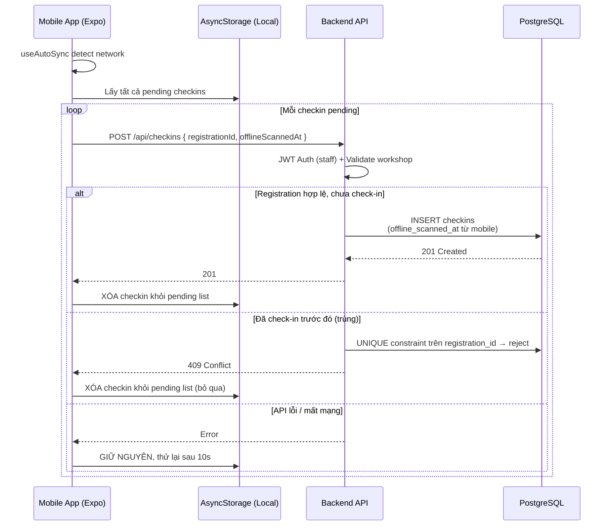

# Đặc tả: Luồng Check-in Offline

## Mô tả
Chức năng cho phép nhân sự (staff) dùng Mobile App (React Native) quét mã QR của sinh viên tại cửa phòng sự kiện. Do môi trường trường đại học có thể có điểm mù Wifi hoặc sóng 4G chập chờn, tính năng quét QR bắt buộc phải hoạt động mượt mà ngay cả khi không có kết nối Internet (Offline-first).

## Luồng chính

### Giai đoạn 1: Chuẩn bị mã QR
1. Web App phía Sinh viên tạo mã QR theo định dạng: `workshop_id|registration_id` để nhúng sẵn ID của phòng thi/sự kiện vào bên trong mã QR. Chống việc quét nhầm giữa các phòng khi điện thoại offline.

### Giai đoạn 2: Quét mã tại sự kiện
1. Staff mở App, chọn Workshop đang phụ trách (App lưu ID này lại).
2. Khi mất mạng, Staff bật màn hình Camera quét QR.
3. App quét được chuỗi: `workshop_id|registration_id`.
4. App lập tức kiểm tra xem `workshop_id` trong mã QR có trùng với Workshop đang chọn hay không.
   - Nếu **không trùng**: Chặn ngay lập tức, báo lỗi "Mã QR thuộc về Workshop khác" (Offline validation).
   - Nếu **trùng**: App ghi nhận bản ghi check-in kèm Timestamp hiện tại và lưu vào bộ nhớ cục bộ (AsyncStorage của điện thoại).
5. App hiện màn hình xanh "Check-in tạm thời thành công".

### Giai đoạn 3: Tự động đồng bộ
1. Khi có mạng trở lại, một Background Hook (`useAutoSync`) phát hiện tín hiệu kết nối thông qua `expo-network` và App State.
2. Hook này âm thầm lấy toàn bộ mảng dữ liệu đang kẹt trong bộ nhớ cục bộ, gửi hàng loạt lên API Backend `/api/workshops/:id/checkins`.
3. Backend nhận Timestamp mà Staff đã quét lúc offline để ghi đè vào cột `offline_scanned_at` trên DB, đảm bảo tính chính xác của thời điểm sinh viên có mặt.
4. Xóa hàng đợi lưu tạm.

## Kịch bản lỗi
- **Staff quét nhầm QR cũ (không có dấu `|`):** App từ chối và báo lỗi ngay "Mã QR cũ hoặc không hợp lệ. Yêu cầu tải lại trang Web".
- **Staff quét cùng một mã nhiều lần:** App lưu Log quét trùng vào bộ nhớ, khi gọi lên Backend, Backend sử dụng Unique Index `registration_id` trên bảng `checkins` để từ chối các bản ghi thừa và chỉ tính 1 lần hợp lệ.
- **Có mạng nhưng API chết:** Hook đồng bộ sẽ đánh dấu thất bại và không xóa bộ nhớ cục bộ, chờ 10 giây sau thử lại.

## Ràng buộc
- Tuyệt đối không xóa dữ liệu offline khi chưa nhận được HTTP status 201 từ Backend.
- Camera phải có cơ chế **Lock state** (sử dụng useRef) để tránh Camera bắn ra 10 requests / giây cho cùng 1 khung hình QR, gây tràn bộ nhớ offline.

## Tiêu chí chấp nhận
- Chuyển điện thoại về chế độ Máy bay (Airplane mode), Staff quét QR hợp lệ và nhận thông báo xanh lá.
- Quét QR của Workshop B khi đang đứng ở màn hình Workshop A, App báo đỏ.
- Bật lại Wifi, đợi 5-10 giây, danh sách Check-in lưu tạm trên App biến mất và dữ liệu đổ thẳng lên Database Postgres trên Server.

---

## Sơ đồ luồng (Sequence Diagram)

### Giai đoạn Offline — Quét QR khi mất mạng

### Giai đoạn Online — Đồng bộ khi có mạng trở lại

