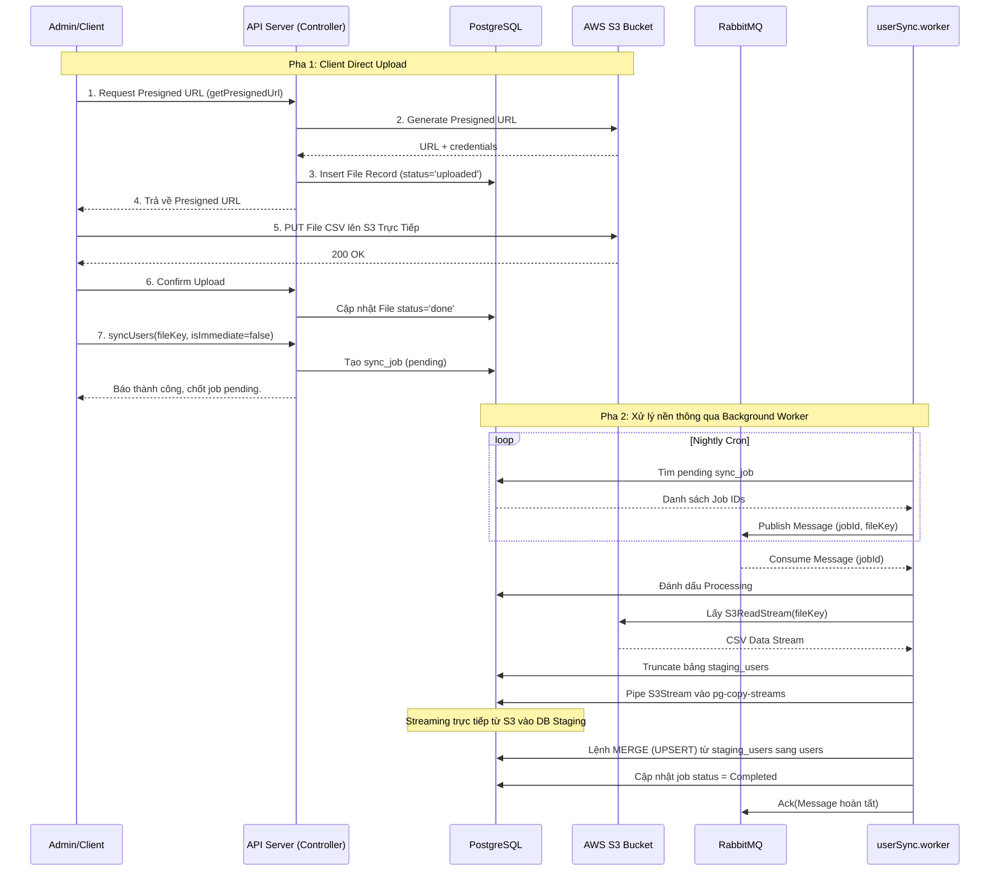

# Thiết kế Hệ thống Đồng bộ File CSV Tự động (CSV Sync Design)

Tài liệu này trình bày luồng xử lý và thiết kế kiến trúc thực tế được áp dụng trong hệ thống nhằm hỗ trợ Upload File CSV chứa danh sách User (Sinh viên) lên đám mây (AWS S3) và đồng bộ trơn tru vào Database (PostgreSQL) mà không gây tắc nghẽn Server API thông qua Message Queue (RabbitMQ) và Streaming xử lý dữ liệu.

## Luồng thực thi chính (Flow)

Luồng hoạt động sẽ chia ra làm 2 pha: Upload File Tức Thời (Pha 1) và Đồng Bộ Ban Đêm Tự Động (Pha 2).

### Pha 1: Upload và Đăng ký Sync (User Interactive)
1. **Khởi tạo kết nối S3**: Admin/Client gửi Request tới `upload.controller.js` (`getPresignedUrl`) với các thông tin cơ bản của file CSV (tên, phân loại, kích thước).
2. **Ký số URL**: API sinh ra một Presigned URL AWS S3 thông qua thư viện AWS SDK, đồng thời tạo một bản phụ thông tin nháp `file` trong Database có đánh dấu trạng thái `uploaded` và trả về URL đó cho Client.
3. **Upload Trực tiếp (Direct Upload)**: Thay vì Tải file qua Server API gây áp lực băng thông, Client sẽ lợi dụng HTTP PUT/POST lên chính cái Presigned URL của AWS S3 để đẩy thẳng file CSV lên bucket.
4. **Xác nhận Upload**: Máy trạm gọi API `confirmUpload` để thông báo cho hệ thống biết file đã lên Amazon S3 thành công. Server đổi trạng thái record tải về `done`.
5. **Gửi lệnh đồng bộ**: Qua `user.controller.js` (`syncUsers`), Client gửi `fileKey` và tạo một `sync_job` trong CSDL. Nếu Flag `isImmediate` là True, Job sẽ được bắn thẳng vào RabbitMQ qua phương thức `publishUserSyncJob`. Ngược lại, nó nằm tại CSDL chờ.

### Pha 2: Đồng bộ Hậu đài Ban Đêm (Background Worker & MQ)
1. **Cron Job quét Database**: Đến chu kỳ thiết lập, Cron Schedule bên trong `userSync.worker.js` sẽ lọc ra toàn bộ các `sync_job` đang pending trong Database. Sau đó vòng lặp sẽ đẩy (Publish) Message vào hàng đợi (Queue) `user_sync_queue` thông qua RabbitMQ.
2. **Worker nhận Job**: RabbitMQ chuyển Message định kỳ đến Worker. Quy định `prefetch(1)` buộc Worker chỉ được xử lý mỗi lần 1 CSV lớn để tránh hết Memory (OOM). Đổi trạng thái job thành `Processing`.
3. **Download Stream từ S3**: Worker trích xuất Data ra một ReadStream thông qua `getS3ReadStream()`.
4. **Load Data tốc độ cao**: 
   - Đầu tiên, Worker gọi API rỗng toàn bộ bảng `staging_users` (Truncate Staging Table).
   - Qua cơ chế PostgreSQL Copy (`pg-copy-streams`), quá trình đưa Stream trực tiếp từ S3 ngấm thẳng vào Database Staging mà không cần nạp bất cứ bytes nào vào RAM của NodeJS. `copyUsersFromStream` hoàn thành việc này siêu nhỏ gọn và nhanh chóng.
5. **Merge (UPSERT)**: Cuối cùng, một lệnh Postgres lớn, `mergeStagingUsersIntoMain`, được thực thi bằng SQL để Insert/Cập Nhật hàng loạt (UPSERT) các dữ liệu từ khu vực trung gian (Staging) vào bảng lõi (Users). Tự động bổ sung User mới hoặc đè lại nếu Email/MSSV đã tồn tại. Job báo `Completed`.

## Sơ đồ luồng (Workflow Diagram)

## Đánh giá thiết kế thuật toán Streaming

### Ưu điểm (Pros):
- **Phân tách I/O & Băng Thông**: Client tự trao đổi File đồ sộ với Amazon, Server API của ta không bị ngậm băng thông tải lên.
- **NodeJS Memory Tối ưu**: Thao tác `Stream S3 -> Stream Database` bỏ qua vòng đời ReadFile lên Memory, ngăn chặn các sự cố Out Of Memory (OOM) nếu file CSV lên tới vài Gigabytes. 
- **DB Bulk Khối lượng lớn cực nhanh**: Cơ chế `psql \copy` (hay thư viện pg-copy-streams dưới Node) nhanh chóng ghi đè vạn bản ghi mà không sinh ra logs I/O rác. Staging Table lại giảm thiểu DeadLock trên bảng Main.
- **An toàn Fault Tolerant**: `prefetch(1)` của Rabbit MQ làm quá trình này trở nên trơn tru và an toàn (sập 1 Process/Container thì MQ trả file lại cho Worker khác làm).

### Nhược điểm (Cons) / Điểm cần cải thiện:
- Quá trình Upsert từ Staging Table vào Main Table tuy xử lí bằng SQL nhanh, nhưng nếu có quá nhiều Index, DB sẽ chịu sức ép I/O khổng lồ.
- Không thể nhận về thông báo lỗi Import từng row nếu dùng SQL Merge 1 Batch như vậy (Khó Report dòng nào trong Excel đã thất bại và lý do vì sao).
- Thất bại giữa chừng ở quá trình Stream Copy đồng nghĩa với File đó phải Sync lại từ dòng mốc số 0, không có Checkpoint Recovery nếu mạng đứt do dữ liệu đang Stream.
