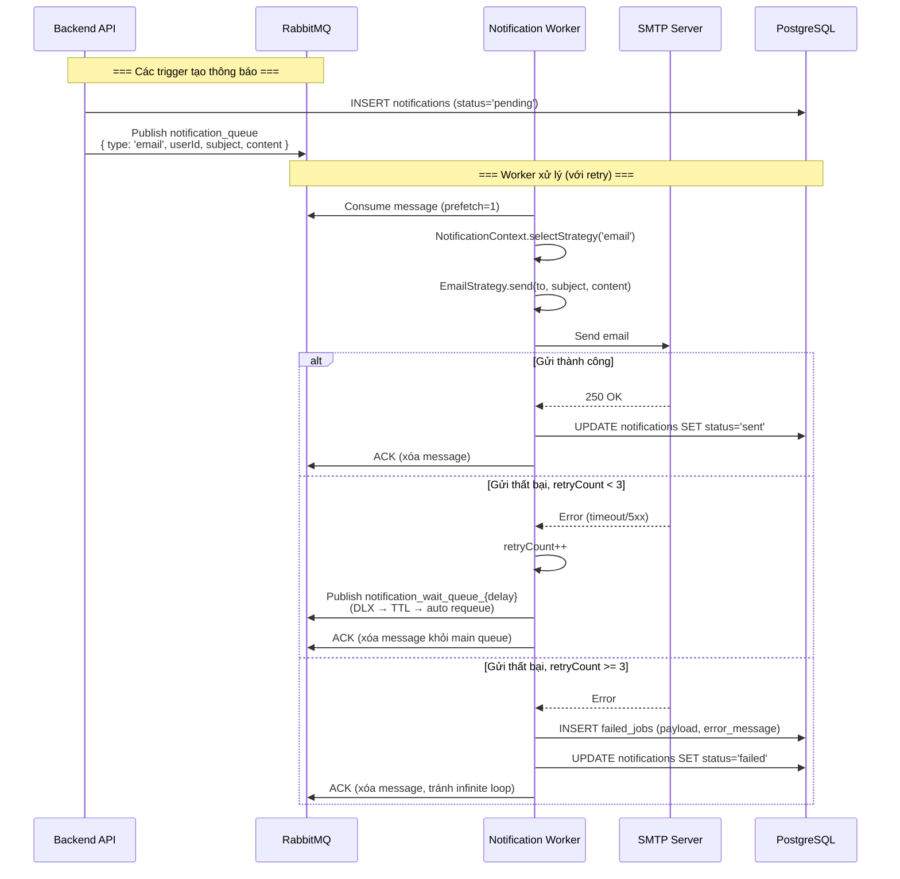
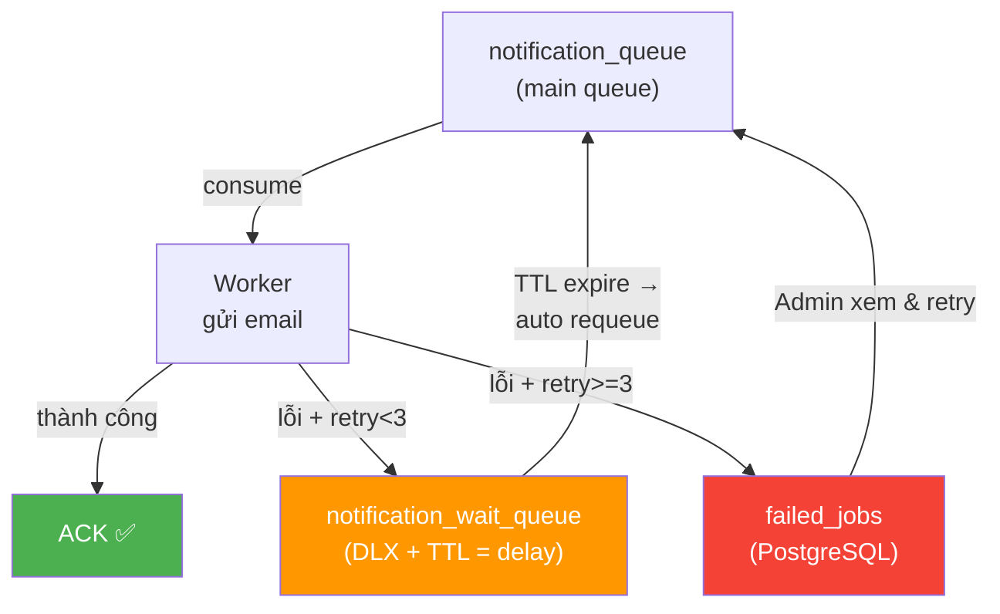

# Đặc tả: Hệ thống Thông báo (Notification)

## Mô tả
Hệ thống gửi thông báo cho sinh viên sau các sự kiện quan trọng: đăng ký workshop thành công, thanh toán hoàn tất, nhắc nhở trước giờ workshop. Hiện tại chỉ hỗ trợ Email, được thiết kế theo Strategy Pattern để dễ dàng mở rộng thêm kênh mới (SMS, Telegram, Push Notification) mà không sửa code hiện có.

## Người dùng liên quan
- **Sinh viên**: Người nhận thông báo.
- **Hệ thống (Worker)**: Tự động gửi thông báo qua RabbitMQ.

## Kiến trúc Strategy Pattern

```
NotificationContext
    └── strategy: BaseStrategy
            ├── EmailStrategy (hiện tại)
            ├── SmsStrategy (tương lai)
            ├── TelegramStrategy (tương lai)
            └── PushStrategy (tương lai)
```

## Luồng chính

1. API publish message vào `notification_queue` của RabbitMQ sau các sự kiện:
   - Sinh viên đăng ký workshop thành công.
   - Thanh toán được xác nhận (webhook PayOS).
   - Admin tạo tài khoản staff mới.
2. Notification Worker consume message với `prefetch(1)`.
3. Worker kiểm tra `type` trong message, chọn strategy tương ứng qua `NotificationContext`.
4. Strategy thực thi gửi thông báo (VD: EmailStrategy gọi SMTP).
5. Nếu thành công: `channel.ack(msg)`, lưu `notifications` với `status = 'sent'`.
6. Nếu thất bại: retry qua DLX pattern (max 3 lần, exponential backoff).
7. Nếu thất bại hoàn toàn (retry >= 3): lưu vào `failed_jobs` để admin xem lại.

## Sơ đồ luồng (Sequence Diagram)



## Sơ đồ Retry với DLX Pattern



## Kịch bản lỗi
- **SMTP timeout**: Worker retry với exponential backoff (5s → 15s → 30s). Sau 3 lần, chuyển vào `failed_jobs`.
- **Worker crash giữa chừng**: RabbitMQ không nhận ACK → message được requeue sang worker khác. Không mất message.
- **Message format sai**: Worker catch lỗi parse, ACK message ngay (tránh retry vô ích với lỗi format), log lỗi.

## Ràng buộc
- `prefetch(1)` — mỗi worker chỉ xử lý 1 message/lần, tránh OOM khi gửi email hàng loạt.
- Không dùng `auto-ack = true` — bắt buộc manual ACK để đảm bảo không mất message.
- DLX queues phải là `durable: true` — message tồn tại trên disk của RabbitMQ.
- Retry delay phải là exponential backoff (5s, 15s, 30s) để tránh spam SMTP server.
- Nội dung email phải chứa QR code (`workshop_id|registration_id`) cho check-in.

## Tiêu chí chấp nhận
- Sinh viên nhận email xác nhận trong vòng 30s sau khi đăng ký thành công.
- Khi SMTP server tắt, email không bị mất mà được retry tối đa 3 lần.
- Sau 3 lần retry thất bại, admin thấy job trong `AdminFailedJobs` dashboard.
- Thêm một strategy mới (VD: Telegram) chỉ cần tạo class mới implement `BaseStrategy.send()` — không sửa code hiện có.
