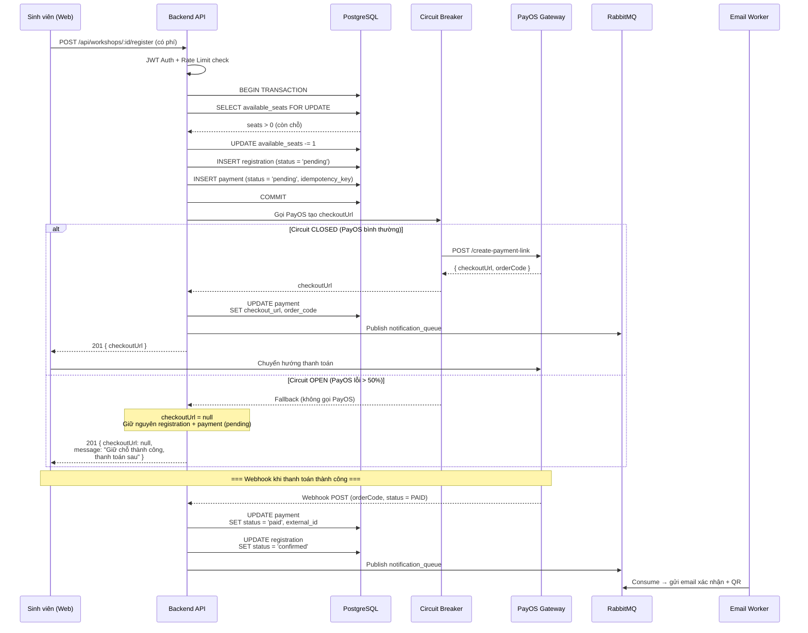
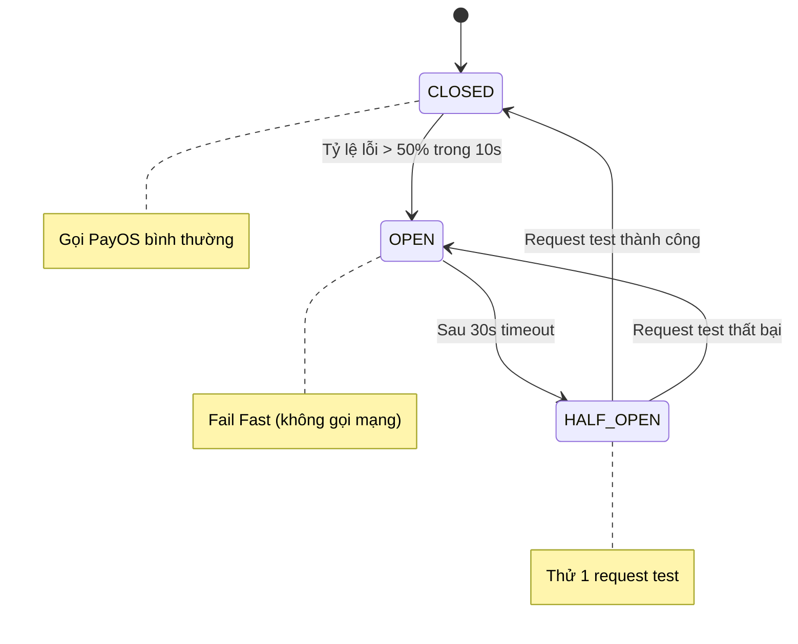

# Đặc tả: Luồng thanh toán Workshop và Chống lỗi (Payment & Circuit Breaker)

## Mô tả
Chức năng này quản lý quá trình thanh toán của sinh viên đối với các Workshop có thu phí. Điểm nhấn của chức năng là sự tích hợp với cổng thanh toán PayOS và áp dụng mẫu thiết kế (pattern) Circuit Breaker để bảo vệ hệ thống khỏi các đợt sập mạng, sập dịch vụ bên thứ 3.

## Luồng chính
1. Sinh viên bấm "Đăng ký" một Workshop có phí.
2. Hệ thống kiểm tra Rate Limit và sức chứa của Workshop (Transaction + Row lock).
3. Hệ thống lưu một bản ghi `Registration` ở trạng thái `pending` và một bản ghi `Payment` ở trạng thái `pending`.
4. Gọi qua API của cổng thanh toán PayOS (thông qua thư viện `opossum` Circuit Breaker) để tạo `checkoutUrl`.
5. Trả URL về cho sinh viên để chuyển hướng sang giao diện thanh toán.
6. Cổng thanh toán gửi Webhook báo thành công: Hệ thống cập nhật trạng thái `Payment` thành `paid` và `Registration` thành `confirmed`.

## Kịch bản lỗi

### 1. Cổng thanh toán chập chờn / Timeout
- Lỗi kết nối (timeout, 5xx) xảy ra.
- Nếu số lần lỗi vượt mức 50% trong thời gian ngắn, Circuit Breaker chuyển sang trạng thái **Open**.
- **Fallback:** Các request tiếp theo thay vì gọi PayOS sẽ bị chặn lại ngay lập tức (Fail Fast). Hệ thống rẽ nhánh sang logic Fallback: 
  - Không ném ra lỗi (Throw Error).
  - Vẫn cho phép tạo `Registration` và giữ chỗ.
  - Trả về `checkoutUrl = null` và thông báo nhắc nhở sinh viên: *"Cổng thanh toán đang bảo trì, bạn đã được giữ chỗ, vui lòng quay lại thanh toán sau."*

### 2. Sinh viên cố bấm đăng ký nhiều lần liên tiếp (Trừ tiền 2 lần)
- Khi sinh viên gửi request lại, hệ thống kiểm tra thấy đã tồn tại một `Registration` và `Payment` `pending` cho Workshop này.
- Hệ thống từ chối tạo mới, mà lấy `order_code` (Idempotency Key) của Payment cũ để gọi lại PayOS tạo lại link hoặc trả thẳng link cũ. Ngăn chặn việc sinh ra 2 mã đơn hàng gây trừ tiền 2 lần.

## Ràng buộc
- Phải dùng Database Transaction kết hợp cơ chế Row Locking (`SELECT FOR UPDATE`) lúc kiểm tra ghế trống để tránh Overbooking.
- Idempotency Key (ở đây là `order_code`) phải là Unique trên toàn bộ hệ thống Payment.

## Tiêu chí chấp nhận
- Đăng ký miễn phí trả thẳng trạng thái `confirmed`.
- Đăng ký có phí trả về link PayOS.
- Giả lập tắt mạng PayOS: Sinh viên vẫn giữ được ghế trống và hệ thống hiển thị nút "Thanh toán lại" ở ngoài Dashboard để sinh viên có thể tự bấm lại khi cổng thanh toán sống lại.

---

## Sơ đồ luồng (Sequence Diagram)

### Sơ đồ trạng thái Circuit Breaker

