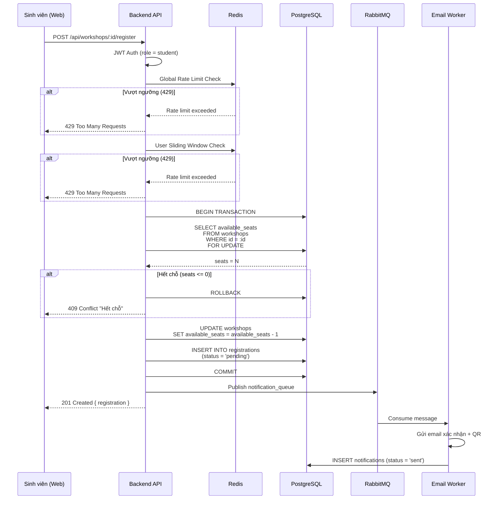

# Đặc tả: Luồng Đăng ký Workshop (Registration)

## Mô tả
Tính năng Đăng ký cho phép Sinh viên giành chỗ tham dự tại các Workshop của "Tuần lễ kỹ năng và nghề nghiệp". Điểm mấu chốt là giải quyết hiện tượng Tải đột biến (12.000 sinh viên truy cập cùng lúc) và Tranh chấp chỗ ngồi (Race Condition khi 2 người cùng bấm nút lấy cái vé cuối cùng).

## Luồng chính
1. Sinh viên mở Web Dashboard, API trả về danh sách Workshop kèm số ghế còn trống (`available_seats`).
2. Sinh viên nhấn nút "Đăng ký" tại một Workshop. Request POST gửi lên `/api/workshops/:id/register`.
3. Hệ thống vượt qua các hàng rào bảo vệ sau:
   - **JWT Auth Check:** Đảm bảo chỉ User sinh viên mới gọi được.
   - **Global Rate Limiter (Redis):** Đảm bảo cả hệ thống không xử lý quá 100 req/s.
   - **Sliding Window Rate Limiter (Redis):** Đảm bảo sinh viên này không gửi 2 request trong vòng 5 giây.
4. Database bắt đầu một Transaction (`BEGIN`).
5. Truy vấn `SELECT available_seats FROM workshops WHERE id = :id FOR UPDATE`. Dòng dữ liệu của Workshop này sẽ bị Lock tạm thời.
6. Hệ thống kiểm tra: Nếu `available_seats <= 0` => Báo lỗi Hết chỗ, `ROLLBACK`.
7. Trừ ghế: `UPDATE workshops SET available_seats = available_seats - 1`.
8. Sinh ra record vào bảng `registrations` với `status = pending` hoặc `confirmed`.
9. `COMMIT` Transaction, giải phóng Lock cho Request của sinh viên kế tiếp chạy.
10. Gửi Message (Event) tới RabbitMQ Queue (chạy ngầm).
11. Worker bắt được Message sẽ gửi Email / App Notification xác nhận cho Sinh viên.

## Kịch bản lỗi
- **Bị Rate Limit chặn:** HTTP 429 Too Many Requests. Sinh viên thấy thông báo: "Hệ thống đang quá tải, vui lòng thử lại sau vài giây".
- **Gửi Email thất bại:** Worker nhận Event gửi email bị crash. RabbitMQ sẽ NACK (Negative Acknowledgement) và giữ lại Message trong Queue. Khi Worker sống lại, Email sẽ được gửi lại mà không bị mất. Sinh viên vẫn đăng ký thành công.
- **Hết chỗ do Race Condition:** Dù màn hình FE hiển thị còn 1 chỗ, nhưng khi request tới DB thì Request của sinh viên khác đã Lock và mua mất vé đó. Lệnh `SELECT FOR UPDATE` của bạn này sẽ thấy 0 chỗ và trả về thông báo lỗi lịch sự cho sinh viên "Rất tiếc, vé cuối cùng vừa có người đăng ký".

## Ràng buộc
- Tuyệt đối không dùng Code JS (vd: lấy biến về rồi tính trừ đi 1) để kiểm tra ghế trống, bắt buộc phải ép Database gánh phần Logic giảm ghế bằng phép trừ trực tiếp trên câu lệnh SQL kết hợp Row Lock.
- RabbitMQ không được cấu hình `auto-ack = true` trong tác vụ Gửi Email để tránh mất mát thư.

## Tiêu chí chấp nhận
- Chạy giả lập 1.000 user cùng chọc vào API mua vé Workshop chỉ có 50 ghế trống. Kết thúc bài test, Database phải hiển thị chính xác 50 vé được mua và `available_seats = 0`, không bao giờ được phép có số ghế bị âm hoặc có 51 người mua thành công.

---

## Sơ đồ luồng (Sequence Diagram)

**Xử lý lỗi trong luồng**:
- **Rate Limit → 429**: "Hệ thống đang quá tải, vui lòng thử lại sau vài giây".
- **Hết chỗ → 409**: "Rất tiếc, vé cuối cùng vừa có người đăng ký".
- **DB lỗi → 500**: Rollback transaction, không mất dữ liệu.
- **Email thất bại**: Worker retry qua DLX (max 3 lần), message không mất.
