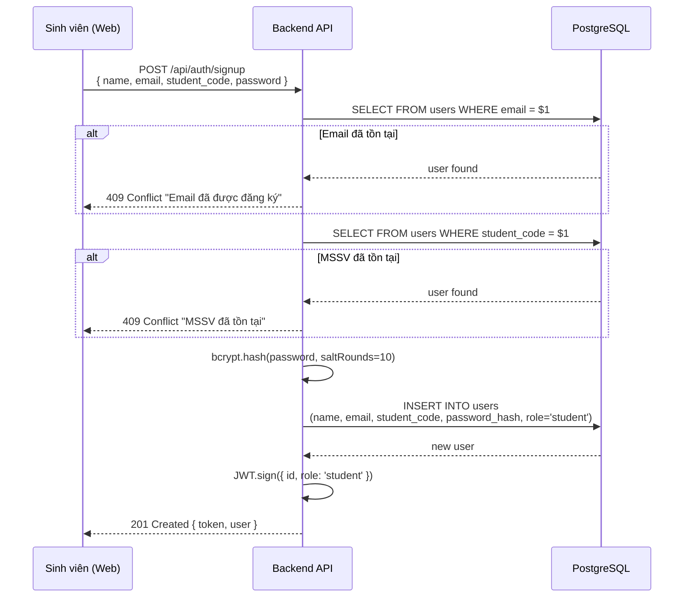

# Đặc tả: Đăng ký tài khoản (Sign Up)

## Mô tả
Chức năng cho phép sinh viên mới tự tạo tài khoản trên hệ thống UniHub Workshop. Đối với sinh viên đã có trong hệ thống (qua đồng bộ CSV), tài khoản được tạo sẵn với mật khẩu mặc định và có thể đổi mật khẩu qua lần đăng nhập đầu tiên. Chức năng này cũng hỗ trợ Admin tạo tài khoản staff mới.

## Người dùng liên quan
- **Sinh viên mới**: Tự đăng ký tài khoản để tham gia workshop.
- **Admin**: Tạo tài khoản cho nhân sự check-in (staff).

## Luồng chính

### Sinh viên tự đăng ký
1. Sinh viên truy cập trang đăng ký, điền form: `name`, `email`, `student_code`, `password`.
2. Client gửi `POST /api/auth/signup` với payload form.
3. Backend kiểm tra:
   - `email` chưa tồn tại trong hệ thống.
   - `student_code` chưa tồn tại (nếu có).
   - `password` đủ mạnh (tối thiểu 6 ký tự).
4. Backend băm mật khẩu bằng `bcrypt` với salt ngẫu nhiên.
5. Lưu user mới vào bảng `users` với `role = 'student'`.
6. Trả về JWT token để tự động đăng nhập.

### Admin tạo tài khoản staff
1. Admin truy cập trang quản trị, điền form: `name`, `email`, chọn `role = 'staff'`.
2. Client gửi `POST /api/users` với payload và JWT admin.
3. Backend kiểm tra quyền admin qua middleware `authorize('admin')`.
4. Mật khẩu mặc định được sinh tự động (VD: `staff@123`).
5. Lưu user mới vào bảng `users`.
6. Gửi email thông báo cho staff mới (qua notification worker).

## Sơ đồ luồng (Sequence Diagram)

## Kịch bản lỗi
- **Email đã tồn tại**: HTTP 409 Conflict. Thông báo: "Email này đã được đăng ký. Vui lòng đăng nhập hoặc sử dụng email khác."
- **MSSV đã tồn tại**: HTTP 409 Conflict. Thông báo: "Mã số sinh viên này đã tồn tại trong hệ thống."
- **Password yếu**: HTTP 400 Bad Request. Thông báo: "Mật khẩu phải có ít nhất 6 ký tự."
- **Thiếu trường bắt buộc**: HTTP 400 Bad Request. Thông báo: "Vui lòng điền đầy đủ thông tin."

## Ràng buộc
- Mật khẩu phải được băm bằng `bcrypt` với salt ngẫu nhiên trước khi lưu.
- `email` là UNIQUE trong bảng `users`.
- `student_code` là UNIQUE (nếu được cung cấp).
- Không yêu cầu xác thực email trong lần đăng ký đầu (có thể thêm sau).

## Tiêu chí chấp nhận
- Sinh viên mới có thể đăng ký và nhận JWT token ngay sau khi đăng ký.
- Không thể đăng ký 2 tài khoản với cùng một email.
- Admin có thể tạo tài khoản staff mới.
- Staff mới nhận được email thông báo tài khoản (nếu notification worker hoạt động).
