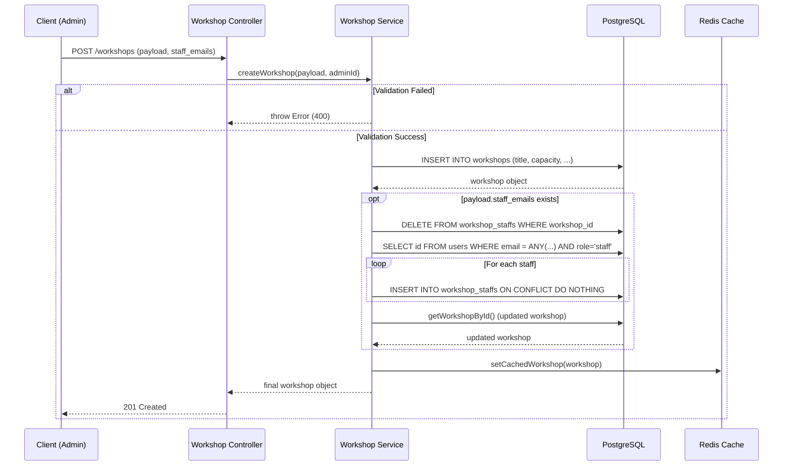

# Workshop Creation Design

Tài liệu này mô tả chi tiết luồng xử lý chức năng đăng/tạo mới Workshop dành cho Admin trong hệ thống, bao gồm các thành phần về lưu trữ và cache, cũng như liên kết giảng viên/staff.

## Luồng thực thi chính (Flow)

Khi Admin gửi yêu cầu tạo/đăng Workshop lên API:

1. **Validation**: Kiểm tra các trường bắt buộc như `title`, `capacity`, `start_time`, `end_time`. Chuyển đổi và kiểm tra giá trị của chúng (thời gian `start_time` phải nhỏ hơn `end_time`, capacity phải $> 0$).
2. **Lưu DB**: Hệ thống gọi `createWorkshopRepo` để Insert record Workshop mới vào CSDL (PostgreSQL).
3. **Quản lý Staff (syncWorkshopStaff)**:
   - Nếu Admin có truyền vào mảng `staff_emails`.
   - Hàm `syncWorkshopStaff` sẽ:
     + Xoá toàn bộ record staff cũ của workshop này (Bulk Delete: `DELETE FROM workshop_staffs WHERE workshop_id = ...`).
     + Lọc mảng `staff_emails`, tra cứu tìm `id` tương ứng của các user có role là `staff`.
     + Lặp qua từng `staff_id` và Insert lại vào bảng `workshop_staffs` với tuỳ chọn `ON CONFLICT DO NOTHING`.
4. **Caching (setCachedWorkshop)**:
   - Sau khi tạo xong (và cập nhật staff nếu có), hệ thống gọi `getWorkshopById` để lấy đầy đủ chi tiết của Workshop.
   - Ghi dữ liệu vào Redis thông qua `setCachedWorkshop`. Đặc biệt, thời gian Cache (TTL) được tính toán tinh tế (`calculateCacheTTL`) theo 2 giai đoạn (Windows):
     + **Giai đoạn 1 (Mới phát hành):** Duy trì TTL tính từ thời điểm `created_at` cộng thêm `CACHE_WORKSHOP_NEW_DURATION` (Mặc định: 1 giờ / 3600s).
     + **Giai đoạn 2 (Xung quanh thời gian sự kiện):** Kích hoạt trong khung thời gian diễn ra sự kiện, bao gồm trước `start_time` và sau `end_time` một khoảng `CACHE_WORKSHOP_EVENT_WINDOW` (Mặc định: 30 phút / 1800s).
     + *Hệ thống sẽ lấy giá trị TTL lớn nhất (maxTTL) giữa các cửa sổ thời gian đang có hiệu lực để lưu lên Redis, đảm bảo lúc event đang diễn ra workshop luôn có cache*.
5. **Trả về kết quả**: Trả về Response cho Admin gồm đối tượng Workshop vừa tạo.

## Sơ đồ luồng (Workflow Diagram)

## Đánh giá thiết kế thuật toán & Caching

### Ưu điểm (Pros):
- **Tính nhất quán dữ liệu ở mức Cơ bản**: Pattern thay thế toàn bộ (Bulk Delete rồi Insert) đối với cấu hình `workshop_staffs` giúp logic sync dễ hiểu, tránh các bài toán conflict phức tạp và không cần phân biệt danh sách xoá hay thêm mới từ client gửi lên.
- **Tối ưu tốc độ Đọc**: Bằng cách chủ động cache (Write-through) thông qua `setCachedWorkshop` ngay tại thời điểm khởi tạo, các lượt khách (sinh viên) vừa vào xem chi tiết lớp sẽ có data ngay lập tức từ Redis, giảm áp lực truy vấn cho DB.

### Nhược điểm (Cons) / Điểm cần cải thiện:
- Bất lợi của *Bulk Delete / Insert*: Khi scale số lượng giảng viên, transaction xoá sau đó lặp vòng lặp thực hiện Insert `1-by-1` vào PostgreSQL sẽ gây phí phạm tài nguyên I/O và lock cục bộ trên database. Thay vì insert một lượt với tính năng bulk insert `insert (...) values (...), (...), ...`, hiện tại database bị hit liên tục.
- Lỗ hổng về Transaction: Chuỗi hành động từ cập nhật bảng `workshops` cho đến `workshop_staffs` chưa được bọc hoàn toàn bên trong 1 Database Transaction (`BEGIN ... COMMIT`). Nếu bước thiết lập Staff xảy ra lỗi (crash app/ngắt mạng), thì Workshop đã được tạo nhưng danh sách Staff bị lỗi, tạo ra trạng thái Inconsistent (chưa toàn vẹn dữ liệu).
